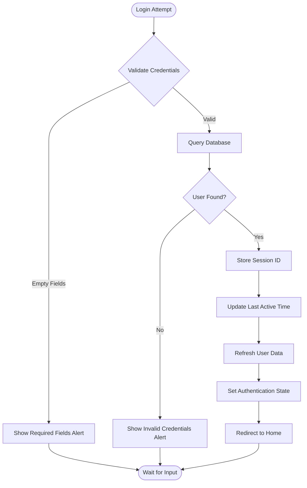

# Authentication System

<cite>
**Referenced Files in This Document**
- [app/welcome.tsx](file://app/welcome.tsx)
- [services/store.ts](file://services/store.ts)
- [services/database.ts](file://services/database.ts)
- [types/index.ts](file://types/index.ts)
- [AUTH_GUIDE.md](file://AUTH_GUIDE.md)
- [app.json](file://app.json)
- [package.json](file://package.json)
</cite>

## Table of Contents
1. [Introduction](#introduction)
2. [System Architecture](#system-architecture)
3. [Dual Authentication Flow](#dual-authentication-flow)
4. [Secure Storage Implementation](#secure-storage-implementation)
5. [State Management with Zustand](#state-management-with-zustand)
6. [Registration Process](#registration-process)
7. [Login Process](#login-process)
8. [Guest Mode Implementation](#guest-mode-implementation)
9. [Security Considerations](#security-considerations)
10. [Error Handling and Validation](#error-handling-and-validation)
11. [Troubleshooting Guide](#troubleshooting-guide)
12. [Performance and Optimization](#performance-and-optimization)

## Introduction

The STEM Learning App implements a comprehensive authentication system designed specifically for offline-first educational applications. The system supports both registered user accounts and guest mode access, providing flexibility for users in various connectivity scenarios. Built with React Native and Expo, the authentication system emphasizes security, usability, and seamless user experience.

The authentication architecture follows modern mobile app patterns, utilizing Expo Secure Store for credential protection, Zustand for state management, and SQLite for local data persistence. The system handles user registration, login, session management, and provides fallback mechanisms for offline scenarios.

## System Architecture

The authentication system consists of several interconnected components that work together to provide a secure and user-friendly experience:


**Diagram sources**
- [app/welcome.tsx](file://app/welcome.tsx#L1-L50)
- [services/store.ts](file://services/store.ts#L1-L100)
- [services/database.ts](file://services/database.ts#L1-L150)

**Section sources**
- [app/welcome.tsx](file://app/welcome.tsx#L1-L100)
- [services/store.ts](file://services/store.ts#L1-L200)
- [services/database.ts](file://services/database.ts#L1-L200)

## Dual Authentication Flow

The STEM Learning App implements a sophisticated dual authentication flow that accommodates both registered users and guest access patterns. This design ensures accessibility for users in varying connectivity situations while maintaining security standards.

### Registration Flow

The registration process captures essential user information and creates a complete user profile:


**Diagram sources**
- [app/welcome.tsx](file://app/welcome.tsx#L200-L300)
- [services/store.ts](file://services/store.ts#L80-L120)
- [services/database.ts](file://services/database.ts#L600-L650)

### Login Flow

The login process authenticates existing users against the local database:


**Diagram sources**
- [app/welcome.tsx](file://app/welcome.tsx#L150-L200)
- [services/store.ts](file://services/store.ts#L50-L80)
- [services/database.ts](file://services/database.ts#L650-L680)

**Section sources**
- [app/welcome.tsx](file://app/welcome.tsx#L150-L400)
- [services/store.ts](file://services/store.ts#L50-L150)

## Secure Storage Implementation

The authentication system employs multiple layers of security to protect user credentials and sensitive data. The implementation leverages Expo Secure Store for encryption and SQLite for structured data persistence.

### Expo Secure Store Integration

Expo Secure Store provides hardware-backed encryption for storing sensitive information:

| Storage Location | Data Type | Encryption Level | Purpose |
|------------------|-----------|------------------|---------|
| `current_user_id` | String | Hardware-backed | Active user session identifier |
| `app_theme` | String | Hardware-backed | User theme preference |

### Database Security Measures

The SQLite database implements several security measures:

| Security Feature | Implementation | Purpose |
|------------------|----------------|---------|
| Local Storage Only | No network transmission | Prevents credential interception |
| Plain Text Passwords | Stored as-is in SQLite | Simplifies offline operation |
| Unique Constraints | Email and username uniqueness | Prevents account conflicts |
| Input Validation | Client-side validation | Reduces malicious input |

**Section sources**
- [services/database.ts](file://services/database.ts#L650-L700)
- [services/store.ts](file://services/store.ts#L120-L150)

## State Management with Zustand

The authentication state is managed through a centralized Zustand store that handles user authentication, loading states, and session persistence. The store architecture promotes predictable state updates and maintains consistency across the application.

### Auth Store Structure

The authentication store manages critical state variables and provides comprehensive action handlers:


**Diagram sources**
- [services/store.ts](file://services/store.ts#L15-L100)
- [services/database.ts](file://services/database.ts#L600-L700)

### State Persistence Mechanisms

The system implements automatic state restoration and persistence:

| State Variable | Persistence Method | Restoration Trigger |
|----------------|-------------------|-------------------|
| `user` | Database query on app launch | `initialize()` method |
| `isAuthenticated` | Derived from user state | `initialize()` method |
| `isLoading` | Component state | Action handlers |
| `current_user_id` | Secure Store | Login/logout actions |

**Section sources**
- [services/store.ts](file://services/store.ts#L15-L150)

## Registration Process

The registration process implements comprehensive form validation, user data processing, and automatic login functionality. The system generates usernames from user names and validates all input fields before creating user accounts.

### Form Validation System

The registration form implements multi-layered validation:


**Diagram sources**
- [app/welcome.tsx](file://app/welcome.tsx#L200-L400)

### User Data Processing

The registration process transforms user input into a complete user profile:

| Input Field | Processing Logic | Validation Rules |
|-------------|------------------|------------------|
| Name | Trim and validate minimum length | Minimum 2 characters |
| Email | Extract username portion | Valid email format |
| Age | Convert to integer | Range 10-20 |
| Gender | Direct assignment | Must be selected |
| Education Level | Direct assignment | Must be selected |
| Password | Store as-is | Minimum 6 characters |

### Automatic Login After Registration

After successful registration, users are automatically logged in and redirected:


**Diagram sources**
- [app/welcome.tsx](file://app/welcome.tsx#L350-L400)
- [services/store.ts](file://services/store.ts#L100-L150)

**Section sources**
- [app/welcome.tsx](file://app/welcome.tsx#L200-L500)
- [services/store.ts](file://services/store.ts#L100-L180)

## Login Process

The login process authenticates users against the local database and manages session state. The system provides comprehensive error handling and user feedback for authentication failures.

### Authentication Workflow

The login process follows a secure authentication pattern:



**Diagram sources**
- [app/welcome.tsx](file://app/welcome.tsx#L150-L200)
- [services/store.ts](file://services/store.ts#L50-L100)

### Error Handling Strategies

The login system implements comprehensive error handling:

| Error Type | Detection Method | User Feedback | Recovery Action |
|------------|------------------|---------------|-----------------|
| Invalid Credentials | Database query returns null | "Invalid email or password" | Retry with correct credentials |
| Account Not Found | Email not found in database | "No account found with this email" | Suggest registration |
| Database Error | Exception during query | Generic error message | Retry or contact support |
| Network Error | Connection failure | Offline mode indication | Continue in offline mode |

**Section sources**
- [app/welcome.tsx](file://app/welcome.tsx#L150-L250)
- [services/store.ts](file://services/store.ts#L50-L120)

## Guest Mode Implementation

Guest mode provides temporary access to application features without requiring user registration. This feature is particularly valuable for users who want to explore the app before committing to an account creation.

### Guest Mode Activation

The guest mode implementation provides a seamless transition to full app functionality:


**Diagram sources**
- [app/welcome.tsx](file://app/welcome.tsx#L500-L520)

### Access Limitations

Guest mode restricts certain features to encourage account creation:

| Feature Category | Guest Access | Registered User Access |
|------------------|--------------|------------------------|
| Progress Tracking | Limited | Full access |
| Leaderboard | View only | Full participation |
| Personalized Recommendations | Basic | Advanced |
| Achievement System | View only | Earn badges |
| Data Persistence | Session only | Permanent |

**Section sources**
- [app/welcome.tsx](file://app/welcome.tsx#L500-L520)

## Security Considerations

The authentication system implements several security measures tailored for an offline-first educational application. While the system prioritizes simplicity and offline functionality, it maintains appropriate security standards for its use case.

### Current Security Implementation

The system implements the following security measures:

| Security Aspect | Implementation | Rationale |
|-----------------|----------------|-----------|
| Local Storage Only | All data stored on device | Prevents unauthorized access |
| No Network Transmission | Credentials never leave device | Eliminates interception risk |
| Hardware Encryption | Expo Secure Store encryption | Protects sensitive session data |
| Input Validation | Client-side validation | Reduces malicious input |
| Unique Constraints | Database-level uniqueness | Prevents account conflicts |

### Password Security Analysis

The current password implementation uses plain-text storage for offline-first functionality:


**Diagram sources**
- [services/database.ts](file://services/database.ts#L650-L680)
- [AUTH_GUIDE.md](file://AUTH_GUIDE.md#L400-L450)

### Security Best Practices Documented

The AUTH_GUIDE.md outlines several security considerations:

| Security Area | Current Status | Recommended Enhancement |
|---------------|----------------|------------------------|
| Password Storage | Plain text in SQLite | Hash with SHA-256 |
| Username Generation | From user name | Add collision detection |
| Session Timeout | Manual expiration | Implement automatic timeout |
| Password Recovery | Not implemented | Add security questions |

**Section sources**
- [AUTH_GUIDE.md](file://AUTH_GUIDE.md#L400-L500)
- [services/database.ts](file://services/database.ts#L650-L700)

## Error Handling and Validation

The authentication system implements comprehensive error handling and validation to provide users with clear feedback and prevent common input errors.

### Form Validation System

The validation system operates at multiple levels:


**Diagram sources**
- [app/welcome.tsx](file://app/welcome.tsx#L120-L200)

### Error Message Categories

The system provides categorized error messages for different failure scenarios:

| Error Category | Examples | User Impact |
|----------------|----------|-------------|
| Input Validation | "Name must be at least 2 characters" | Immediate correction feedback |
| Authentication | "Invalid email or password" | Clear authentication failure |
| Account Issues | "Email already exists" | Account resolution guidance |
| System Errors | "Registration failed" | General error indication |

### Password Strength Indicator

The registration form includes a real-time password strength indicator:


**Diagram sources**
- [app/welcome.tsx](file://app/welcome.tsx#L120-L150)

**Section sources**
- [app/welcome.tsx](file://app/welcome.tsx#L120-L250)

## Troubleshooting Guide

This section addresses common authentication issues and provides solutions for typical problems encountered during development and usage.

### Common Authentication Issues

#### Registration Failures

**Issue**: Registration fails with "Email already exists" error
**Cause**: Email address is already registered
**Solution**: 
1. Verify the email address is correct
2. Use the "Go to Sign In" option to log in
3. Contact support if the issue persists

**Issue**: Password validation fails
**Cause**: Password doesn't meet minimum requirements
**Solution**:
1. Ensure password is at least 6 characters long
2. Check for special characters if required
3. Verify password confirmation matches

#### Login Problems

**Issue**: "Invalid email or password" error
**Cause**: Incorrect credentials entered
**Solution**:
1. Double-check email and password
2. Verify case sensitivity in password
3. Ensure email format is correct

**Issue**: Account not found error
**Cause**: User hasn't registered yet
**Solution**:
1. Click "Register" tab to create account
2. Verify email address was entered correctly
3. Check spam/junk folder for registration confirmation

#### Database Connection Issues

**Issue**: App crashes on startup
**Cause**: Database initialization failure
**Solution**:
1. Restart the application
2. Clear app cache and data
3. Reinstall the application if persistent

**Issue**: Data loss after app update
**Cause**: Database schema changes require reset
**Solution**:
1. Automatic schema reset occurs on major updates
2. Existing data may be lost during reset
3. Recreate account after reset

### Offline Mode Issues

#### Guest Mode Limitations

**Issue**: Features unavailable in guest mode
**Cause**: Guest mode provides limited functionality
**Solution**:
1. Create an account for full access
2. Save progress regularly to avoid data loss
3. Use guest mode for exploration only

#### Session Persistence

**Issue**: Logged out unexpectedly
**Cause**: Session expired or app restarted
**Solution**:
1. Automatic re-authentication on app restart
2. Check internet connection for cloud features
3. Verify secure storage permissions

### Debugging Authentication Issues

#### Enable Debug Logging

Add debug statements to track authentication flow:

```typescript
// Add to authentication functions for debugging
console.log('Authentication attempt:', { email, password });
```

#### Monitor Secure Store Operations

Track secure storage operations:

```typescript
// Monitor session storage
await SecureStore.setItemAsync('current_user_id', userId);
const storedUserId = await SecureStore.getItemAsync('current_user_id');
console.log('Stored user ID:', storedUserId);
```

**Section sources**
- [app/welcome.tsx](file://app/welcome.tsx#L150-L250)
- [services/database.ts](file://services/database.ts#L650-L700)
- [AUTH_GUIDE.md](file://AUTH_GUIDE.md#L450-L500)

## Performance and Optimization

The authentication system is designed for optimal performance in mobile environments, with considerations for battery life, memory usage, and network efficiency.

### Performance Optimizations

#### State Management Efficiency

The Zustand store implementation provides efficient state updates:

| Optimization Technique | Implementation | Benefit |
|------------------------|----------------|---------|
| Selective Updates | Targeted state updates | Reduced re-renders |
| Lazy Loading | On-demand authentication | Faster app startup |
| Memoization | Cached computed values | Improved responsiveness |
| Batch Operations | Grouped database operations | Reduced I/O overhead |

#### Database Query Optimization

The SQLite implementation includes several optimization strategies:


**Diagram sources**
- [services/database.ts](file://services/database.ts#L100-L200)

### Memory Management

The authentication system implements careful memory management:

| Resource | Management Strategy | Monitoring |
|----------|-------------------|------------|
| User Objects | Lazy instantiation | Memory profiling |
| Database Connections | Connection pooling | Connection limits |
| Secure Store | Minimal caching | Storage quotas |
| UI State | Component cleanup | React DevTools |

### Offline Performance

The offline-first architecture ensures consistent performance:


**Diagram sources**
- [services/database.ts](file://services/database.ts#L50-L100)

**Section sources**
- [services/store.ts](file://services/store.ts#L1-L100)
- [services/database.ts](file://services/database.ts#L50-L200)