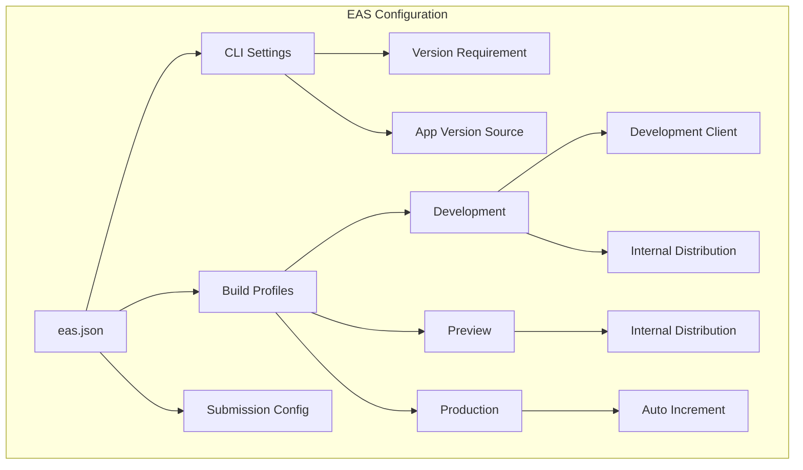
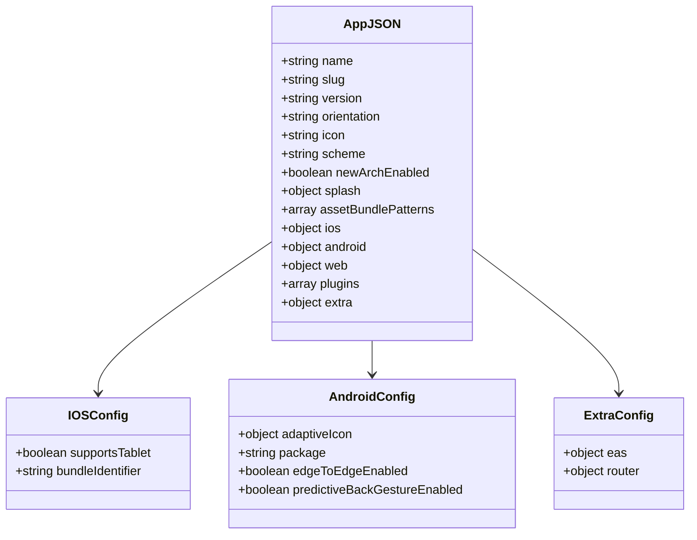
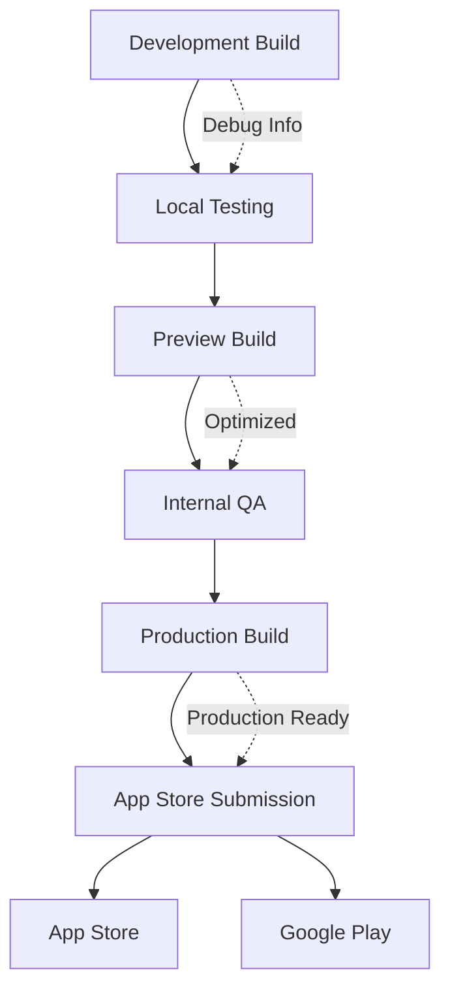
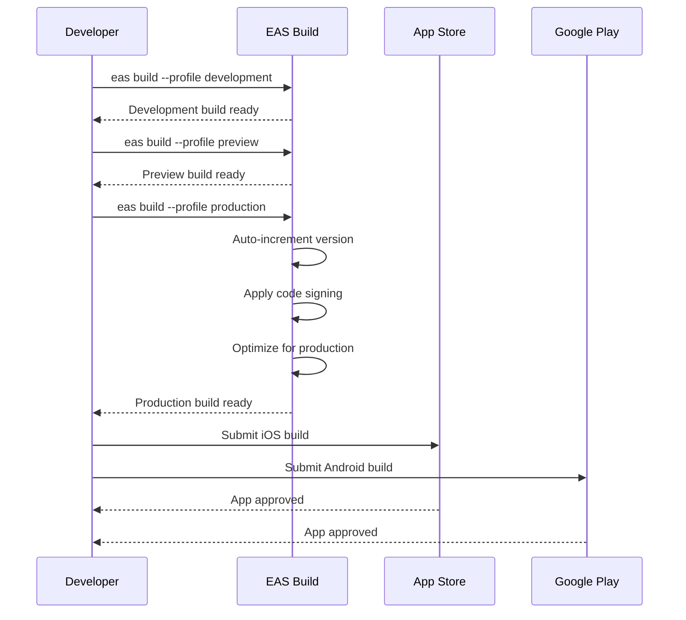
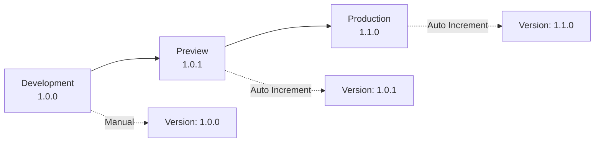
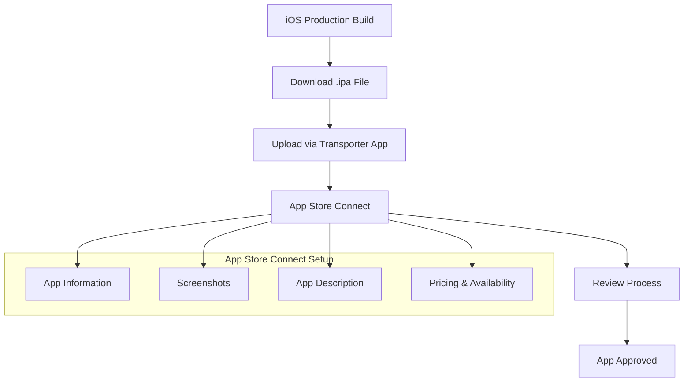
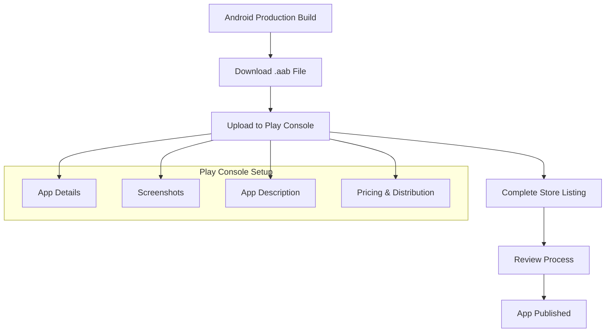
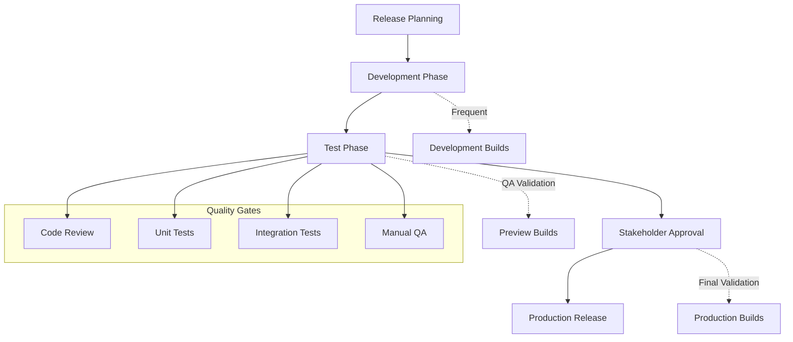

# Build & Deployment

<cite>
**Referenced Files in This Document**
- [eas.json](file://eas.json)
- [app.json](file://app.json)
- [package.json](file://package.json)
- [BUILD_GUIDE.md](file://BUILD_GUIDE.md)
- [EASDOC.md](file://EASDOC.md)
- [metro.config.js](file://metro.config.js)
- [babel.config.js](file://babel.config.js)
- [tsconfig.json](file://tsconfig.json)
- [README.md](file://README.md)
</cite>

## Table of Contents
1. [Introduction](#introduction)
2. [Project Overview](#project-overview)
3. [EAS Configuration](#eas-configuration)
4. [App Configuration](#app-configuration)
5. [Build Profiles](#build-profiles)
6. [Build Process](#build-process)
7. [Environment Variables](#environment-variables)
8. [Code Signing](#code-signing)
9. [Version Management](#version-management)
10. [Deployment Workflow](#deployment-workflow)
11. [Common Issues & Solutions](#common-issues--solutions)
12. [Best Practices](#best-practices)
13. [Monitoring & Analytics](#monitoring--analytics)

## Introduction

The STEM Learning App utilizes Expo Application Services (EAS) for streamlined build and deployment processes. This comprehensive guide covers the complete workflow from local development to production deployment, including configuration management, environment variables, code signing, and versioning strategies.

EAS provides automated building, submission, and over-the-air (OTA) updates for Expo applications, enabling efficient development cycles and reliable production deployments across both iOS and Android platforms.

## Project Overview

The STEM Learning App is a React Native application built with Expo, featuring offline-first architecture, gamification elements, and AI-powered learning recommendations. The application targets students aged 10-20 in Zambia and operates completely offline with local authentication and data storage.

**Key Features:**
- Offline-first architecture with SQLite database
- Gamification system (XP, levels, badges, streaks)
- Adaptive quizzes with instant feedback
- Local leaderboard functionality
- Light/dark theme support
- Multi-platform compatibility (iOS, Android, Web)

**Section sources**
- [README.md](file://README.md#L1-L50)
- [package.json](file://package.json#L1-L43)

## EAS Configuration

### Core Configuration Structure

The EAS configuration is managed through the `eas.json` file, which defines build profiles, CLI settings, and submission parameters.



**Diagram sources**
- [eas.json](file://eas.json#L1-L22)

### CLI Configuration

The CLI settings ensure compatibility with the required EAS version and enable remote version tracking:

- **Version Requirement**: EAS CLI version 16.20.4 or higher
- **App Version Source**: Remote tracking for centralized version management

### Build Profiles Configuration

Each build profile serves specific development and deployment needs:

1. **Development Profile**: Fast iteration with development client
2. **Preview Profile**: Internal testing and QA validation
3. **Production Profile**: Store-ready builds with automatic versioning

**Section sources**
- [eas.json](file://eas.json#L1-L22)
- [EASDOC.md](file://EASDOC.md#L40-L80)

## App Configuration

### Application Metadata

The `app.json` file contains essential application metadata, platform-specific configurations, and Expo plugin settings.



**Diagram sources**
- [app.json](file://app.json#L1-L50)

### Platform-Specific Configurations

#### iOS Configuration
- **Bundle Identifier**: `com.stemlearning.app`
- **Tablet Support**: Enabled for iPad compatibility
- **Universal Binary**: Supports both iPhone and iPad

#### Android Configuration
- **Package Name**: `com.stemlearning.app`
- **Adaptive Icon**: Modern Android icon design
- **Edge-to-Edge**: Full-screen display support
- **Predictive Back Gesture**: Disabled for consistent navigation

### Plugin Configuration

The application includes several Expo plugins for enhanced functionality:

- **expo-font**: Font loading and management
- **expo-secure-store**: Secure local storage
- **expo-sqlite**: Database operations
- **expo-router**: Navigation system

**Section sources**
- [app.json](file://app.json#L1-L50)
- [EASDOC.md](file://EASDOC.md#L120-L180)

## Build Profiles

### Development Profile

The development profile enables rapid iteration during local development with the following characteristics:

**Features:**
- Development client enabled for fast reloads
- Internal distribution for team access
- Debug symbols included for troubleshooting
- Faster build times for quick testing

**Use Cases:**
- Feature development and testing
- Debugging application issues
- Local development workflow
- Quick prototype iterations

### Preview Profile

The preview profile provides optimized builds for internal testing and quality assurance:

**Features:**
- Internal distribution for team members
- Optimized build performance
- Testing environment validation
- Pre-production verification

**Use Cases:**
- Internal QA testing
- Stakeholder reviews
- Beta testing with team members
- Feature validation before production

### Production Profile

The production profile generates store-ready builds with automatic version management:

**Features:**
- Auto-increment version numbers
- Fully optimized for performance
- Production signing certificates
- Store compliance validation

**Use Cases:**
- App Store submissions
- Google Play releases
- Public application distribution
- Major feature releases



**Diagram sources**
- [EASDOC.md](file://EASDOC.md#L80-L120)

**Section sources**
- [EASDOC.md](file://EASDOC.md#L80-L150)
- [eas.json](file://eas.json#L6-L18)

## Build Process

### Local Development to Production Workflow

The build process follows a structured workflow from local development to production deployment:



**Diagram sources**
- [EASDOC.md](file://EASDOC.md#L150-L200)

### Platform-Specific Build Commands

#### iOS Build Commands

```bash
# Development build
eas build --platform ios --profile development

# Preview build  
eas build --platform ios --profile preview

# Production build
eas build --platform ios --profile production
```

#### Android Build Commands

```bash
# Development build
eas build --platform android --profile development

# Preview build
eas build --platform android --profile preview

# Production build
eas build --platform android --profile production
```

### Build Status Monitoring

Monitor build progress and access build artifacts:

```bash
# Check build status
eas build:list

# View specific build details
eas build:view [BUILD_ID]

# Check project configuration
eas config

# Validate build configuration
eas build --platform [ios|android] --profile [PROFILE] --dry-run
```

**Section sources**
- [EASDOC.md](file://EASDOC.md#L150-L250)

## Environment Variables

### EAS Secrets Management

EAS provides secure environment variable management through the secrets system:

```bash
# Create environment variable
eas secret:create --scope project --name API_KEY --value "your-api-key"

# List all environment variables
eas secret:list

# Delete environment variable
eas secret:delete --name API_KEY
```

### Environment-Specific Configuration

Configure different environments for development, preview, and production:

#### Environment Variable Files

```bash
# .env.development
API_URL=https://dev-api.stemlearning.app
ENABLE_ANALYTICS=false
DEBUG_MODE=true

# .env.preview
API_URL=https://staging-api.stemlearning.app
ENABLE_ANALYTICS=true
DEBUG_MODE=false

# .env.production
API_URL=https://api.stemlearning.app
ENABLE_ANALYTICS=true
DEBUG_MODE=false
```

#### EAS Configuration for Environments

```json
{
  "build": {
    "development": {
      "env": {
        "APP_ENV": "development",
        "API_URL": "https://dev-api.stemlearning.app"
      }
    },
    "preview": {
      "env": {
        "APP_ENV": "preview", 
        "API_URL": "https://staging-api.stemlearning.app"
      }
    },
    "production": {
      "env": {
        "APP_ENV": "production",
        "API_URL": "https://api.stemlearning.app"
      }
    }
  }
}
```

### Configuration in app.json

Environment variables can also be configured directly in `app.json`:

```json
{
  "expo": {
    "extra": {
      "apiUrl": "${API_URL}",
      "debugMode": "${DEBUG_MODE}"
    }
  }
}
```

**Section sources**
- [EASDOC.md](file://EASDOC.md#L250-L300)

## Code Signing

### iOS Code Signing

iOS applications require proper code signing for App Store submission:

#### Prerequisites
- Apple Developer Account ($99/year)
- App ID created in Developer Portal
- Certificates and provisioning profiles configured

#### Interactive Configuration
```bash
# Configure iOS credentials interactively
eas credentials

# Reset provisioning profile if needed
eas credentials --clear-provisioning-profile
```

#### Manual Configuration Steps
1. Create App ID in Apple Developer Portal
2. Generate Development/Production certificates
3. Create provisioning profiles
4. Upload certificates to EAS
5. Configure bundle identifier in app.json

### Android Code Signing

Android applications require keystore configuration for production builds:

#### Keystore Generation
```bash
# Generate new keystore (first-time setup)
keytool -genkeypair -v -storetype PKCS12 -keystore my-release-key.p12 -alias my-key-alias -keyalg RSA -keysize 2048 -validity 10000
```

#### EAS Configuration
```bash
# Configure Android credentials
eas credentials -p android
```

#### Automatic Keystore Management
EAS can automatically manage keystores for production builds, eliminating the need for manual keystore handling.

**Section sources**
- [EASDOC.md](file://EASDOC.md#L300-L400)

## Version Management

### Semantic Versioning

The application follows semantic versioning (MAJOR.MINOR.PATCH):

```
1.0.0 → 1.0.1 → 1.1.0 → 2.0.0
```

### Auto-Increment Configuration

Production builds automatically increment version numbers:

```json
{
  "build": {
    "production": {
      "autoIncrement": true
    }
  }
}
```

### Manual Version Updates

For development and preview builds, version numbers can be manually controlled:

#### iOS Version Management
```json
{
  "ios": {
    "buildNumber": "2",
    "version": "1.0.1"
  }
}
```

#### Android Version Management
```json
{
  "android": {
    "versionCode": 2,
    "version": "1.0.1"
  }
}
```

### Version Control Strategy



**Diagram sources**
- [eas.json](file://eas.json#L15-L18)
- [app.json](file://app.json#L3-L4)

**Section sources**
- [EASDOC.md](file://EASDOC.md#L400-L450)
- [eas.json](file://eas.json#L15-L18)

## Deployment Workflow

### App Store Submission

#### iOS Submission Process



**Diagram sources**
- [EASDOC.md](file://EASDOC.md#L450-L500)

#### iOS Submission Commands
```bash
# Submit to App Store
eas submit --platform ios --profile production

# Manual submission steps
# 1. Build production iOS app
# 2. Download .ipa file
# 3. Use Transporter app to upload
# 4. Submit for review in App Store Connect
```

#### Google Play Submission



**Diagram sources**
- [EASDOC.md](file://EASDOC.md#L500-L550)

#### Android Submission Commands
```bash
# Submit to Google Play
eas submit --platform android --profile production

# Manual submission steps
# 1. Build production Android app
# 2. Download .aab file
# 3. Upload to Play Console
# 4. Complete store listing
# 5. Submit for review
```

### Over-The-Air (OTA) Updates

EAS Updates enable publishing JavaScript and asset changes without rebuilding:

#### Configuration
```bash
# Configure updates
eas update:configure

# Publish update to production
eas update --branch production --message "Bug fixes and improvements"

# Publish update to preview
eas update --branch preview --message "Testing new features"
```

#### Update Branches
- **production**: Live users
- **preview**: Beta testers
- **development**: Development team

**Section sources**
- [EASDOC.md](file://EASDOC.md#L450-L600)

## Common Issues & Solutions

### Build Failures

#### Missing Credentials
**Problem**: iOS or Android credentials not configured

**Solution**:
```bash
# Configure credentials interactively
eas credentials

# Reset provisioning profile if needed
eas credentials --clear-provisioning-profile
```

#### Version Conflicts
**Problem**: Version number already exists in store

**Solution**:
- Update version in `app.json`
- Use auto-increment for production builds

#### Build Timeouts
**Problem**: Build takes too long and times out

**Solution**:
- Check for large assets
- Optimize dependencies
- Use `--clear-cache` flag

### Dependency Conflicts

#### Package Version Mismatches
**Problem**: Expo SDK version conflicts with dependencies

**Solution**:
```bash
# Check Expo SDK version compatibility
expo diagnostics

# Update dependencies to match Expo SDK
npm install expo@latest
```

#### Metro Configuration Issues
**Problem**: Bundling errors or module resolution

**Solution**:
```bash
# Clear Metro cache
npm start -- --reset-cache

# Restart development server
expo start -c
```

### Platform-Specific Requirements

#### iOS Specific Issues
- **Bundle Identifier**: Must match App Store Connect
- **Entitlements**: Required for certain features
- **Capabilities**: Push notifications, background modes

#### Android Specific Issues
- **Package Name**: Must be globally unique
- **Permissions**: Required for device features
- **ProGuard/R8**: Obfuscation configuration

### Debug Commands

```bash
# View build logs
eas build:view [BUILD_ID]

# Check project configuration
eas config

# Validate eas.json
eas build --platform [ios|android] --profile [PROFILE] --dry-run

# Check account status
eas whoami
```

**Section sources**
- [EASDOC.md](file://EASDOC.md#L600-L700)

## Best Practices

### Development Workflow

1. **Version Control**: Always commit `eas.json` and `app.json`
2. **Build Staging**: Follow development → preview → production workflow
3. **Testing Strategy**: Test on development builds, validate on preview builds
4. **Release Checklist**: Comprehensive testing before production deployment

### Release Management



**Diagram sources**
- [EASDOC.md](file://EASDOC.md#L700-L750)

### Security Best Practices

1. **Environment Variables**: Use EAS secrets for sensitive data
2. **Code Signing**: Never commit certificates or keys
3. **Credential Rotation**: Regularly rotate signing credentials
4. **Access Control**: Limit EAS access to authorized team members

### Performance Optimization

1. **Asset Optimization**: Use appropriate image formats and compression
2. **Bundle Splitting**: Split code into smaller chunks
3. **Caching**: Leverage EAS build caching
4. **Analytics**: Implement crash reporting and performance monitoring

### Monitoring and Maintenance

1. **Build Monitoring**: Track build success rates and failure patterns
2. **Update Rollout**: Gradual rollout of OTA updates
3. **Crash Reporting**: Integrate with Sentry or similar tools
4. **User Feedback**: Monitor app store reviews and ratings

**Section sources**
- [EASDOC.md](file://EASDOC.md#L700-L800)

## Monitoring & Analytics

### EAS Build Dashboard

Monitor build status and access build artifacts through the EAS dashboard:

- **Build Status**: Real-time build progress tracking
- **Artifact Downloads**: Direct access to build files
- **Submission History**: Track store submission status
- **Analytics**: Build performance metrics

### Store Analytics

#### App Store Connect Analytics
- **User Acquisition**: Install trends and marketing effectiveness
- **Engagement**: Active users and session data
- **Retention**: User retention and churn rates
- **Revenue**: Sales and in-app purchase analytics

#### Google Play Console Statistics
- **Installs**: Daily and cumulative installs
- **Uninstalls**: Uninstall reasons and trends
- **Crashes**: Crash reports and stability metrics
- **Reviews**: User feedback and ratings

### Crash Reporting Integration

Integrate crash reporting tools for comprehensive error tracking:

```bash
# Install Sentry
npm install @sentry/react-native

# Configure in app.json
{
  "plugins": [
    [
      "@sentry/react-native/expo",
      {
        "organization": "your-org",
        "project": "stem-learning-app"
      }
    ]
  ]
}
```

### Performance Monitoring

1. **Build Performance**: Monitor build times and optimize pipeline
2. **App Performance**: Track startup time and memory usage
3. **User Experience**: Monitor user engagement and satisfaction
4. **Error Rates**: Track and resolve application errors

**Section sources**
- [EASDOC.md](file://EASDOC.md#L750-L812)