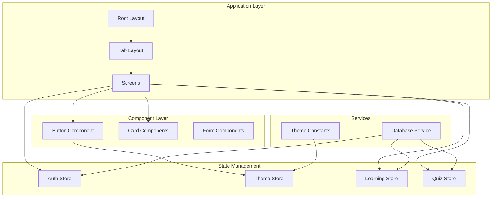
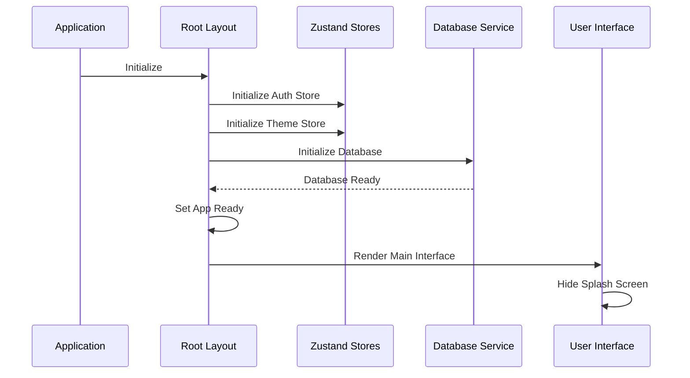
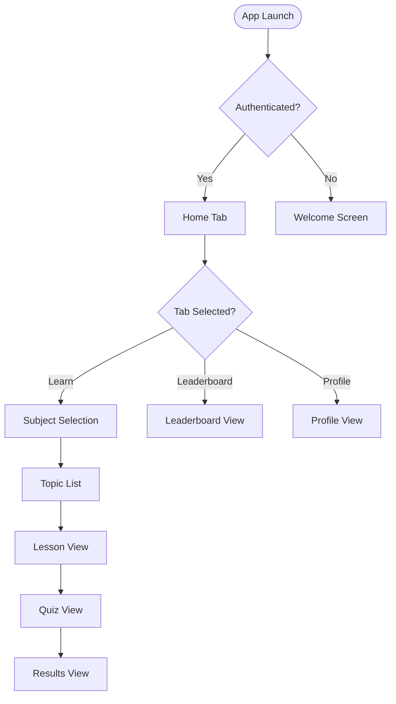
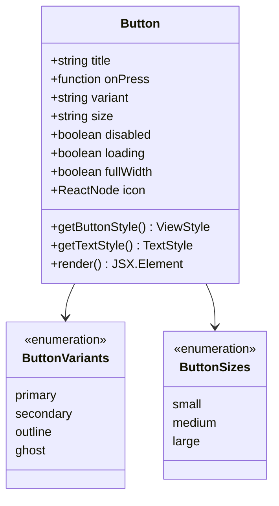
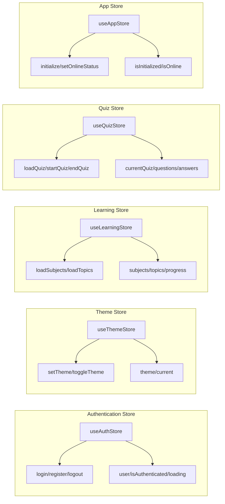
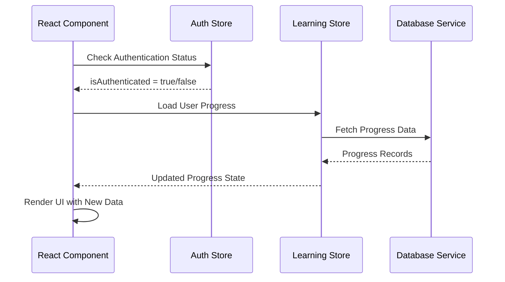
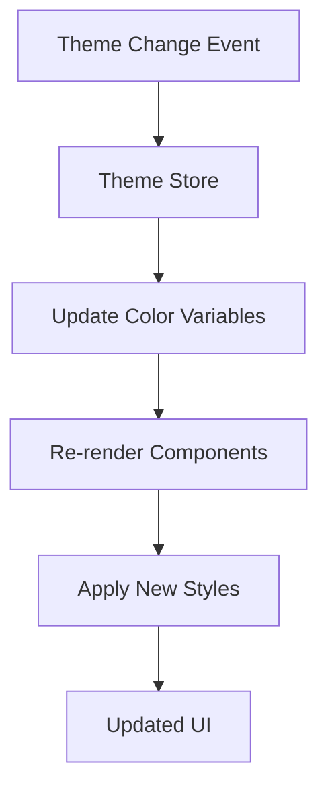
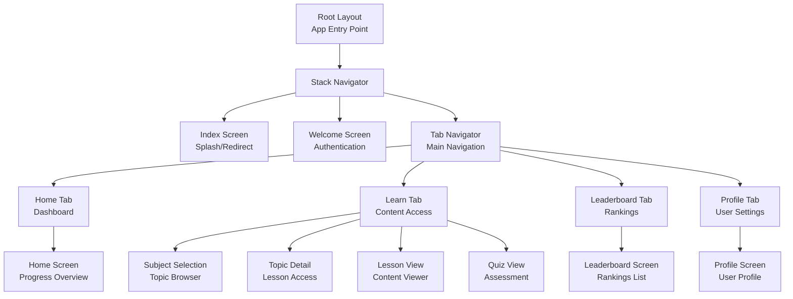

# Component Architecture

<cite>
**Referenced Files in This Document**
- [app/_layout.tsx](file://app/_layout.tsx)
- [app/(tabs)/_layout.tsx](file://app/(tabs)/_layout.tsx)
- [components/Button.tsx](file://components/Button.tsx)
- [constants/theme.ts](file://constants/theme.ts)
- [services/store.ts](file://services/store.ts.ts)
- [services/database.ts](file://services/database.ts)
- [types/index.ts](file://types/index.ts)
- [app/index.tsx](file://app/index.tsx)
- [app/home.tsx](file://app/(tabs)/home.tsx)
- [app/profile.tsx](file://app/(tabs)/profile.tsx)
</cite>

## Table of Contents
1. [Introduction](#introduction)
2. [Modular Design Pattern](#modular-design-pattern)
3. [Root Layout Architecture](#root-layout-architecture)
4. [Tab-Based Navigation System](#tab-based-navigation-system)
5. [Button Component Implementation](#button-component-implementation)
6. [State Management with Zustand](#state-management-with-zustand)
7. [Theme System Integration](#theme-system-integration)
8. [Component Hierarchy](#component-hierarchy)
9. [Accessibility and Responsive Design](#accessibility-and-responsive-design)
10. [Best Practices](#best-practices)
11. [Conclusion](#conclusion)

## Introduction

The STEM Learning App employs a sophisticated component architecture built on React Native with Expo Router, featuring a modular design pattern that emphasizes reusability, separation of concerns, and consistent user experience. The architecture leverages modern React patterns, state management with Zustand stores, and a comprehensive theming system to create a scalable and maintainable mobile learning platform.

## Modular Design Pattern

The application follows a clear modular architecture where each component serves a specific purpose while maintaining loose coupling with others. This design enables easy maintenance, testing, and extension of functionality.

**Diagram sources**
- [app/_layout.tsx](file://app/_layout.tsx#L1-L133)
- [app/(tabs)/_layout.tsx](file://app/(tabs)/_layout.tsx#L1-L91)
- [services/store.ts](file://services/store.ts#L1-L570)

**Section sources**
- [app/_layout.tsx](file://app/_layout.tsx#L1-L133)
- [app/(tabs)/_layout.tsx](file://app/(tabs)/_layout.tsx#L1-L91)

## Root Layout Architecture

The root layout serves as the application's entry point and orchestrates global state initialization, navigation configuration, and resource loading. It implements a sophisticated loading mechanism that ensures all critical systems are ready before rendering the main interface.

### Key Features

- **Splash Screen Management**: Implements controlled splash screen timing with artificial delays for professional presentation
- **Global State Initialization**: Coordinates initialization of authentication, theme, and learning stores
- **Resource Loading**: Handles database initialization and asset preparation
- **Navigation Configuration**: Sets up stack navigation with theme-aware screen options

### Component Lifecycle

**Diagram sources**
- [app/_layout.tsx](file://app/_layout.tsx#L20-L50)
- [services/store.ts](file://services/store.ts#L540-L570)

**Section sources**
- [app/_layout.tsx](file://app/_layout.tsx#L1-L133)

## Tab-Based Navigation System

The tab navigation system provides intuitive access to the four main application areas: Home, Learn, Leaderboard, and Profile. Each tab is configured with appropriate icons, styling, and navigation behavior.

### Tab Configuration

| Tab | Icon | Purpose | Navigation Behavior |
|-----|------|---------|-------------------|
| Home | home | Dashboard and progress overview | Direct navigation |
| Learn | school | Educational content access | Nested routing |
| Leaderboard | leaderboard | Competitive ranking | List view |
| Profile | person | User settings and achievements | Profile management |

### Navigation Flow

**Diagram sources**
- [app/(tabs)/_layout.tsx](file://app/(tabs)/_layout.tsx#L15-L85)
- [app/_layout.tsx](file://app/_layout.tsx#L70-L120)

**Section sources**
- [app/(tabs)/_layout.tsx](file://app/(tabs)/_layout.tsx#L1-L91)

## Button Component Implementation

The Button component exemplifies the application's design principles, offering extensive customization options while maintaining consistent styling and behavior across the interface.

### Props Architecture

The Button component accepts a comprehensive set of props that enable flexible usage patterns:

| Prop | Type | Default | Description |
|------|------|---------|-------------|
| title | string | Required | Button text content |
| onPress | function | Required | Click handler |
| variant | enum | "primary" | Visual appearance variant |
| size | enum | "medium" | Button size variation |
| disabled | boolean | false | Disabled state |
| loading | boolean | false | Loading indicator state |
| fullWidth | boolean | false | Full-width layout |
| icon | ReactNode | undefined | Leading icon element |

### Variant System

**Diagram sources**
- [components/Button.tsx](file://components/Button.tsx#L15-L35)

### Styling Implementation

The component dynamically generates styles based on props, ensuring consistency with the theme system while allowing customization:

- **Primary Variant**: Solid background with white text, prominent for main actions
- **Secondary Variant**: Surface-colored with border, suitable for secondary actions  
- **Outline Variant**: Transparent background with primary border, for less prominent actions
- **Ghost Variant**: Transparent background, minimal visual impact

**Section sources**
- [components/Button.tsx](file://components/Button.tsx#L1-L167)

## State Management with Zustand

The application employs a comprehensive state management solution using Zustand stores, each responsible for specific domains of functionality.

### Store Architecture

**Diagram sources**
- [services/store.ts](file://services/store.ts#L15-L100)
- [services/store.ts](file://services/store.ts#L150-L250)
- [services/store.ts](file://services/store.ts#L300-L400)
- [services/store.ts](file://services/store.ts#L450-L550)

### Store Interactions

Components consume state from multiple stores, enabling seamless data flow and reactive updates:

**Diagram sources**
- [services/store.ts](file://services/store.ts#L20-L80)
- [services/store.ts](file://services/store.ts#L300-L400)

**Section sources**
- [services/store.ts](file://services/store.ts#L1-L570)

## Theme System Integration

The theme system provides comprehensive styling control across all components, supporting both light and dark modes with consistent color palettes and typography scales.

### Theme Constants Structure

The theme system defines comprehensive styling constants:

| Category | Purpose | Key Values |
|----------|---------|------------|
| Colors | Color palette | Primary, Background, Surface, Text variants |
| Typography | Font definitions | Sizes, Weights, Line heights |
| Spacing | Layout spacing | XS, SM, MD, LG, XL increments |
| Border Radius | Corner rounding | Various radius values |
| Shadows | Depth effects | Multiple shadow levels |

### Dynamic Theme Application

Components automatically adapt to theme changes through the theme store, ensuring consistent appearance across the application:

**Diagram sources**
- [constants/theme.ts](file://constants/theme.ts#L10-L100)
- [services/store.ts](file://services/store.ts#L150-L200)

**Section sources**
- [constants/theme.ts](file://constants/theme.ts#L1-L360)

## Component Hierarchy

The component hierarchy demonstrates the structured approach to building reusable UI elements that compose into complex screens.

### Root-to-Screen Flow

**Diagram sources**
- [app/_layout.tsx](file://app/_layout.tsx#L70-L120)
- [app/(tabs)/_layout.tsx](file://app/(tabs)/_layout.tsx#L15-L85)

### Component Composition Patterns

The application demonstrates several composition patterns:

1. **Container-Presentational Pattern**: Separates data logic from UI presentation
2. **Higher-Order Component Pattern**: Wraps functionality for reuse
3. **Render Props Pattern**: Enables flexible component composition
4. **Compound Component Pattern**: Groups related components

**Section sources**
- [app/_layout.tsx](file://app/_layout.tsx#L1-L133)
- [app/(tabs)/_layout.tsx](file://app/(tabs)/_layout.tsx#L1-L91)

## Accessibility and Responsive Design

The component architecture incorporates accessibility features and responsive design principles to ensure usability across different devices and user needs.

### Accessibility Features

- **Semantic HTML**: Proper role assignment and ARIA attributes
- **Keyboard Navigation**: Full keyboard support for all interactive elements
- **Screen Reader Support**: Descriptive labels and announcements
- **High Contrast**: Theme-aware contrast ratios meeting WCAG guidelines
- **Touch Targets**: Minimum 44px touch target sizes

### Responsive Design Patterns

The application adapts to various screen sizes and orientations:

- **Flexible Layouts**: Percentage-based widths and flexible containers
- **Adaptive Typography**: Responsive font sizing based on device characteristics
- **Touch-Friendly Interfaces**: Optimized for mobile interaction patterns
- **Orientation Support**: Smooth transitions between portrait and landscape modes

### Theming for Accessibility

The theme system supports accessibility through:

- **Color Contrast**: Predefined contrast ratios for readability
- **Color Blindness Support**: Alternative color combinations
- **Focus Indicators**: Clear visual feedback for keyboard navigation
- **Reduced Motion**: Respect for user motion preferences

**Section sources**
- [constants/theme.ts](file://constants/theme.ts#L1-L360)

## Best Practices

### Creating New Components

When developing new components, follow these established patterns:

1. **TypeScript Integration**: Always define clear prop types using interfaces
2. **Theme Consistency**: Utilize theme constants for colors, spacing, and typography
3. **State Management**: Consume appropriate stores rather than managing local state
4. **Accessibility**: Implement proper ARIA labels and keyboard navigation
5. **Performance**: Use memoization for expensive computations and renders

### Component Naming Conventions

- **File Names**: PascalCase for component files (e.g., `UserProfile.tsx`)
- **Component Names**: PascalCase for exported component functions
- **Prop Interfaces**: Use descriptive names ending with "Props" (e.g., `ButtonProps`)
- **Constants**: Use UPPER_SNAKE_CASE for theme constants

### Testing Strategies

- **Unit Testing**: Test component logic independently
- **Integration Testing**: Verify component interactions with stores
- **Accessibility Testing**: Automated and manual accessibility checks
- **Cross-Platform Testing**: Verify functionality across different devices

### Performance Optimization

- **Code Splitting**: Lazy load heavy components when possible
- **Memoization**: Use React.memo for expensive renders
- **State Optimization**: Minimize store subscriptions where unnecessary
- **Image Optimization**: Implement lazy loading for media content

**Section sources**
- [components/Button.tsx](file://components/Button.tsx#L1-L167)
- [constants/theme.ts](file://constants/theme.ts#L1-L360)

## Conclusion

The STEM Learning App's component architecture demonstrates a mature approach to mobile application development, combining modern React patterns with robust state management and comprehensive theming. The modular design enables efficient development and maintenance while ensuring consistent user experiences across all application screens.

Key architectural strengths include:

- **Separation of Concerns**: Clear boundaries between layout, presentation, and business logic
- **Reusable Components**: Well-designed components that can be composed into complex interfaces
- **Type Safety**: Comprehensive TypeScript integration for reliable development
- **Scalable State Management**: Zustand stores provide predictable state updates
- **Accessibility First**: Built-in accessibility features and responsive design

This architecture provides a solid foundation for continued development and feature expansion while maintaining code quality and user experience standards.