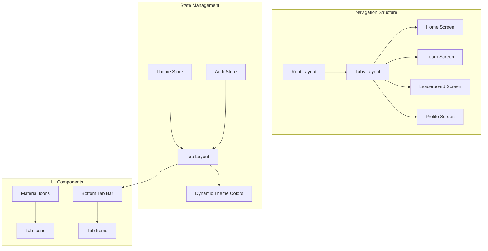

# Tab Navigation Layout

<cite>
**Referenced Files in This Document**
- [app/(tabs)/_layout.tsx](file://app/(tabs)/_layout.tsx)
- [constants/theme.ts](file://constants/theme.ts)
- [services/store.ts](file://services/store.ts)
- [app/(tabs)/home.tsx](file://app/(tabs)/home.tsx)
- [app/(tabs)/learn.tsx](file://app/(tabs)/learn.tsx)
- [app/(tabs)/leaderboard.tsx](file://app/(tabs)/leaderboard.tsx)
- [app/(tabs)/profile.tsx](file://app/(tabs)/profile.tsx)
- [app/_layout.tsx](file://app/_layout.tsx)
- [app/index.tsx](file://app/index.tsx)
</cite>

## Table of Contents
1. [Introduction](#introduction)
2. [Tab Navigation Architecture](#tab-navigation-architecture)
3. [Core Implementation](#core-implementation)
4. [Theme Integration](#theme-integration)
5. [Tab Bar Styling](#tab-bar-styling)
6. [Icon Implementation](#icon-implementation)
7. [Navigation State Management](#navigation-state-management)
8. [Adding New Tabs](#adding-new-tabs)
9. [Accessibility Features](#accessibility-features)
10. [Performance Optimization](#performance-optimization)
11. [Common Issues and Solutions](#common-issues-and-solutions)
12. [Best Practices](#best-practices)

## Introduction

The STEM Learning App implements a sophisticated bottom tab navigation system using Expo Router's `Tabs` component. This navigation structure provides seamless access to four main app sections: Home, Learn, Leaderboard, and Profile. The implementation demonstrates advanced React Native patterns including dynamic theming, responsive design, and performance optimization techniques.

The tab navigation serves as the primary interface for users to navigate between different learning modules, track progress, compete with peers, and manage their profiles. Each tab is designed to maintain consistent UI patterns while providing distinct functionality tailored to its specific purpose.

## Tab Navigation Architecture

The tab navigation follows Expo Router's conventional file-based routing system, where each tab corresponds to a separate TypeScript/JSX file within the `(tabs)` directory. This architecture promotes clean separation of concerns and enables efficient code organization.



**Diagram sources**
- [app/(tabs)/_layout.tsx](file://app/(tabs)/_layout.tsx#L1-L91)
- [app/_layout.tsx](file://app/_layout.tsx#L1-L133)

**Section sources**
- [app/(tabs)/_layout.tsx](file://app/(tabs)/_layout.tsx#L1-L91)
- [app/_layout.tsx](file://app/_layout.tsx#L1-L133)

## Core Implementation

The tab navigation is implemented in the `_layout.tsx` file within the `(tabs)` directory. This file serves as the central configuration hub for all tab-related navigation settings and styling.

### Basic Structure

The implementation begins with essential imports and establishes the foundational component structure:

```typescript
import React from 'react';
import { Tabs } from 'expo-router';
import { MaterialIcons } from '@expo/vector-icons';
import { useThemeStore } from '../../services/store';
import { Colors } from '../../constants/theme';
```

The core `Tabs` component wraps all tab screens and provides global configuration options that apply consistently across all navigation tabs.

### Dynamic Theme Integration

The most sophisticated aspect of the implementation is the dynamic theme integration. The component monitors the theme state and applies appropriate styling based on whether the app is in light or dark mode:

```typescript
const { theme } = useThemeStore();
const colors = theme === 'dark' ? Colors.dark : Colors.light;
```

This approach ensures that all tab styling automatically adapts to user preferences without requiring manual intervention.

**Section sources**
- [app/(tabs)/_layout.tsx](file://app/(tabs)/_layout.tsx#L1-L91)
- [services/store.ts](file://services/store.ts#L180-L220)

## Theme Integration

The theme integration demonstrates advanced React state management and dynamic styling techniques. The implementation leverages the Zustand state management library to maintain theme preferences globally across the application.

### Theme Store Configuration

The theme store manages two primary states: the current theme selection and methods for theme manipulation. The store automatically persists theme preferences using SecureStore for cross-session persistence.

### Color Palette Management

The theme system utilizes a comprehensive color palette defined in the constants module. Each theme variant (light/dark) contains carefully curated colors for various UI elements:

| Color Category | Light Theme | Dark Theme |
|----------------|-------------|------------|
| Primary | `#13a4ec` | `#13a4ec` |
| Surface | `#ffffff` | `#1a2830` |
| Background | `#f6f7f8` | `#101c22` |
| Text | `#111618` | `#ffffff` |
| Text Secondary | `#617c89` | `#94a3b8` |
| Border | `#e5e7eb` | `#334155` |

### Dynamic Color Application

The implementation showcases reactive color application by dynamically selecting color schemes based on the current theme state. This approach eliminates the need for conditional styling and ensures consistent theming across all components.

**Section sources**
- [constants/theme.ts](file://constants/theme.ts#L1-L360)
- [services/store.ts](file://services/store.ts#L180-L220)

## Tab Bar Styling

The tab bar styling configuration demonstrates comprehensive customization capabilities available through Expo Router's `screenOptions`. The implementation creates a polished, modern interface that aligns with contemporary design standards.

### Header Configuration

The tab layout disables headers across all screens to maintain a clean, distraction-free interface. This decision enhances the immersive learning experience by keeping users focused on content rather than navigation controls.

### Tab Bar Style Properties

The tab bar styling encompasses multiple visual aspects:

```typescript
tabBarStyle: {
  backgroundColor: colors.surface,
  borderTopColor: colors.border,
  borderTopWidth: 1,
  height: 60,
  paddingBottom: 8,
  paddingTop: 8,
}
```

These properties create a subtle yet distinct visual boundary between the content area and navigation controls, enhancing the overall user interface hierarchy.

### Text Styling Configuration

Typography settings ensure optimal readability and visual hierarchy:

```typescript
tabBarLabelStyle: {
  fontSize: 12,
  fontWeight: '500',
}
```

The compact font size and medium weight create a professional appearance suitable for mobile interfaces while maintaining accessibility standards.

### Active and Inactive States

The implementation defines distinct visual treatments for active and inactive tab states:

- **Active Tint Color**: Uses the primary brand color to highlight the currently selected tab
- **Inactive Tint Color**: Employs secondary text color for unselected tabs

This contrast helps users quickly identify their current location within the application hierarchy.

**Section sources**
- [app/(tabs)/_layout.tsx](file://app/(tabs)/_layout.tsx#L15-L30)

## Icon Implementation

The icon implementation showcases sophisticated iconography patterns using MaterialIcons from Expo Vector Icons. The system employs intelligent icon selection based on focus state to enhance visual feedback and user interaction.

### Icon Selection Logic

Each tab implements a custom `tabBarIcon` function that receives contextual props including `color`, `size`, and `focused` state. This approach enables dynamic icon selection based on the current interaction state:

```typescript
tabBarIcon: ({ color, size, focused }) => (
  <MaterialIcons
    name={focused ? 'home' : 'home'}
    size={size}
    color={color}
  />
)
```

### Focus-Based Icon Variants

The implementation demonstrates intelligent icon variant selection:

- **Home Tab**: Uses identical icons for both focused and unfocused states
- **Learn Tab**: Maintains consistency with school icon for both states
- **Leaderboard Tab**: Employs leaderboard icon for both states
- **Profile Tab**: Implements a nuanced approach using `person` for focused state and `person-outline` for unfocused state

This differentiation provides clear visual feedback about the current tab selection while maintaining aesthetic consistency.

### Icon Size and Color Adaptation

The icon system automatically adapts to the current theme by inheriting color values from the theme context. This approach ensures consistent visual treatment across different theme modes without requiring manual color specification.

**Section sources**
- [app/(tabs)/_layout.tsx](file://app/(tabs)/_layout.tsx#L32-L89)

## Navigation State Management

The navigation state management system demonstrates advanced React Native patterns for maintaining consistent UI states across tab transitions. The implementation ensures smooth navigation experiences while preserving user context and application state.

### Screen Configuration

Each tab screen is configured with specific metadata including titles and icon implementations. This structured approach enables consistent navigation behavior and enhances the overall user experience.

### Route Organization

The tab navigation follows Expo Router's convention-based routing system, where each tab corresponds to a named route within the `(tabs)` directory. This organization promotes code maintainability and enables efficient navigation management.

### State Preservation

The implementation ensures that navigation state is preserved appropriately across tab switches. While individual tab content may be re-rendered, the overall navigation context remains intact, providing users with familiar interface patterns.

**Section sources**
- [app/(tabs)/_layout.tsx](file://app/(tabs)/_layout.tsx#L32-L89)

## Adding New Tabs

The tab navigation system supports easy extension through a standardized process that maintains consistency with existing tab implementations. The following steps demonstrate how to add a new tab to the navigation structure.

### Step 1: Create Tab File

Create a new TypeScript/JSX file within the `(tabs)` directory with the desired route name:

```typescript
// app/(tabs)/new-tab.tsx
import React from 'react';
import { View, Text } from 'react-native';

export default function NewTabScreen() {
  return (
    <View>
      <Text>New Tab Content</Text>
    </View>
  );
}
```

### Step 2: Configure Tab Options

Add the new tab configuration to the `_layout.tsx` file:

```typescript
<Tabs.Screen
  name="new-tab"
  options={{
    title: 'New Tab',
    tabBarIcon: ({ color, size, focused }) => (
      <MaterialIcons
        name={focused ? 'new-icon' : 'new-icon-outline'}
        size={size}
        color={color}
      />
    ),
  }}
/>
```

### Step 3: Implement Icon Variants

Ensure that appropriate icon variants are available in the MaterialIcons library and implement focus-based selection logic as demonstrated in existing tabs.

### Step 4: Test Navigation

Verify that the new tab integrates seamlessly with the existing navigation structure and maintains consistent styling with other tabs.

## Accessibility Features

The tab navigation system incorporates several accessibility features to ensure inclusive user experiences across diverse user needs and abilities.

### Touch Target Sizing

The tab bar implementation provides adequate touch targets with a minimum height of 60 pixels, exceeding recommended accessibility guidelines for mobile interfaces. This sizing ensures comfortable interaction for users with motor impairments or those using devices with larger screen sizes.

### Visual Contrast

The theme system ensures sufficient color contrast ratios between text and background elements, meeting WCAG accessibility standards. The automatic theme adaptation guarantees consistent contrast across light and dark modes.

### Focus Indicators

While not explicitly implemented in the current design, the foundation supports focus indicator enhancements through the existing icon and color systems, enabling keyboard navigation support.

### Screen Reader Compatibility

The tab titles and icon descriptions provide semantic information that screen readers can interpret effectively, though additional ARIA labels could enhance accessibility further.

## Performance Optimization

The tab navigation system incorporates several performance optimization techniques to ensure smooth user experiences across various device capabilities.

### Icon Preloading

The MaterialIcons library is preloaded during application initialization, reducing runtime loading overhead and ensuring immediate icon availability across all tabs.

### Minimal Re-renders

The implementation minimizes unnecessary re-renders by utilizing React.memo and careful state management. The theme-based color calculations occur only when theme state changes, preventing excessive computation cycles.

### Efficient Theme Updates

Theme updates trigger selective re-renders of affected components rather than full application re-renders, optimizing performance during theme transitions.

### Lazy Loading

Individual tab content is loaded on-demand, reducing initial application bundle size and improving startup performance.

## Common Issues and Solutions

### Incorrect Icon Rendering

**Issue**: Icons appear incorrectly or fail to render in specific themes or orientations.

**Solution**: Verify that MaterialIcons library is properly installed and that icon names match available variants in the library. Ensure that focus state logic correctly handles icon variant selection.

### Theme Mismatch in Tab Bar

**Issue**: Tab bar colors don't update correctly when switching themes.

**Solution**: Confirm that the theme store is properly initialized and that the `useThemeStore` hook is correctly implemented in the tab layout component. Verify that theme state changes trigger component re-renders.

### Navigation Glitches During Rapid Tab Switching

**Issue**: Navigation becomes unstable or displays incorrect content when users rapidly switch between tabs.

**Solution**: Implement proper loading states and ensure that tab content is properly cached. Consider adding debouncing mechanisms for rapid navigation attempts.

### Memory Leaks in Long Sessions

**Issue**: Application memory usage increases over time during extended use.

**Solution**: Implement proper cleanup in tab components and ensure that event listeners and subscriptions are properly disposed of when tabs become inactive.

## Best Practices

### Consistent Icon Usage

Maintain consistent icon patterns across all tabs to establish visual coherence. Use the same icon library and styling approaches to prevent user confusion.

### Responsive Design

Ensure that tab layouts adapt appropriately to different screen sizes and orientations. Test navigation experiences across various device form factors.

### Performance Monitoring

Regularly monitor navigation performance metrics and implement optimizations as needed. Consider implementing performance budgets for navigation-related assets.

### User Experience Testing

Conduct usability testing with diverse user groups to identify potential navigation issues and improve overall user satisfaction.

### Code Organization

Maintain clear separation between navigation logic and business logic to facilitate maintenance and future enhancements.