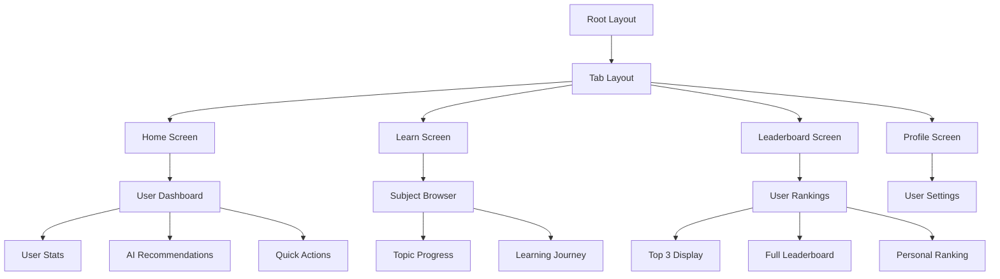
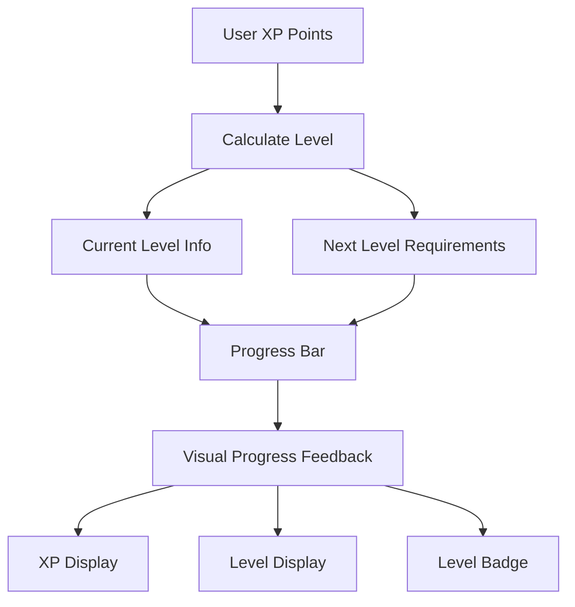
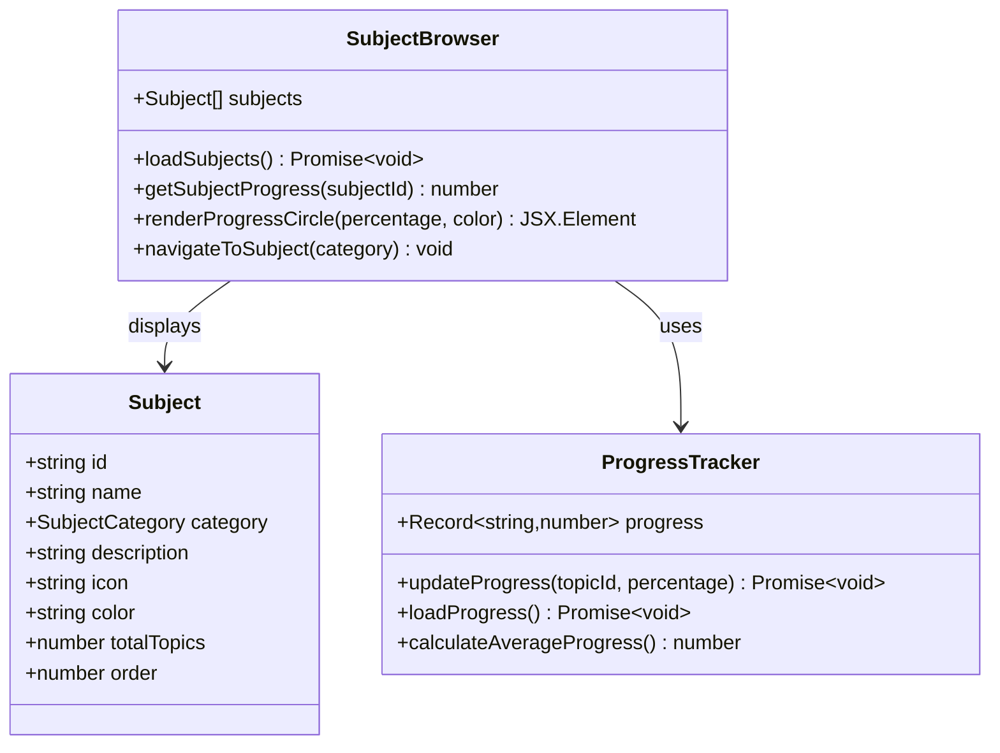
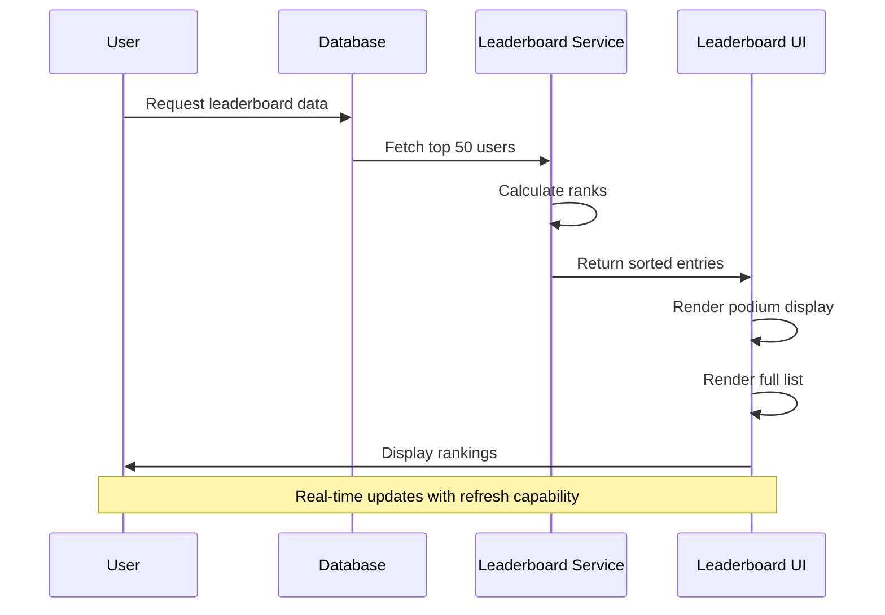
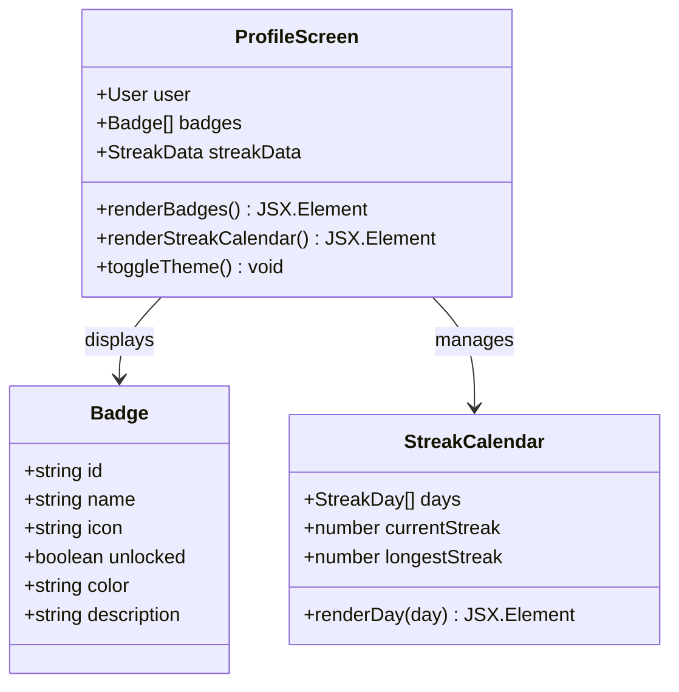
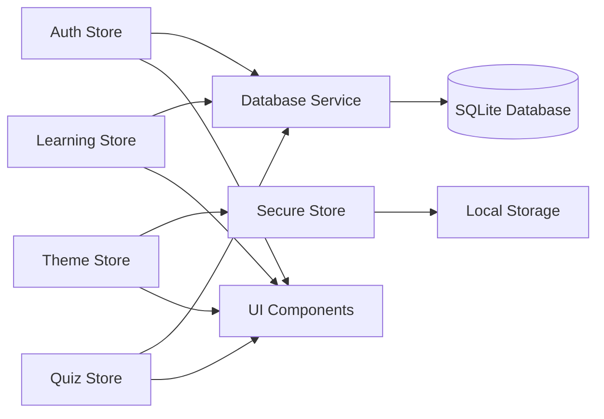

# Core Features

<cite>
**Referenced Files in This Document**
- [app/(tabs)/home.tsx](file://app/(tabs)/home.tsx)
- [app/(tabs)/learn.tsx](file://app/(tabs)/learn.tsx)
- [app/(tabs)/profile.tsx](file://app/(tabs)/profile.tsx)
- [app/(tabs)/leaderboard.tsx](file://app/(tabs)/leaderboard.tsx)
- [services/database.ts](file://services/database.ts)
- [services/store.ts](file://services/store.ts)
- [constants/theme.ts](file://constants/theme.ts)
- [types/index.ts](file://types/index.ts)
- [app/(tabs)/_layout.tsx](file://app/(tabs)/_layout.tsx)
- [app/_layout.tsx](file://app/_layout.tsx)
</cite>

## Table of Contents
1. [Introduction](#introduction)
2. [Navigation Architecture](#navigation-architecture)
3. [Home Screen Features](#home-screen-features)
4. [Learn Screen Features](#learn-screen-features)
5. [Leaderboard Features](#leaderboard-features)
6. [Profile Management](#profile-management)
7. [Data Flow Architecture](#data-flow-architecture)
8. [Performance Optimization](#performance-optimization)
9. [Accessibility Features](#accessibility-features)
10. [Extending Core Features](#extending-core-features)
11. [Best Practices](#best-practices)

## Introduction

The STEM Learning App provides a comprehensive educational platform built around four core tab navigation screens: Home, Learn, Leaderboard, and Profile. Each screen delivers specialized functionality while maintaining consistent design patterns and seamless data flow through a centralized state management system.

The application follows an offline-first architecture with gamification elements, adaptive learning recommendations, and responsive UI components. Built with React Native and Expo, it offers cross-platform compatibility with native performance characteristics.

## Navigation Architecture

The app uses a bottom tab navigation system that provides intuitive access to all major features. The navigation structure is implemented using Expo Router's tab system with consistent theming and accessibility support.

**Diagram sources**
- [app/(tabs)/_layout.tsx](file://app/(tabs)/_layout.tsx#L1-L91)
- [app/_layout.tsx](file://app/_layout.tsx#L1-L133)

**Section sources**
- [app/(tabs)/_layout.tsx](file://app/(tabs)/_layout.tsx#L1-L91)
- [app/_layout.tsx](file://app/_layout.tsx#L1-L133)

## Home Screen Features

The Home screen serves as the central dashboard, displaying user statistics, quick actions, and personalized AI recommendations. It provides immediate access to key learning features and progress indicators.

### User Statistics Display

The home screen prominently displays three key metrics that motivate continued learning:

- **XP Points**: Total experience points earned across all activities
- **Badges**: Number of achievements unlocked
- **Streak**: Current consecutive days of learning activity

Each statistic is presented in a card format with appropriate visual indicators and contextual information.

### Level Progress Visualization

The level progress component shows the user's current standing in the gamification system:

**Diagram sources**
- [constants/theme.ts](file://constants/theme.ts#L180-L220)
- [app/(tabs)/home.tsx](file://app/(tabs)/home.tsx#L150-L200)

### AI Recommendations System

The home screen includes an intelligent recommendation engine that suggests learning content based on user performance and progress patterns. The AI system considers:

- Recent learning activity
- Subject preferences
- Performance trends
- Time spent on topics

### Quick Action Buttons

Four primary action buttons provide rapid access to key features:
- **Learn**: Navigate to subject selection
- **Quiz**: Access quiz functionality
- **Leaderboard**: View competitive rankings
- **Profile**: Manage personal settings

**Section sources**
- [app/(tabs)/home.tsx](file://app/(tabs)/home.tsx#L1-L509)
- [constants/theme.ts](file://constants/theme.ts#L180-L220)

## Learn Screen Features

The Learn screen provides comprehensive subject browsing and topic progression tracking. It serves as the primary interface for accessing educational content and monitoring learning progress.

### Subject Browsing Interface

The subject browser presents STEM categories in an organized grid format:

**Diagram sources**
- [app/(tabs)/learn.tsx](file://app/(tabs)/learn.tsx#L1-L352)
- [types/index.ts](file://types/index.ts#L40-L60)

### Topic Progress Tracking

Each subject displays individual progress through multiple visual indicators:

- **Progress Circles**: Circular progress indicators with percentage display
- **Progress Bars**: Linear progress bars with subject-specific colors
- **Completion Status**: Visual indicators for completed vs. pending topics

### Learning Journey Navigation

The screen includes a "Continue Learning" section that shows recently accessed subjects, encouraging users to resume their learning sessions. This feature helps maintain momentum and reinforces learning continuity.

**Section sources**
- [app/(tabs)/learn.tsx](file://app/(tabs)/learn.tsx#L1-L352)
- [services/store.ts](file://services/store.ts#L200-L300)

## Leaderboard Features

The Leaderboard screen creates a competitive environment by displaying user rankings and fostering engagement through friendly competition. It implements a sophisticated ranking system with visual hierarchy and user-centric features.

### Ranking System Architecture

The leaderboard employs a multi-tiered ranking structure:

**Diagram sources**
- [app/(tabs)/leaderboard.tsx](file://app/(tabs)/leaderboard.tsx#L1-L547)
- [services/database.ts](file://services/database.ts#L750-L822)

### Top Three Display

The leaderboard features a visually striking podium display for the top three users:

- **Gold Medal**: First-place user with special styling
- **Silver Medal**: Second-place user with distinct appearance
- **Bronze Medal**: Third-place user with unique presentation

Each podium position includes:
- User avatar with rank badge
- Username display
- XP points and level information
- Special medal indicators

### Personal Ranking Integration

Every user sees their own ranking prominently displayed, along with:
- Current rank position
- Personal XP points
- Level progression
- Comparison to next rank

### Full Leaderboard Display

The complete leaderboard shows up to 50 users with:
- Rank numbers
- User avatars
- Names with "You" indicator for current user
- XP points
- Level information

**Section sources**
- [app/(tabs)/leaderboard.tsx](file://app/(tabs)/leaderboard.tsx#L1-L547)
- [services/database.ts](file://services/database.ts#L750-L822)

## Profile Management

The Profile screen handles comprehensive user management including personal information, achievement tracking, and theme preferences. It provides a centralized hub for user customization and progress review.

### Achievement Display System

The profile showcases user accomplishments through a well-organized badge system:

**Diagram sources**
- [app/(tabs)/profile.tsx](file://app/(tabs)/profile.tsx#L1-L498)
- [types/index.ts](file://types/index.ts#L120-L150)

### Theme Preferences

The profile screen includes comprehensive theme management:

- **Light/Dark Toggle**: Immediate theme switching
- **Automatic Theme**: System preference detection
- **Persistent Storage**: Theme preferences saved locally
- **Real-time Updates**: Instant visual feedback

### User Information Management

Profile editing capabilities include:
- Basic information updates
- Avatar customization
- Contact details management
- Privacy settings

**Section sources**
- [app/(tabs)/profile.tsx](file://app/(tabs)/profile.tsx#L1-L498)
- [services/store.ts](file://services/store.ts#L100-L200)

## Data Flow Architecture

The app implements a centralized state management system using Zustand stores that handle authentication, theme preferences, learning progress, and quiz state. This architecture ensures consistent data flow and optimal performance.

### State Management Pattern

**Diagram sources**
- [services/store.ts](file://services/store.ts#L1-L570)
- [services/database.ts](file://services/database.ts#L1-L822)

### Database Operations

The database service provides comprehensive CRUD operations with transaction support and offline-first capabilities. Key operations include:

- **User Management**: Authentication, profile updates, preferences
- **Content Management**: Subject, topic, lesson, and quiz data
- **Progress Tracking**: Learning progress and completion status
- **Gamification**: XP, badges, streaks, and leaderboard updates

### Caching Strategy

The app implements intelligent caching to optimize performance:

- **Memory Cache**: Frequently accessed data in memory
- **Database Cache**: Persistent data storage
- **Network Cache**: Offline operation support
- **Component Cache**: React memoization for UI performance

**Section sources**
- [services/store.ts](file://services/store.ts#L1-L570)
- [services/database.ts](file://services/database.ts#L1-L822)

## Performance Optimization

The app implements several performance optimization strategies to ensure smooth operation across different devices and network conditions.

### Data-Heavy Screen Optimization

For screens with substantial data loads (Home, Learn, Leaderboard):

- **Virtual Scrolling**: Efficient rendering of large lists
- **Lazy Loading**: On-demand content loading
- **Image Optimization**: Compressed and cached images
- **Memoization**: React.memo and useMemo for expensive computations

### Memory Management

- **Component Unmounting**: Proper cleanup of event listeners
- **State Optimization**: Minimal state updates
- **Image Caching**: Reduced network requests
- **Database Indexing**: Fast query performance

### Offline Performance

- **Preloaded Content**: Essential data available offline
- **Incremental Downloads**: Progressive content loading
- **Background Sync**: Asynchronous data synchronization
- **Cache Validation**: Intelligent cache invalidation

## Accessibility Features

The app incorporates comprehensive accessibility features to ensure usability for all users, including those with disabilities.

### Keyboard Navigation

- **Focus Management**: Logical tab order through interactive elements
- **Keyboard Shortcuts**: Alternative navigation methods
- **Focus Indicators**: Clear visual focus states
- **Skip Links**: Quick navigation to main content

### Screen Reader Support

- **Semantic HTML**: Proper ARIA labels and roles
- **Descriptive Text**: Meaningful button and link labels
- **Progress Announcements**: Learning progress updates
- **Error Messages**: Clear accessibility-friendly error reporting

### Visual Accessibility

- **High Contrast**: Sufficient color contrast ratios
- **Scalable Text**: Responsive typography scaling
- **Color Independence**: Information conveyed beyond color alone
- **Large Touch Targets**: Minimum 44px touch areas

### Audio Considerations

- **Sound Effects**: Optional audio feedback
- **Volume Control**: Respect system audio settings
- **Alternative Formats**: Text alternatives for audio content

**Section sources**
- [ERROR_HANDLING_GUIDE.md](file://ERROR_HANDLING_GUIDE.md#L346-L353)

## Extending Core Features

The modular architecture allows for easy extension of existing features while maintaining architectural consistency.

### Adding New Subject Categories

To add a new subject category:

1. **Update Subject Configuration**: Add to SUBJECT_CONFIG in theme constants
2. **Database Schema**: Add new subject record
3. **UI Components**: Update subject cards and navigation
4. **Content Management**: Add topics, lessons, and quizzes

### Implementing New Gamification Elements

New gamification features can be added through:

- **Badge System**: Extend badge requirements and unlock conditions
- **XP Rewards**: Add new XP earning opportunities
- **Streak Bonuses**: Implement additional streak benefits
- **Achievement Triggers**: Create new achievement criteria

### Customizing AI Recommendations

The AI recommendation system can be enhanced by:

- **Learning Algorithms**: Implement machine learning models
- **User Behavior Analysis**: Track and analyze learning patterns
- **Content Matching**: Improve content recommendation accuracy
- **Performance Prediction**: Predict future learning outcomes

### Theme Customization

Theme extensions can include:

- **Custom Palettes**: Additional color schemes
- **Typography Options**: Font family variations
- **Animation Presets**: Custom transition effects
- **Accessibility Themes**: Enhanced accessibility options

## Best Practices

### Maintaining Architectural Consistency

- **State Management**: Use centralized stores for shared data
- **Component Design**: Follow established design patterns
- **Data Flow**: Maintain unidirectional data flow
- **Error Handling**: Implement consistent error boundaries

### Code Organization

- **File Structure**: Maintain logical separation of concerns
- **Naming Conventions**: Use consistent naming patterns
- **Documentation**: Document complex functionality
- **Testing**: Implement comprehensive test coverage

### Performance Guidelines

- **Bundle Size**: Minimize JavaScript bundle size
- **Rendering**: Optimize component re-renders
- **Memory Usage**: Monitor and manage memory consumption
- **Network Requests**: Minimize unnecessary API calls

### Security Considerations

- **Data Encryption**: Encrypt sensitive user data
- **Secure Storage**: Use platform-specific secure storage
- **Input Validation**: Validate all user inputs
- **Privacy Compliance**: Adhere to privacy regulations