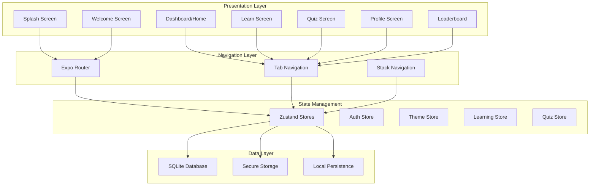
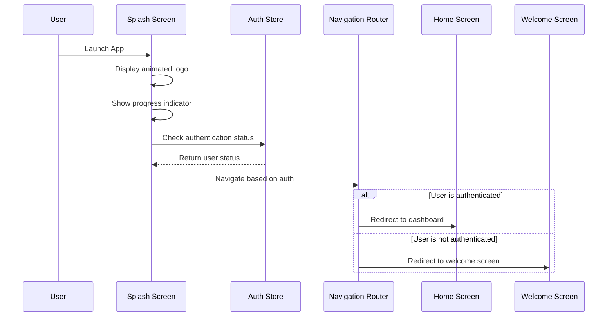
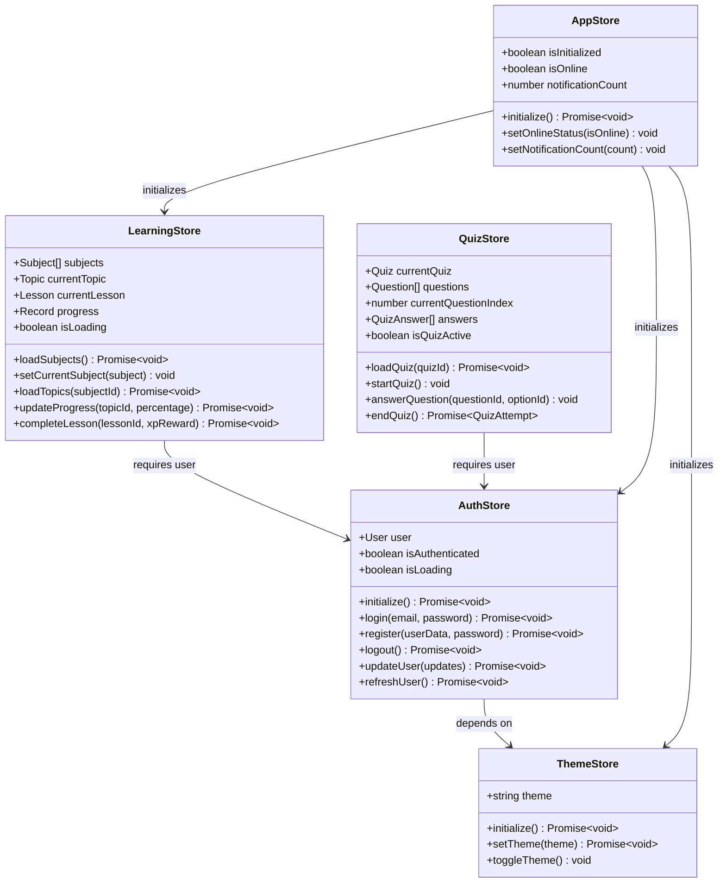
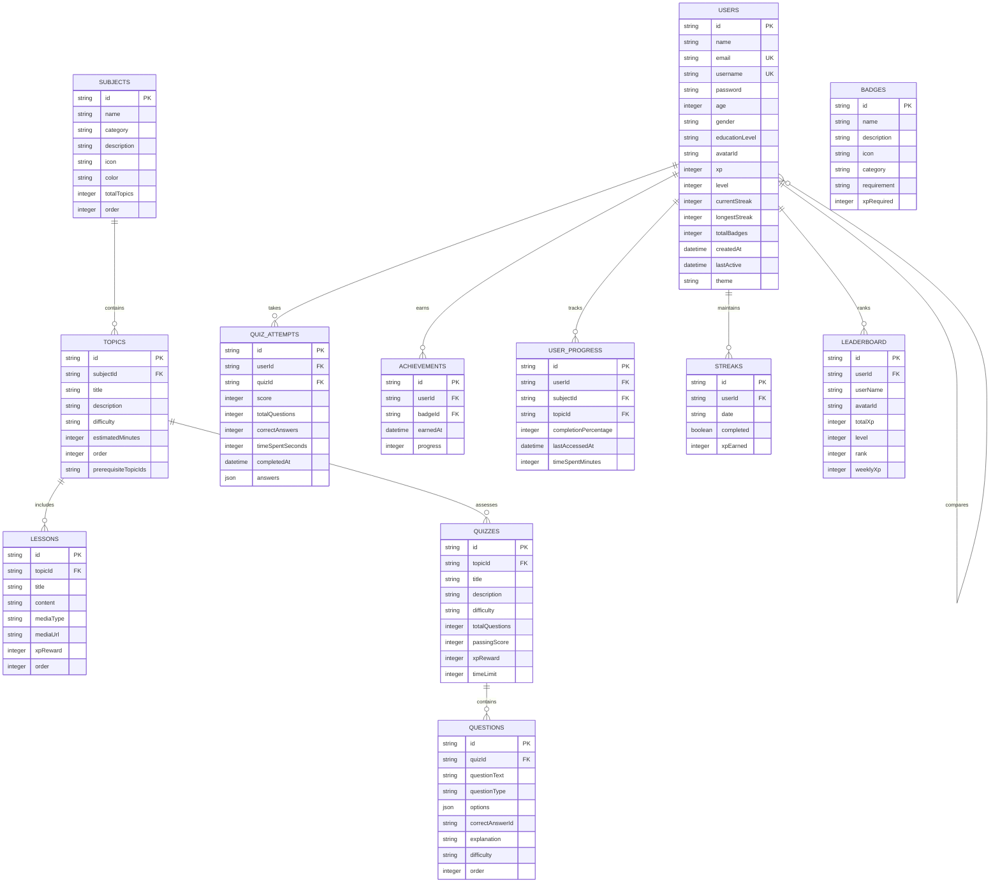

# Project Overview

<cite>
**Referenced Files in This Document**
- [README.md](file://README.md)
- [package.json](file://package.json)
- [app/index.tsx](file://app/index.tsx)
- [app/_layout.tsx](file://app/_layout.tsx)
- [app/(tabs)/_layout.tsx](file://app/(tabs)/_layout.tsx)
- [app/welcome.tsx](file://app/welcome.tsx)
- [app/(tabs)/home.tsx](file://app/(tabs)/home.tsx)
- [app/(tabs)/learn.tsx](file://app/(tabs)/learn.tsx)
- [app/(tabs)/leaderboard.tsx](file://app/(tabs)/leaderboard.tsx)
- [app/(tabs)/profile.tsx](file://app/(tabs)/profile.tsx)
- [services/store.ts](file://services/store.ts)
- [services/database.ts](file://services/database.ts)
- [constants/theme.ts](file://constants/theme.ts)
- [types/index.ts](file://types/index.ts)
- [app.json](file://app.json)
- [eas.json](file://eas.json)
</cite>

## Table of Contents
1. [Introduction](#introduction)
2. [Project Purpose and Vision](#project-purpose-and-vision)
3. [Target Audience](#target-audience)
4. [Core Features and Functionality](#core-features-and-functionality)
5. [Technical Architecture](#technical-architecture)
6. [Gamification System](#gamification-system)
7. [Offline-First Design](#offline-first-design)
8. [Navigation Flow](#navigation-flow)
9. [State Management](#state-management)
10. [Database Architecture](#database-architecture)
11. [Performance Considerations](#performance-considerations)
12. [Common Onboarding Issues](#common-onboarding-issues)
13. [Development Setup](#development-setup)
14. [Conclusion](#conclusion)

## Introduction

The STEM Learning App is an innovative offline-first, gamified educational platform designed specifically for students aged 10-20 in Zambia. Built with React Native and Expo, this application delivers accessible STEM education through interactive learning experiences, gamification mechanics, and personalized progress tracking. The app serves as a comprehensive solution for enhancing STEM literacy in educational environments where internet connectivity may be unreliable or unavailable.

## Project Purpose and Vision

### Mission Statement
The STEM Learning App aims to democratize access to quality STEM education by providing an engaging, offline-capable learning platform that adapts to individual student needs and motivates continuous learning through gamification.

### Educational Goals
- **Accessibility**: Deliver STEM education to students in remote areas with limited internet access
- **Engagement**: Transform traditional learning into an interactive, rewarding experience
- **Personalization**: Adapt content delivery based on individual learning patterns and performance
- **Retention**: Foster long-term interest in STEM subjects through positive reinforcement
- **Equity**: Provide equal learning opportunities regardless of geographical or economic constraints

**Section sources**
- [README.md](file://README.md#L1-L50)

## Target Audience

### Primary Users
- **Students**: Ages 10-20 in Zambian educational institutions
- **Educators**: Teachers seeking supplementary learning materials
- **Parents**: Guardians supporting children's educational development

### Secondary Users
- **Educational Administrators**: School principals and curriculum developers
- **Community Leaders**: Organizations promoting STEM education initiatives

### User Characteristics
- **Device Access**: Smartphones and tablets commonly available in Zambian households
- **Internet Connectivity**: Variable, with emphasis on offline functionality
- **Educational Background**: Students from diverse socioeconomic backgrounds
- **Learning Preferences**: Visual learners benefiting from multimedia content

**Section sources**
- [README.md](file://README.md#L51-L100)

## Core Features and Functionality

### Interactive Learning Modules
The app provides comprehensive STEM education across four core subject areas:

#### Subject Categories
- **Science**: Biology, Chemistry, Physics, Earth Science
- **Technology**: Programming, Web Development, Digital Literacy
- **Engineering**: Mechanical, Electrical, Civil Engineering Principles
- **Mathematics**: Algebra, Geometry, Calculus, Statistics

#### Content Delivery
- **Rich Multimedia Lessons**: Text, images, and interactive elements
- **Adaptive Quizzes**: Multiple-choice questions with instant feedback
- **Progress Tracking**: Real-time monitoring of learning achievements
- **Personalized Recommendations**: AI-driven content suggestions

### Gamification System
The app incorporates a sophisticated gamification framework designed to motivate and engage learners:

#### XP and Leveling System
- **20-Level Progression**: From Beginner to Einstein
- **Experience Points**: Earned through lesson completion and quiz performance
- **Level Advancement**: Unlock new challenges and content

#### Achievement System
- **Badge Collection**: Visual rewards for milestones and accomplishments
- **Streak Tracking**: Daily learning streaks with motivational incentives
- **Leaderboard Competition**: Friendly competition among peers

### User Management
- **Local Authentication**: Secure user accounts stored locally
- **Guest Mode**: Limited access for anonymous users
- **Profile Customization**: Personalized avatars and preferences

**Section sources**
- [README.md](file://README.md#L101-L200)

## Technical Architecture

### Foundation Technologies
The app is built on a robust technological foundation optimized for educational applications:

#### React Native and Expo
- **Cross-platform Compatibility**: Single codebase for Android, iOS, and Web
- **Rapid Development**: Hot reloading and live updates during development
- **Native Performance**: Near-native performance with React Native's bridge
- **Expo Ecosystem**: Simplified dependency management and build processes

#### TypeScript Integration
- **Type Safety**: Comprehensive type definitions for all application components
- **Developer Experience**: Enhanced IDE support with IntelliSense
- **Runtime Reliability**: Compile-time error detection and prevention

#### Architecture Patterns
- **Modular Design**: Separation of concerns across distinct modules
- **Component-Based Architecture**: Reusable UI components and layouts
- **State Management**: Centralized state with predictable updates
- **Database Abstraction**: Unified interface for data persistence

**Diagram sources**
- [app/_layout.tsx](file://app/_layout.tsx#L1-L50)
- [services/store.ts](file://services/store.ts#L1-L100)

**Section sources**
- [package.json](file://package.json#L1-L43)
- [app.json](file://app.json#L1-L50)

## Gamification System

### XP and Reward Mechanics
The gamification system is designed to create intrinsic motivation through a well-structured reward hierarchy:

#### XP Point System
- **Lesson Completion**: 50 XP per completed lesson
- **Quiz Performance**: 75-200 XP based on difficulty and score
- **Perfect Scores**: Additional 50 XP bonus
- **Daily Streaks**: 25 XP per day maintained
- **Weekly Streaks**: 100 XP bonus for 7 consecutive days
- **Badge Earnings**: 150 XP for each achievement unlocked

#### Level Progression
The leveling system provides clear progression milestones:

| Level | XP Required | Title | Description |
|-------|-------------|-------|-------------|
| 1 | 0 | Beginner | Starting your STEM journey |
| 5 | 800 | Scientist | Demonstrating scientific knowledge |
| 10 | 3,800 | Master | Mastery of fundamental concepts |
| 15 | 9,300 | Prodigy | Exceptional problem-solving skills |
| 20 | 17,300 | Einstein | STEM excellence |

### Achievement and Badge System
The achievement system recognizes various learning milestones and encourages continued engagement:

#### General Badges
- **First Steps**: Complete your first lesson
- **Quiz Champion**: Pass 10 quizzes
- **Perfect Score**: Achieve 100% on any quiz
- **Week Warrior**: Maintain a 7-day streak

#### Subject-Specific Badges
- **Science Star**: Complete 5 Science lessons (500 XP)
- **Tech Wizard**: Complete 5 Technology lessons (500 XP)
- **Engineering Pro**: Complete 5 Engineering lessons (500 XP)
- **Math Master**: Complete 5 Mathematics lessons (500 XP)

### Leaderboard System
The local leaderboard fosters healthy competition among users:

- **Real-time Updates**: Leaderboard recalculates after each XP gain
- **Local Ranking**: Compete with other users on the same device
- **Weekly Challenges**: Special weekly XP bonuses
- **Social Sharing**: Encourage friendly competition

**Section sources**
- [README.md](file://README.md#L201-L300)
- [constants/theme.ts](file://constants/theme.ts#L150-L250)

## Offline-First Design

### Core Principles
The offline-first architecture ensures uninterrupted learning experiences regardless of internet connectivity:

#### Data Persistence
- **SQLite Database**: Local storage for all educational content
- **Secure Storage**: Encrypted user credentials and preferences
- **File System**: Offline access to multimedia content
- **Cache Management**: Intelligent caching of frequently accessed data

#### Synchronization Strategy
- **Local-First Approach**: All operations occur locally by default
- **Conflict Resolution**: Handle simultaneous changes gracefully
- **Graceful Degradation**: Reduced functionality when offline
- **Reconciliation**: Sync data when connectivity is restored

#### Performance Optimization
- **Lazy Loading**: Load content only when needed
- **Image Optimization**: Compressed images for faster loading
- **Memory Management**: Efficient component lifecycle management
- **Background Processing**: Non-blocking operations for smooth UI

### Offline Capabilities
The app maintains full functionality without internet connectivity:

| Feature | Offline Status | Description |
|---------|----------------|-------------|
| User Authentication | ✅ Fully Supported | Login and registration without network |
| Content Access | ✅ Fully Supported | Browse and access all lessons and quizzes |
| Progress Tracking | ✅ Fully Supported | Monitor learning progress locally |
| XP and Badge Systems | ✅ Fully Supported | Earn and track achievements offline |
| Local Leaderboard | ✅ Fully Supported | Compare with other local users |
| Theme Preferences | ✅ Fully Supported | Customize appearance offline |

**Section sources**
- [README.md](file://README.md#L301-L350)
- [services/database.ts](file://services/database.ts#L1-L100)

## Navigation Flow

### Application Lifecycle
The app follows a structured navigation flow designed for seamless user experience:

#### Splash Screen Phase
The splash screen serves as the initial entry point, establishing the app's identity and preparing for user authentication:

**Diagram sources**
- [app/index.tsx](file://app/index.tsx#L1-L100)
- [app/_layout.tsx](file://app/_layout.tsx#L40-L80)

#### Authentication Flow
The authentication process accommodates both new and returning users:

1. **Initial Check**: Verify if user is already authenticated
2. **Guest Mode**: Offer limited access for anonymous users
3. **Registration**: New users create accounts with personal information
4. **Login**: Existing users authenticate with credentials
5. **Profile Setup**: Complete user profile with preferences

#### Tab Navigation Structure
Once authenticated, users access the main application through a bottom tab navigation system:

- **Home Tab**: Dashboard with user statistics and recommendations
- **Learn Tab**: Browse and select subjects for study
- **Quiz Tab**: Practice with subject-specific quizzes
- **Profile Tab**: Manage user profile and settings

### Routing Configuration
The app utilizes Expo Router for declarative navigation:

#### Screen Definitions
- **index.tsx**: Splash screen with automatic redirection
- **welcome.tsx**: Registration and login interface
- **(tabs)**: Main tab navigation container
- **lesson/[id].tsx**: Individual lesson pages
- **quiz/[id].tsx**: Quiz interface with dynamic routing
- **quiz-result.tsx**: Quiz completion and results

#### Navigation Transitions
The app employs smooth transitions between screens:
- **Slide Animations**: Horizontal sliding for tab changes
- **Fade Effects**: Smooth appearance for modal screens
- **Scale Transitions**: Dynamic scaling for emphasis
- **Progressive Loading**: Gradual reveal of content elements

**Section sources**
- [app/index.tsx](file://app/index.tsx#L40-L90)
- [app/_layout.tsx](file://app/_layout.tsx#L60-L130)
- [app/(tabs)/_layout.tsx](file://app/(tabs)/_layout.tsx#L1-L90)

## State Management

### Zustand Store Architecture
The app employs Zustand for centralized state management, providing predictable and scalable state handling:

#### Store Composition
The state management system consists of multiple specialized stores:

**Diagram sources**
- [services/store.ts](file://services/store.ts#L1-L200)

#### Authentication State
The AuthStore manages user authentication and session persistence:

- **User Context**: Current user information and authentication status
- **Session Management**: Automatic login state persistence
- **Credential Security**: Secure storage of user credentials
- **State Synchronization**: Real-time updates across components

#### Theme Management
The ThemeStore handles application appearance preferences:

- **Light/Dark Mode**: Automatic theme switching based on system preferences
- **User Preferences**: Persistent theme selection across sessions
- **Dynamic Updates**: Real-time theme changes without app restart
- **Accessibility**: Color contrast adjustments for visual accessibility

#### Learning State
The LearningStore tracks educational progress and content access:

- **Subject Navigation**: Current subject and topic selection
- **Progress Monitoring**: Completion percentages and learning metrics
- **Content Organization**: Hierarchical structure of educational material
- **Performance Analytics**: Learning patterns and achievement tracking

#### Quiz State
The QuizStore manages assessment functionality:

- **Quiz Lifecycle**: Creation, execution, and completion of assessments
- **Question Management**: Dynamic question loading and response handling
- **Scoring System**: Automated scoring with immediate feedback
- **Attempt History**: Comprehensive record of quiz performance

**Section sources**
- [services/store.ts](file://services/store.ts#L1-L570)

## Database Architecture

### SQLite Implementation
The app utilizes SQLite for robust local data persistence, providing ACID compliance and efficient query performance:

#### Database Schema Design
The database schema is optimized for educational content management:

**Diagram sources**
- [services/database.ts](file://services/database.ts#L100-L300)

#### Data Relationships
The database establishes meaningful relationships between educational entities:

- **Hierarchical Structure**: Subjects contain topics, which contain lessons and quizzes
- **Progress Tracking**: User progress linked to specific topics and subjects
- **Assessment History**: Comprehensive quiz attempt records with detailed analytics
- **Achievement System**: Badge unlocking tied to user performance and milestones

#### Migration Strategy
The database implements a robust migration system for schema evolution:

- **Version Control**: Track database schema versions for backward compatibility
- **Automatic Updates**: Seamless migration of existing data to new schema versions
- **Data Integrity**: Preserve user data during migration processes
- **Rollback Capability**: Revert to previous schema versions if needed

#### Performance Optimization
Database performance is optimized through several strategies:

- **Indexing**: Strategic indexes on frequently queried columns
- **Query Optimization**: Efficient SQL queries with minimal resource usage
- **Connection Pooling**: Manage database connections efficiently
- **Transaction Management**: Atomic operations for data consistency

**Section sources**
- [services/database.ts](file://services/database.ts#L1-L822)

## Performance Considerations

### Low-End Device Optimization
The app is specifically designed to perform well on low-end devices commonly found in educational settings:

#### Memory Management
- **Component Lifecycle**: Proper cleanup of unused components and listeners
- **Image Optimization**: Compressed images with progressive loading
- **State Minimization**: Reduce unnecessary state updates and re-renders
- **Lazy Loading**: Load components and data only when needed

#### Battery Efficiency
- **Background Processing**: Minimal background tasks to preserve battery life
- **Network Optimization**: Reduce unnecessary network requests
- **Animation Performance**: Hardware-accelerated animations for smooth performance
- **Resource Cleanup**: Proper disposal of timers and intervals

#### Storage Optimization
- **Data Compression**: Compress stored data to minimize storage usage
- **Cache Management**: Intelligent caching with automatic cleanup
- **File Size Control**: Limit multimedia file sizes for faster loading
- **Storage Monitoring**: Track and optimize storage consumption

### Network Performance (Offline-First)
Since the app operates primarily offline, network-related performance considerations are minimized:

#### Offline-First Benefits
- **Zero Latency**: Immediate access to content without network delays
- **Consistent Performance**: Reliable operation regardless of network conditions
- **Reduced Data Usage**: Eliminate mobile data consumption
- **Improved Reliability**: Consistent functionality across varying connectivity

#### Progressive Enhancement
- **Enhanced Features**: Additional features become available with internet connectivity
- **Graceful Degradation**: Core functionality remains intact offline
- **Intelligent Sync**: Automatic synchronization when connectivity is restored
- **Conflict Resolution**: Handle simultaneous changes across devices

### User Experience Optimization
The app prioritizes smooth user experience across all device capabilities:

#### Animation Performance
- **Hardware Acceleration**: Utilize GPU acceleration for smooth animations
- **Frame Rate Optimization**: Maintain consistent 60 FPS during transitions
- **Animation Caching**: Pre-compute animations for repeated use
- **Performance Monitoring**: Track and optimize animation performance

#### Content Loading
- **Progressive Loading**: Load content progressively for faster perceived performance
- **Placeholder Management**: Use appropriate placeholders during loading states
- **Error Handling**: Graceful handling of loading failures
- **Retry Mechanisms**: Automatic retry for transient loading issues

**Section sources**
- [README.md](file://README.md#L400-L452)

## Common Onboarding Issues

### Authentication Problems
Several common issues may arise during user onboarding:

#### Registration Failures
- **Duplicate Email**: Users attempting to register with existing email addresses
- **Weak Passwords**: Insufficient password complexity requirements
- **Age Validation**: Incorrect age input outside acceptable range (10-20)
- **Field Validation**: Missing required information in registration form

#### Login Difficulties
- **Credential Mismatch**: Incorrect email or password combinations
- **Account Not Found**: Attempting to login with non-existent accounts
- **Password Recovery**: Lack of password reset functionality
- **Session Management**: Issues with persistent login sessions

### Technical Issues
#### App Initialization Problems
- **Database Corruption**: Corrupted SQLite database preventing app startup
- **Migration Failures**: Issues during database schema upgrades
- **Storage Limitations**: Insufficient device storage for app installation
- **Permission Issues**: Missing required device permissions

#### Network-Related Problems
- **False Offline Detection**: App incorrectly detecting offline status
- **Sync Conflicts**: Issues resolving data conflicts during sync
- **Timeout Errors**: Long-running operations timing out unexpectedly
- **Data Loss**: Unintended data loss during network operations

### Performance Issues
#### Slow Loading Times
- **Large Media Files**: Heavy multimedia content slowing app startup
- **Insufficient Memory**: Low memory devices struggling with app operations
- **Storage Bottlenecks**: Slow storage access affecting app responsiveness
- **Background Processes**: Other applications consuming system resources

#### User Interface Problems
- **Rendering Issues**: Components not displaying correctly
- **Animation Failures**: Smooth animations failing to execute
- **Touch Responsiveness**: Delayed or unresponsive touch interactions
- **Layout Problems**: Content not displaying in intended layout

### Solutions and Workarounds
#### Database Reset Procedures
When encountering database-related issues:
1. **Clear App Data**: Reset application data through device settings
2. **Reinstall Application**: Fresh installation resolves corruption issues
3. **Backup Restoration**: Restore from previous backup if available
4. **Manual Cleanup**: Remove cached data and temporary files

#### Network Troubleshooting
For connectivity-related problems:
1. **Force Restart**: Completely close and reopen the application
2. **Cache Clearing**: Clear application cache and temporary data
3. **Permission Reset**: Grant required permissions manually
4. **System Restart**: Restart device to resolve system-level issues

#### Performance Optimization
To improve app performance:
1. **Close Background Apps**: Free up system resources
2. **Clear Storage**: Remove unnecessary files to free up space
3. **Update System**: Ensure device operating system is current
4. **Monitor Usage**: Track app resource consumption patterns

**Section sources**
- [README.md](file://README.md#L453-L500)

## Development Setup

### Prerequisites
The development environment requires specific tools and configurations:

#### Required Software
- **Node.js**: Version 16 or higher for JavaScript runtime
- **npm or yarn**: Package managers for dependency installation
- **Expo CLI**: Command-line interface for Expo development
- **Android Studio**: Android development environment (for Android development)
- **Xcode**: Apple's development environment (for iOS development, macOS only)

#### Development Tools
- **Code Editor**: Visual Studio Code with recommended extensions
- **React Developer Tools**: Browser extension for React component inspection
- **Expo Go**: Mobile application for testing Expo projects
- **Database Viewer**: Tool for inspecting SQLite database contents

### Installation Process
#### Step-by-Step Setup
1. **Repository Cloning**: Clone the STEM Learning App repository
2. **Dependency Installation**: Install all required npm packages
3. **Development Server**: Start the Expo development server
4. **Device Testing**: Test on physical devices or emulators
5. **Platform-Specific Builds**: Generate platform-specific binaries

#### Environment Configuration
The app requires specific configuration for optimal development:

- **App Configuration**: Customize app settings in `app.json`
- **Theme Customization**: Modify color schemes and typography
- **Database Schema**: Configure database structure and seeding
- **API Endpoints**: Set up backend services (if applicable)

### Build Configuration
#### Production Builds
The app supports automated production builds through EAS (Expo Application Services):

- **Android APK Generation**: Automated APK creation for distribution
- **iOS IPA Compilation**: IPA generation for App Store submission
- **Web Deployment**: Static web build for browser deployment
- **Internal Distribution**: Internal testing builds for team members

#### Quality Assurance
Development includes comprehensive testing procedures:

- **Unit Testing**: Individual component and function testing
- **Integration Testing**: Cross-component functionality verification
- **Performance Testing**: Device performance benchmarking
- **User Acceptance Testing**: Real-world usage validation

**Section sources**
- [README.md](file://README.md#L501-L550)
- [eas.json](file://eas.json#L1-L22)

## Conclusion

The STEM Learning App represents a comprehensive solution for delivering accessible, engaging STEM education in Zambia's educational landscape. Through its offline-first architecture, sophisticated gamification system, and robust technical foundation, the app addresses critical educational challenges while providing an enjoyable learning experience.

### Key Strengths
- **Accessibility**: Offline functionality ensures education reaches remote areas
- **Engagement**: Gamification mechanics motivate continuous learning
- **Personalization**: Adaptive content delivery based on individual progress
- **Reliability**: Robust architecture withstands varied connectivity conditions
- **Scalability**: Modular design supports future feature additions

### Future Enhancements
The app's architecture supports numerous potential improvements:

- **Cloud Sync**: Optional cloud synchronization for cross-device access
- **Multi-language Support**: Expanded language options for broader reach
- **Advanced Analytics**: Detailed learning analytics and reporting
- **Social Features**: Peer collaboration and community building
- **Content Creation**: User-generated content and customization

### Impact Potential
By combining educational content with engaging gameplay mechanics, the STEM Learning App has the potential to significantly enhance STEM literacy among Zambian students, fostering a new generation of innovators and problem solvers equipped with essential 21st-century skills.

The app's commitment to offline-first design, coupled with its comprehensive feature set and robust technical foundation, positions it as a valuable educational tool that can adapt to evolving educational needs while maintaining accessibility for all students.