# Routing & Navigation

<cite>
**Referenced Files in This Document**
- [app/index.tsx](file://app/index.tsx)
- [app/welcome.tsx](file://app/welcome.tsx)
- [app/_layout.tsx](file://app/_layout.tsx)
- [app/(tabs)/_layout.tsx](file://app/(tabs)/_layout.tsx)
- [app/(tabs)/home.tsx](file://app/(tabs)/home.tsx)
- [app/(tabs)/leaderboard.tsx](file://app/(tabs)/leaderboard.tsx)
- [app/(tabs)/learn.tsx](file://app/(tabs)/learn.tsx)
- [app/(tabs)/profile.tsx](file://app/(tabs)/profile.tsx)
- [services/store.ts](file://services/store.tsx)
- [services/database.ts](file://services/database.ts)
</cite>

## Table of Contents
1. [Introduction](#introduction)
2. [Expo Router Architecture](#expo-router-architecture)
3. [File-Based Routing System](#file-based-routing-system)
4. [Navigation Flow Overview](#navigation-flow-overview)
5. [Root Layout Configuration](#root-layout-configuration)
6. [Tab-Based Navigation](#tab-based-navigation)
7. [Authentication Flow](#authentication-flow)
8. [Screen Transitions and Animations](#screen-transitions-and-animations)
9. [Navigation Guards and State Management](#navigation-guards-and-state-management)
10. [Deep Linking and URL Patterns](#deep-linking-and-url-patterns)
11. [Performance Optimization](#performance-optimization)
12. [Common Issues and Solutions](#common-issues-and-solutions)
13. [Best Practices](#best-practices)

## Introduction

The STEM Learning App utilizes Expo Router's file-based routing system to create a seamless navigation experience. The app implements a sophisticated navigation architecture that handles authentication flows, tab-based navigation, and state management across different screens. This system ensures smooth transitions between the splash screen, authentication screens, and main application tabs while maintaining optimal performance and user experience.

## Expo Router Architecture

Expo Router provides a powerful file-based routing system that automatically generates routes based on the file structure within the `app` directory. The architecture follows Expo's convention where each `.tsx` file becomes a route, and nested directories create hierarchical navigation structures.

```mermaid
graph TB
subgraph "App Directory Structure"
A[app/] --> B[index.tsx]
A --> C[welcome.tsx]
A --> D[_layout.tsx]
A --> E[(tabs)/]
E --> F[_layout.tsx]
E --> G[home.tsx]
E --> H[leaderboard.tsx]
E --> I[learn.tsx]
E --> J[profile.tsx]
end
subgraph "Navigation Flow"
K[Splash Screen] --> L{Authenticated?}
L --> |Yes| M[Main Tabs]
L --> |No| N[Welcome Screen]
M --> O[Home Tab]
M --> P[Learn Tab]
M --> Q[Leaderboard Tab]
M --> R[Profile Tab]
end
```

**Diagram sources**
- [app/index.tsx](file://app/index.tsx#L1-L202)
- [app/welcome.tsx](file://app/welcome.tsx#L1-L1276)
- [app/_layout.tsx](file://app/_layout.tsx#L1-L133)
- [app/(tabs)/_layout.tsx](file://app/(tabs)/_layout.tsx#L1-L91)

## File-Based Routing System

The app uses Expo Router's automatic routing capabilities where each file in the `app` directory corresponds to a specific route. The routing system supports:

### Route Naming Conventions
- **index.tsx**: Default route for `/` (splash screen)
- **welcome.tsx**: Authentication route for `/welcome`
- **(tabs)**: Named group for tab navigation
- **(tabs)/home.tsx**: Home tab route
- **(tabs)/learn.tsx**: Learn tab route
- **(tabs)/leaderboard.tsx**: Leaderboard tab route
- **(tabs)/profile.tsx**: Profile tab route

### Nested Layouts
The `(tabs)` directory creates a named group that encapsulates tab navigation. The `_layout.tsx` file within this directory defines the tab structure and shared UI elements.

**Section sources**
- [app/index.tsx](file://app/index.tsx#L1-L202)
- [app/welcome.tsx](file://app/welcome.tsx#L1-L1276)
- [app/(tabs)/_layout.tsx](file://app/(tabs)/_layout.tsx#L1-L91)

## Navigation Flow Overview

The app implements a clear navigation flow that guides users from initial launch through authentication to the main application interface.


**Diagram sources**
- [app/index.tsx](file://app/index.tsx#L46-L60)
- [services/store.ts](file://services/store.tsx#L40-L85)

## Root Layout Configuration

The root layout (`_layout.tsx`) serves as the main navigation container that manages global navigation state and screen transitions.

### Key Features
- **Splash Screen Management**: Controls splash screen visibility and timing
- **Global Navigation State**: Manages app initialization and authentication loading
- **Stack Navigation**: Defines screen transitions and animations
- **Theme Integration**: Applies theme colors across all screens

### Screen Configuration
The root layout defines specific configurations for each screen:

| Screen | Animation | Header | Purpose |
|--------|-----------|---------|---------|
| index | None | Hidden | Splash screen entry point |
| welcome | Fade | Hidden | Authentication interface |
| (tabs) | None | Hidden | Main tab navigator |
| lesson/[id] | Slide | Visible | Individual lesson pages |
| quiz/[id] | Slide | Visible | Quiz interface |
| quiz-result | Slide | Visible | Quiz results display |

**Section sources**
- [app/_layout.tsx](file://app/_layout.tsx#L1-L133)

## Tab-Based Navigation

The tab navigation system provides a bottom-tab interface for accessing main app sections. The tab layout is defined in `(tabs)/_layout.tsx`.

### Tab Configuration
Each tab is configured with:

- **Title**: Display name for the tab
- **Icon**: Material Icons for visual identification
- **Route**: Corresponding screen path
- **Styling**: Theme-aware appearance with custom colors

### Tab Structure

```mermaid
graph LR
A[Home] --> B[Learn]
B --> C[Leaderboard]
C --> D[Profile]
D --> A
subgraph "Tab Icons"
E[🏠 Home]
F[🎓 Learn]
G[🏆 Leaderboard]
H[👤 Profile]
end
```


**Diagram sources**
- [app/(tabs)/_layout.tsx](file://app/(tabs)/_layout.tsx#L20-L85)

### Tab Navigation Implementation
The tab navigation system supports:

- **Bottom Navigation Bar**: Persistent navigation interface
- **Icon States**: Active/inactive states with color changes
- **Accessibility**: Proper labeling and focus management
- **Theme Integration**: Dynamic theming support

**Section sources**
- [app/(tabs)/_layout.tsx](file://app/(tabs)/_layout.tsx#L1-L91)
- [app/(tabs)/home.tsx](file://app/(tabs)/home.tsx#L1-L509)
- [app/(tabs)/learn.tsx](file://app/(tabs)/learn.tsx#L1-L352)
- [app/(tabs)/leaderboard.tsx](file://app/(tabs)/leaderboard.tsx#L1-L547)
- [app/(tabs)/profile.tsx](file://app/(tabs)/profile.tsx#L1-L498)

## Authentication Flow

The authentication system implements a seamless flow from splash screen through registration/login to the main application.

### Authentication States
The app manages three primary states:
- **Loading**: Initial app startup and authentication check
- **Authenticated**: User is logged in and accessing main features
- **Not Authenticated**: User needs to log in or register

### Navigation Triggers
Authentication state changes trigger immediate navigation:

```mermaid
flowchart TD
A[App Starts] --> B[Check Auth Status]
B --> C{Is Loading?}
C --> |Yes| D[Show Loading]
C --> |No| E{Is Authenticated?}
E --> |Yes| F[Navigate to (tabs)/home]
E --> |No| G[Navigate to welcome]
F --> H[Main App Ready]
G --> I[Auth Screen Ready]
```

**Diagram sources**
- [app/index.tsx](file://app/index.tsx#L46-L60)
- [services/store.ts](file://services/store.tsx#L40-L85)

### Authentication Screens
The welcome screen provides comprehensive authentication functionality:

- **Login Tab**: Email/password authentication
- **Registration Tab**: User creation with validation
- **Guest Mode**: Limited access option
- **Form Validation**: Real-time input validation
- **Error Handling**: User-friendly error messages

**Section sources**
- [app/index.tsx](file://app/index.tsx#L1-L202)
- [app/welcome.tsx](file://app/welcome.tsx#L1-L1276)
- [services/store.ts](file://services/store.tsx#L40-L150)

## Screen Transitions and Animations

The app implements sophisticated transition animations to enhance user experience and provide visual continuity.

### Transition Types
- **Slide From Right**: Standard navigation between screens
- **Fade**: Authentication transitions
- **None**: Tab navigation (immediate switching)

### Animation Configuration
Each screen type receives specific animation treatment:


**Diagram sources**
- [app/_layout.tsx](file://app/_layout.tsx#L45-L85)

### Custom Animations
The splash screen implements custom animations:
- **Logo Entrance**: Spring animation with scaling
- **Progress Bar**: Linear progression animation
- **Fade Effects**: Smooth opacity transitions

**Section sources**
- [app/index.tsx](file://app/index.tsx#L25-L50)
- [app/_layout.tsx](file://app/_layout.tsx#L45-L85)

## Navigation Guards and State Management

The app implements robust navigation guards through the authentication store and state management system.

### State Management Integration
Navigation decisions are made based on global state:

- **Authentication Status**: Determines initial route
- **Loading State**: Controls splash screen timing
- **User Data**: Influences navigation permissions

### Navigation Control Flow


**Diagram sources**
- [services/store.ts](file://services/store.tsx#L40-L85)
- [app/index.tsx](file://app/index.tsx#L46-L60)

### Error Handling
Navigation errors are handled gracefully:
- **Network Failures**: Retry mechanisms and fallback routes
- **Authentication Errors**: Automatic redirection to login
- **State Corruption**: Recovery through store reset

**Section sources**
- [services/store.ts](file://services/store.tsx#L40-L150)
- [app/index.tsx](file://app/index.tsx#L46-L60)

## Deep Linking and URL Patterns

The app supports deep linking for direct access to specific content and features.

### Supported URL Patterns
- **Authentication**: `/welcome` - Direct access to login/register
- **Content**: `/lesson/:id` - Specific lesson access
- **Quizzes**: `/quiz/:id` - Specific quiz access
- **Results**: `/quiz-result` - Quiz results page

### Deep Link Implementation
Deep links are processed through Expo Router's built-in linking system:


**Diagram sources**
- [app/_layout.tsx](file://app/_layout.tsx#L60-L100)

### URL Parameter Handling
The app supports dynamic routing with parameters:
- **Lesson ID**: `/lesson/sci-topic-001-lesson-001`
- **Quiz ID**: `/quiz/math-topic-001-quiz-001`
- **User ID**: `/profile/:userId` (future implementation)

**Section sources**
- [app/_layout.tsx](file://app/_layout.tsx#L60-L100)

## Performance Optimization

The navigation system implements several performance optimization strategies to ensure smooth user experience.

### Lazy Loading Strategies
- **Tab Content**: Each tab loads independently when accessed
- **Screen Components**: Heavy components are loaded on demand
- **Data Fetching**: Async data loading prevents blocking navigation

### Memory Management
- **Component Unmounting**: Proper cleanup of navigation components
- **State Persistence**: Selective state retention across navigations
- **Resource Cleanup**: Efficient handling of animations and timers

### Navigation Performance Tips
1. **Preload Critical Data**: Load essential data before navigation
2. **Optimize Animations**: Use native drivers for smooth animations
3. **Minimize Re-renders**: Implement proper memoization
4. **Bundle Splitting**: Separate navigation logic from content

### Monitoring and Metrics
The app tracks navigation performance:
- **Navigation Timing**: Measure transition durations
- **Memory Usage**: Monitor component memory consumption
- **Error Rates**: Track navigation failures

**Section sources**
- [services/store.ts](file://services/store.tsx#L524-L568)
- [app/_layout.tsx](file://app/_layout.tsx#L20-L40)

## Common Issues and Solutions

### Navigation State Persistence
**Issue**: Navigation state lost after app restart
**Solution**: Implement state persistence using SecureStore for authentication tokens

### Tab Reinitialization
**Issue**: Tabs reload data unnecessarily on navigation
**Solution**: Use React.memo and selective state updates

### Back Button Behavior
**Issue**: Unexpected navigation on back button press
**Solution**: Implement proper navigation stack management

### Deep Linking Problems
**Issue**: Deep links not working correctly
**Solution**: Configure linking prefixes and handle URL parsing

### Performance Issues
**Issue**: Slow navigation transitions
**Solution**: Optimize animations and implement proper lazy loading

**Section sources**
- [services/store.ts](file://services/store.tsx#L150-L200)
- [app/_layout.tsx](file://app/_layout.tsx#L30-L50)

## Best Practices

### Navigation Architecture
1. **Separation of Concerns**: Keep navigation logic separate from business logic
2. **Centralized State Management**: Use stores for navigation state
3. **Type Safety**: Implement proper typing for navigation parameters
4. **Error Boundaries**: Handle navigation errors gracefully

### User Experience
1. **Smooth Transitions**: Use appropriate animations for context
2. **Loading States**: Show indicators during navigation
3. **Accessibility**: Ensure navigation is keyboard and screen reader friendly
4. **Consistency**: Maintain consistent navigation patterns

### Development Workflow
1. **Testing**: Thoroughly test navigation flows
2. **Debugging**: Use navigation debugging tools
3. **Documentation**: Document custom navigation logic
4. **Performance**: Monitor navigation performance regularly

### Security Considerations
1. **Authentication Guards**: Implement proper route protection
2. **State Security**: Secure sensitive navigation state
3. **URL Validation**: Validate navigation parameters
4. **Session Management**: Handle authentication state properly

The STEM Learning App's routing and navigation system demonstrates a well-architected approach to mobile application navigation, combining Expo Router's powerful file-based routing with robust state management and performance optimization techniques. This system provides a seamless user experience while maintaining code organization and scalability.