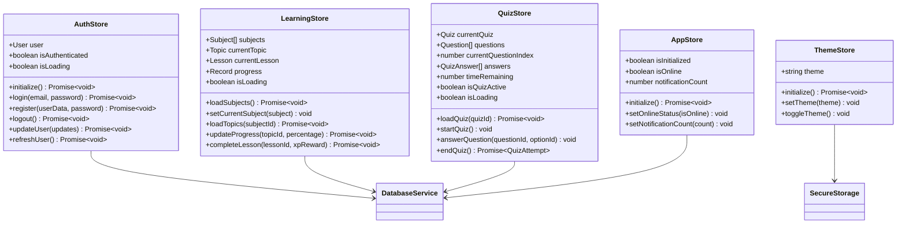

# State Management

<cite>
**Referenced Files in This Document**
- [services/store.ts](file://services/store.ts)
- [services/database.ts](file://services/database.ts)
- [types/index.ts](file://types/index.ts)
- [constants/theme.ts](file://constants/theme.ts)
- [app/_layout.tsx](file://app/_layout.tsx)
- [app/(tabs)/home.tsx](file://app/(tabs)/home.tsx)
- [app/(tabs)/learn.tsx](file://app/(tabs)/learn.tsx)
- [app/(tabs)/leaderboard.tsx](file://app/(tabs)/leaderboard.tsx)
</cite>

## Table of Contents
1. [Introduction](#introduction)
2. [Architecture Overview](#architecture-overview)
3. [Store Composition and Organization](#store-composition-and-organization)
4. [Authentication Store](#authentication-store)
5. [Theme Store](#theme-store)
6. [Learning Progress Store](#learning-progress-store)
7. [Quiz State Management](#quiz-state-management)
8. [Application State Store](#application-state-store)
9. [Database Integration](#database-integration)
10. [Component Subscription Patterns](#component-subscription-patterns)
11. [Best Practices](#best-practices)
12. [Performance Optimization](#performance-optimization)
13. [Troubleshooting Guide](#troubleshooting-guide)
14. [Conclusion](#conclusion)

## Introduction

The STEM Learning App employs a sophisticated Zustand-based state management system that orchestrates multiple specialized stores to handle authentication, theme preferences, learning progress tracking, and quiz state management. This architecture ensures seamless synchronization between application state and persistent SQLite storage while maintaining optimal performance and user experience.

The state management system is built around five core stores that work together to provide a cohesive learning experience: Authentication Store for user session management, Theme Store for appearance customization, Learning Store for educational progress tracking, Quiz Store for assessment functionality, and Application Store for global UI state coordination.

## Architecture Overview

The state management architecture follows a modular composition pattern where each store handles specific domain concerns while maintaining loose coupling through the database service layer.


**Diagram sources**
- [services/store.ts](file://services/store.ts#L1-L570)
- [services/database.ts](file://services/database.ts#L1-L822)

**Section sources**
- [services/store.ts](file://services/store.ts#L1-L570)

## Store Composition and Organization

The state management system is organized into five distinct stores, each serving specific functional domains. The stores are composed using Zustand's create function and maintain separate namespaces to prevent state conflicts.



**Diagram sources**
- [services/store.ts](file://services/store.ts#L15-L570)
- [services/database.ts](file://services/database.ts#L30-L100)

Each store maintains its own state shape and lifecycle, with the App Store coordinating initialization across all other stores. The modular design allows for independent testing and maintenance while ensuring consistent data flow patterns.

**Section sources**
- [services/store.ts](file://services/store.ts#L15-L570)

## Authentication Store

The Authentication Store manages user sessions, registration, and authentication state. It integrates with the database service for persistent user data and SecureStore for sensitive credentials.

### State Structure and Lifecycle

The authentication store maintains three primary state properties: user data, authentication status, and loading indicators. The store supports asynchronous operations for login, registration, and logout with proper error handling.


**Diagram sources**
- [services/store.ts](file://services/store.ts#L15-L100)

### Key Operations

The authentication store provides comprehensive user management capabilities:

- **Initialization**: Loads current user from secure storage and validates session
- **Login/Registration**: Handles credential validation and user creation
- **Session Management**: Updates user activity timestamps and streaks
- **Profile Updates**: Allows modification of user preferences and personal data
- **Logout**: Clears session data and resets authentication state

### Database Integration Pattern

Authentication operations follow a consistent pattern of state updates followed by database synchronization:

```typescript
// Example pattern from store.ts
login: async (email, password) => {
  set({ isLoading: true });
  const user = await database.authenticateUser(email, password);
  if (user) {
    await database.updateUser(user.id, { lastActive: new Date().toISOString() });
    const updatedUser = await database.getUser(user.id);
    set({ user: updatedUser, isAuthenticated: true });
  }
  set({ isLoading: false });
}
```

**Section sources**
- [services/store.ts](file://services/store.ts#L15-L150)

## Theme Store

The Theme Store manages application appearance preferences with automatic persistence to SecureStore. It supports both light and dark themes with seamless transitions.

### Theme Persistence Strategy

The theme store implements a dual-persistence approach combining SecureStore for long-term preference storage with in-memory state for immediate UI updates.


**Diagram sources**
- [services/store.ts](file://services/store.ts#L200-L250)

### Theme Initialization

Theme initialization occurs during app startup and follows a cascading fallback pattern:

1. Attempt to load saved theme from SecureStore
2. Fall back to system preference or default
3. Apply theme to global state
4. Persist to database if user is authenticated

**Section sources**
- [services/store.ts](file://services/store.ts#L200-L250)

## Learning Progress Store

The Learning Store orchestrates educational content consumption and progress tracking. It manages subject hierarchies, topic navigation, and learning milestones.

### Progress Tracking Architecture

Progress tracking operates on a granular level, recording completion percentages for individual topics within subjects:


**Diagram sources**
- [services/store.ts](file://services/store.ts#L300-L350)

### Content Navigation Flow

The learning store manages hierarchical content navigation through four levels: subjects → topics → lessons → assessments. Each level maintains its own state while contributing to overall progress metrics.

### Progress Synchronization

Progress updates follow a two-phase commit pattern:

1. **Local State Update**: Immediate UI feedback with optimistic updates
2. **Database Persistence**: Asynchronous synchronization with retry logic

**Section sources**
- [services/store.ts](file://services/store.ts#L250-L350)

## Quiz State Management

The Quiz Store provides comprehensive assessment functionality with real-time scoring, timing, and attempt tracking. It manages quiz lifecycle from loading to completion.

### Quiz Lifecycle Management


**Diagram sources**
- [services/store.ts](file://services/store.ts#L370-L524)

### Scoring and Reward System

The quiz system implements a sophisticated scoring mechanism with XP rewards based on performance:

- **Passing Score**: Minimum threshold for XP award
- **Perfect Score Bonus**: Additional XP for 100% accuracy
- **Time Penalty**: Reduced rewards for slower completion
- **Retry Logic**: Multiple attempts with diminishing rewards

### Real-time State Updates

Quiz state updates occur in real-time during active assessment:

```typescript
answerQuestion: (questionId, selectedOptionId) => {
  const { questions, currentQuestionIndex } = get();
  const question = questions[currentQuestionIndex];
  
  const isCorrect = question.correctAnswerId === selectedOptionId;
  const answer: QuizAnswer = {
    questionId,
    selectedOptionId,
    isCorrect,
    timeSpentSeconds: 0,
  };
  
  set((state) => ({
    answers: [...state.answers, answer],
  }));
}
```

**Section sources**
- [services/store.ts](file://services/store.ts#L370-L524)

## Application State Store

The Application Store serves as the central coordinator for global UI state and application initialization. It manages the bootstrapping process and maintains cross-cutting concerns.

### Initialization Sequence

The App Store orchestrates a carefully sequenced initialization process:


**Diagram sources**
- [services/store.ts](file://services/store.ts#L524-L568)

### Global State Coordination

The App Store maintains essential global state including:

- **Initialization Status**: Tracks application readiness
- **Network Connectivity**: Monitors online/offline status
- **Notification Count**: Manages unread notification indicators

**Section sources**
- [services/store.ts](file://services/store.ts#L524-L570)

## Database Integration

The state management system integrates deeply with the SQLite database service, ensuring data consistency and offline-first functionality.

### Database Service Architecture

The database service provides a unified interface for all data operations with automatic migration support and transaction management.


**Diagram sources**
- [services/database.ts](file://services/database.ts#L30-L200)

### Synchronization Patterns

Data synchronization follows several patterns depending on the operation type:

- **Optimistic Updates**: Immediate UI feedback with background persistence
- **Transactional Operations**: Atomic database updates with rollback capability
- **Batch Operations**: Efficient bulk data processing for large datasets
- **Conflict Resolution**: Strategies for handling concurrent modifications

**Section sources**
- [services/database.ts](file://services/database.ts#L1-L822)

## Component Subscription Patterns

Components subscribe to store changes using React hooks that provide reactive state updates and efficient rendering optimization.

### Hook Usage Patterns

Common subscription patterns include:

```typescript
// Basic store subscription
const { user, isAuthenticated } = useAuthStore();
const { subjects, loadSubjects } = useLearningStore();
const { theme } = useThemeStore();
const { currentQuiz, startQuiz } = useQuizStore();

// Derived state computation
const progressPercentage = useMemo(() => {
  return calculateProgress(user.progress, currentTopic);
}, [user.progress, currentTopic]);

// Event handlers with store actions
const handleQuizSubmit = useCallback(async () => {
  const result = await useQuizStore.getState().endQuiz();
  if (result) {
    // Navigate to results
  }
}, []);
```

### Component State Management

Components manage their own local state while subscribing to global store changes:

- **Local State**: UI-specific state that doesn't require persistence
- **Global State**: Shared state managed by stores
- **Derived State**: Computed values based on store subscriptions
- **Event Handlers**: Store action dispatchers

**Section sources**
- [app/_layout.tsx](file://app/_layout.tsx#L15-L50)
- [app/(tabs)/home.tsx](file://app/(tabs)/home.tsx#L20-L60)

## Best Practices

### Store Organization

1. **Single Responsibility**: Each store handles one domain concern
2. **Immutable Updates**: Use Zustand's functional update patterns
3. **Type Safety**: Leverage TypeScript interfaces for store contracts
4. **Error Boundaries**: Implement comprehensive error handling

### Performance Optimization

1. **Selective Subscriptions**: Subscribe only to necessary state slices
2. **Memoization**: Use React.memo and useMemo for expensive computations
3. **Batch Updates**: Group related state changes
4. **Lazy Loading**: Defer non-critical data loading

### State Synchronization

1. **Optimistic UI**: Update immediately, sync later
2. **Conflict Resolution**: Handle concurrent modifications gracefully
3. **Offline Support**: Maintain state consistency during connectivity issues
4. **Data Validation**: Validate state changes before persistence

## Performance Optimization

### Store Performance Patterns

The state management system implements several performance optimization strategies:

- **Computed Properties**: Derive values efficiently using memoization
- **Selective Updates**: Minimize re-renders through targeted subscriptions
- **Batch Operations**: Group related state changes for efficiency
- **Memory Management**: Clean up unused state and subscriptions

### Rendering Optimization

Components optimize rendering through:

- **React.memo**: Prevent unnecessary re-renders
- **useCallback**: Memoize event handlers
- **useMemo**: Cache expensive computations
- **Selective Subscriptions**: Subscribe to minimal state slices

### Database Performance

Database operations are optimized through:

- **Connection Pooling**: Reuse database connections
- **Transaction Batching**: Group related operations
- **Index Optimization**: Proper indexing for query performance
- **Query Optimization**: Efficient SQL statement construction

## Troubleshooting Guide

### Common State Synchronization Issues

**Issue**: State not updating after database changes
**Solution**: Verify store action is properly calling database methods and state updates

**Issue**: Concurrent modifications causing data corruption
**Solution**: Implement proper locking mechanisms and conflict resolution strategies

**Issue**: Memory leaks from store subscriptions
**Solution**: Ensure proper cleanup of event listeners and subscriptions

### Performance Bottlenecks

**Issue**: Slow state updates affecting UI responsiveness
**Solution**: Optimize store selectors and implement proper batching

**Issue**: Excessive re-renders in connected components
**Solution**: Use React.memo and selective state subscriptions

**Issue**: Database queries blocking the main thread
**Solution**: Implement async operations and proper indexing

### Debugging Strategies

1. **Store Inspection**: Use browser dev tools to monitor state changes
2. **Action Logging**: Log store actions for debugging flow issues
3. **Performance Profiling**: Monitor component render times
4. **Database Monitoring**: Track query performance and connection usage

## Conclusion

The Zustand-based state management system in the STEM Learning App demonstrates a sophisticated approach to handling complex application state while maintaining performance and user experience quality. The modular architecture with specialized stores for authentication, theming, learning progress, and quiz management provides clear separation of concerns while ensuring seamless data synchronization.

The system's strength lies in its comprehensive integration with SQLite database services, robust error handling, and performance optimization strategies. The reactive nature of the state management enables responsive user interfaces while maintaining data consistency across offline and online scenarios.

Key benefits of this architecture include:

- **Modularity**: Clear separation of concerns across specialized stores
- **Performance**: Optimized rendering and database operations
- **Reliability**: Comprehensive error handling and synchronization
- **Maintainability**: Well-defined interfaces and TypeScript support
- **Scalability**: Extensible architecture supporting future feature additions

The state management system successfully balances complexity with usability, providing developers with powerful tools for building engaging educational experiences while maintaining the reliability and performance required for production applications.