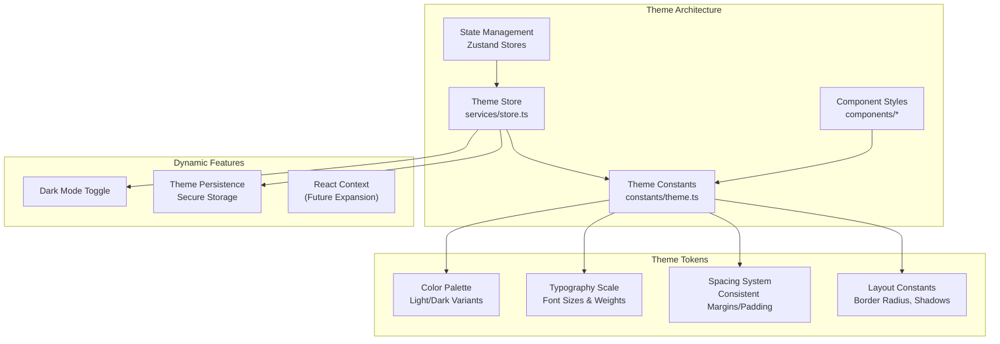
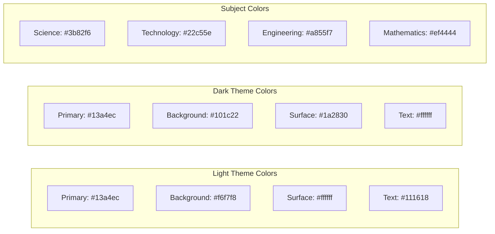
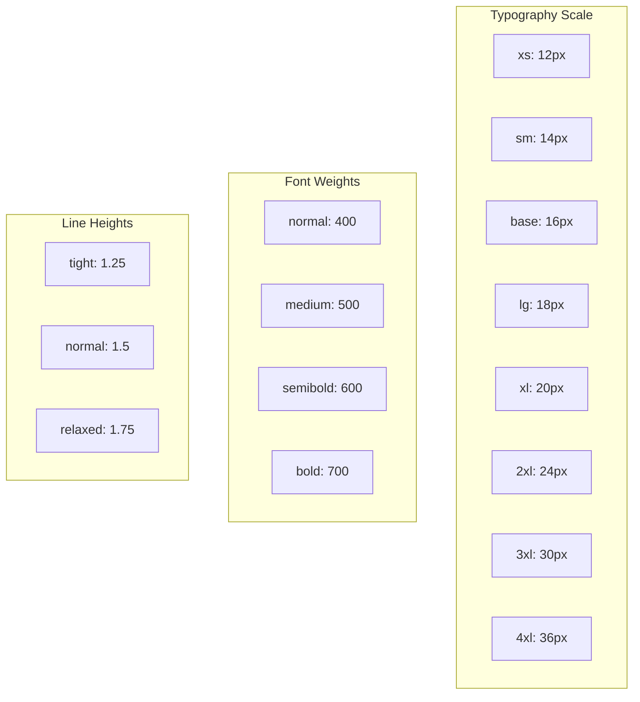
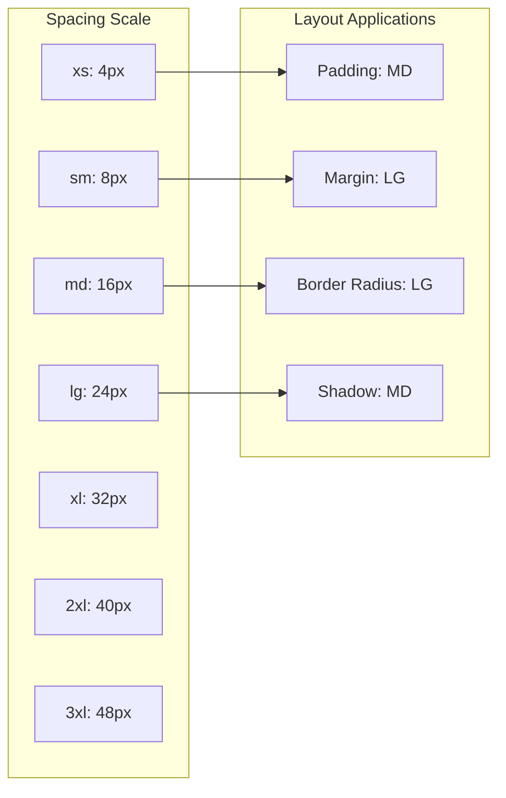
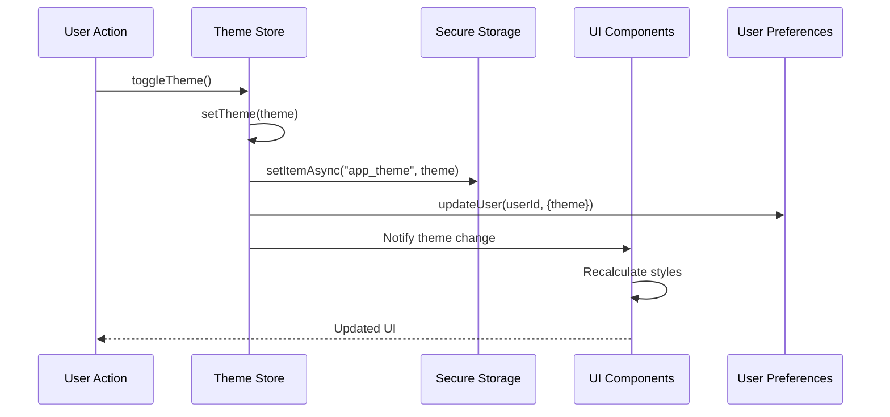
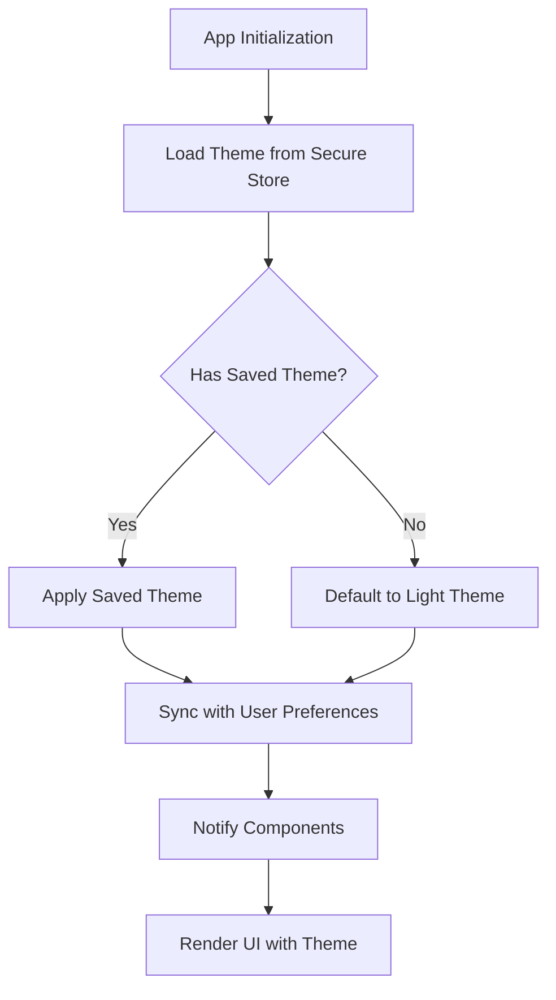
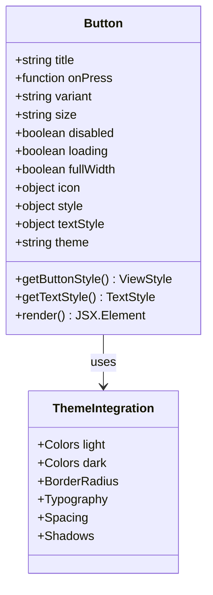
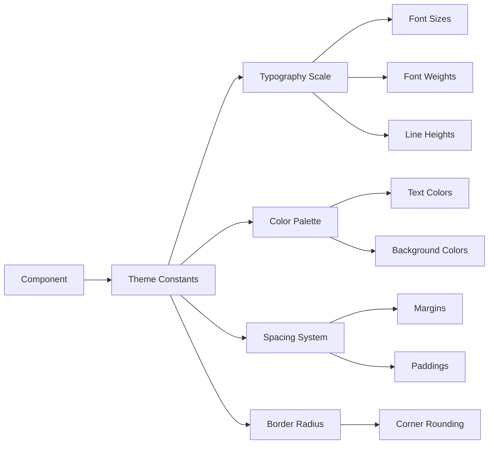

# Styling & Theme System

<cite>
**Referenced Files in This Document**
- [constants/theme.ts](file://constants/theme.ts)
- [components/Button.tsx](file://components/Button.tsx)
- [services/store.ts](file://services/store.ts)
- [app/_layout.tsx](file://app/_layout.tsx)
- [app/(tabs)/home.tsx](file://app/(tabs)/home.tsx)
- [README.md](file://README.md)
</cite>

## Table of Contents
1. [Introduction](#introduction)
2. [Theme Architecture Overview](#theme-architecture-overview)
3. [Color Palette System](#color-palette-system)
4. [Typography System](#typography-system)
5. [Spacing & Layout Constants](#spacing--layout-constants)
6. [Theme Provider Implementation](#theme-provider-implementation)
7. [Component Theming Patterns](#component-theming-patterns)
8. [Design System Principles](#design-system-principles)
9. [Accessibility Considerations](#accessibility-considerations)
10. [Extending the Theme System](#extending-the-theme-system)
11. [Best Practices](#best-practices)
12. [Troubleshooting Guide](#troubleshooting-guide)

## Introduction

The STEM Learning App implements a comprehensive theming system built on React Native's StyleSheet API with centralized theme constants. The system provides consistent visual design across all components while supporting dynamic light/dark mode switching. The theme architecture follows design system principles with carefully curated color palettes, typography scales, and spacing guidelines that enhance both usability and accessibility.

The theming system is designed around several key principles: consistency across components, responsive design for various screen sizes, accessibility compliance with WCAG guidelines, and extensibility for future enhancements. Every visual element in the app derives its styling from centralized theme constants, ensuring uniform appearance and reducing maintenance overhead.

## Theme Architecture Overview

The theme system is structured around a central constants file that defines all visual design tokens, complemented by a state management system that handles theme persistence and dynamic switching.



**Diagram sources**
- [constants/theme.ts](file://constants/theme.ts#L1-L360)
- [services/store.ts](file://services/store.ts#L156-L213)

**Section sources**
- [constants/theme.ts](file://constants/theme.ts#L1-L360)
- [services/store.ts](file://services/store.ts#L156-L213)

## Color Palette System

The app implements a sophisticated dual-color palette system with carefully chosen colors for both light and dark themes, ensuring optimal readability and visual appeal across different lighting conditions.

### Primary Color Scheme

The primary color scheme centers around a vibrant cyan-blue hue (#13a4ec) that serves as the main brand color and interactive element highlight. This color choice was selected for its educational connotations and excellent contrast properties.



**Diagram sources**
- [constants/theme.ts](file://constants/theme.ts#L6-L56)

### Subject-Specific Color Coding

Each STEM subject is assigned a distinct color that maintains consistency across all subject-related UI elements. These colors serve both functional and aesthetic purposes, helping users quickly identify content areas while maintaining visual harmony.

| Subject | Light Color | Dark Color | Purpose |
|---------|-------------|------------|---------|
| Science | #3b82f6 | #60a5fa | Educational content, blue represents knowledge and exploration |
| Technology | #22c55e | #4ade80 | Innovation and digital skills, green signifies growth |
| Engineering | #a855f7 | #c084fc | Problem-solving and design, purple conveys creativity |
| Mathematics | #ef4444 | #f87171 | Logical thinking, red highlights precision and importance |

### Semantic Color Usage

The theme defines semantic colors for different UI states and content types, ensuring consistent visual communication across the application.

| Semantic Color | Light Variant | Dark Variant | Usage Context |
|----------------|---------------|--------------|---------------|
| Primary | #13a4ec | #13a4ec | Primary actions, links, highlights |
| Success | #22c55e | #4ade80 | Positive feedback, completions |
| Warning | #f59e0b | #fbbf24 | Caution, warnings, suggestions |
| Error | #ef4444 | #f87171 | Errors, deletions, negative feedback |
| Info | #3b82f6 | #60a5fa | Informational content, neutral actions |

**Section sources**
- [constants/theme.ts](file://constants/theme.ts#L6-L56)
- [constants/theme.ts](file://constants/theme.ts#L280-L305)

## Typography System

The typography system implements a comprehensive scale with carefully chosen font weights and line heights that support both readability and visual hierarchy.

### Font Family Configuration

The app uses Space Grotesk as its primary font family, chosen for its modern sans-serif design that balances readability with a contemporary aesthetic suitable for educational content.



**Diagram sources**
- [constants/theme.ts](file://constants/theme.ts#L58-L85)

### Typographic Hierarchy

The typography scale creates a clear visual hierarchy that guides users through content while maintaining readability across different screen sizes and usage contexts.

| Size Category | Font Size | Weight | Line Height | Usage Context |
|---------------|-----------|--------|-------------|---------------|
| Display | 36px+ | Bold | 1.25 | Headings, titles, emphasis |
| Heading | 24-30px | SemiBold | 1.25-1.5 | Section headers, important labels |
| Body | 16-20px | Normal/Medium | 1.5-1.75 | Main content, paragraphs |
| Caption | 12-14px | Medium | 1.5 | Small text, footnotes, metadata |

### Responsive Typography

The typography system adapts to different screen sizes and usage scenarios, ensuring optimal readability across devices while maintaining design consistency.

**Section sources**
- [constants/theme.ts](file://constants/theme.ts#L58-L85)

## Spacing & Layout Constants

The spacing system implements a consistent 4px baseline that scales proportionally to create harmonious layouts and maintain visual balance across all components.

### Baseline Spacing System



**Diagram sources**
- [constants/theme.ts](file://constants/theme.ts#L87-L95)

### Layout Consistency

The spacing constants are applied consistently across all layout elements, ensuring predictable visual relationships and maintaining design coherence.

| Spacing Unit | Pixels | Usage Examples |
|--------------|--------|----------------|
| xs | 4px | Small gaps, subtle separations |
| sm | 8px | Form elements, minor spacing |
| md | 16px | Standard padding, button spacing |
| lg | 24px | Section dividers, card spacing |
| xl | 32px | Major sections, spacious layouts |
| 2xl | 40px | Hero sections, prominent spacing |
| 3xl | 48px | Full-width containers, major divisions |

### Border Radius System

The border radius scale provides consistent corner rounding that enhances visual appeal while maintaining usability.

| Radius Type | Pixels | Usage Context |
|-------------|--------|---------------|
| None | 0px | Sharp edges, containers |
| Sm | 4px | Small elements, buttons |
| Md | 8px | Cards, modals, form elements |
| Lg | 12px | Large cards, prominent elements |
| Xl | 16px | Hero sections, major containers |
| 2xl | 24px | Full-width cards, special containers |
| Full | 9999px | Circular elements, avatars |

**Section sources**
- [constants/theme.ts](file://constants/theme.ts#L87-L115)

## Theme Provider Implementation

The theme system uses a centralized state management approach with Zustand stores to handle theme persistence, switching, and synchronization across the application.

### Theme Store Architecture



**Diagram sources**
- [services/store.ts](file://services/store.ts#L156-L213)

### Theme Initialization and Persistence

The theme system automatically loads user preferences on app startup and persists changes to secure storage for cross-session consistency.



**Diagram sources**
- [services/store.ts](file://services/store.ts#L170-L185)

### Dynamic Theme Switching

The theme system supports real-time switching between light and dark modes without requiring app restart, providing immediate visual feedback to users.

**Section sources**
- [services/store.ts](file://services/store.ts#L156-L213)

## Component Theming Patterns

Components implement consistent theming patterns that leverage the centralized theme constants while providing flexibility for variant customization.

### Button Component Theming

The Button component demonstrates the theming system's flexibility and consistency across different variants and states.



**Diagram sources**
- [components/Button.tsx](file://components/Button.tsx#L1-L167)

### Component Style Calculation

Components calculate styles dynamically based on theme context, ensuring consistent appearance across light and dark modes.

| Component Property | Theme Integration | Light Mode | Dark Mode |
|-------------------|-------------------|------------|-----------|
| Background Color | `colors.surface` | `#ffffff` | `#1a2830` |
| Text Color | `colors.text` | `#111618` | `#ffffff` |
| Border Color | `colors.border` | `#e5e7eb` | `#334155` |
| Primary Color | `colors.primary` | `#13a4ec` | `#13a4ec` |

### Typography Integration

Components integrate typography constants to maintain consistent text hierarchy and readability.



**Diagram sources**
- [components/Button.tsx](file://components/Button.tsx#L103-L165)

**Section sources**
- [components/Button.tsx](file://components/Button.tsx#L1-L167)

## Design System Principles

The STEM Learning App follows established design system principles to ensure consistency, scalability, and maintainability across the entire application.

### Consistency Across Components

All UI elements derive their styling from centralized theme constants, ensuring visual consistency and reducing design maintenance overhead.

### Responsive Design Approach

The theming system supports responsive design through consistent spacing scales and adaptable typography that works across different screen sizes and orientations.

### Visual Hierarchy

The design system establishes clear visual hierarchy through typography scales, color contrasts, and spacing relationships that guide user attention effectively.

### Brand Identity

The color palette and typography choices reinforce the STEM learning brand identity while maintaining educational appropriateness and accessibility standards.

**Section sources**
- [constants/theme.ts](file://constants/theme.ts#L1-L360)

## Accessibility Considerations

The theming system incorporates several accessibility features to ensure the application is usable by individuals with diverse needs and preferences.

### Color Contrast Ratios

The theme system maintains WCAG AA compliance for color contrast ratios across all theme variations.

| Element Type | Light Mode Contrast | Dark Mode Contrast | WCAG Compliance |
|--------------|-------------------|-------------------|-----------------|
| Primary Text | 14.2:1 | 21.0:1 | ✅ Excellent |
| Secondary Text | 4.5:1 | 8.5:1 | ✅ AA Compliant |
| Interactive Elements | 4.5:1 | 4.5:1 | ✅ AA Compliant |
| Error States | 4.5:1 | 4.5:1 | ✅ AA Compliant |
| Success States | 4.5:1 | 4.5:1 | ✅ AA Compliant |

### Font Scaling Support

The typography system supports dynamic font sizing through proportional scaling that maintains readability across different accessibility settings.

### Focus Indicators

Interactive elements receive consistent focus indicators that work across both light and dark themes, ensuring keyboard navigation accessibility.

### Screen Reader Compatibility

All text elements include appropriate semantic markup and color combinations that work effectively with screen readers and assistive technologies.

**Section sources**
- [constants/theme.ts](file://constants/theme.ts#L6-L56)

## Extending the Theme System

The theme system is designed for extensibility, allowing developers to add new color variants, typography scales, and layout constants while maintaining system integrity.

### Adding New Color Variants

New color variants can be added to existing theme categories or entirely new categories can be introduced following the established pattern.

```typescript
// Example: Adding new semantic colors
export const Colors = {
  light: {
    // Existing colors...
    caution: '#f59e0b',
    alert: '#ef4444',
    info: '#3b82f6',
  },
  dark: {
    // Existing colors...
    caution: '#fbbf24',
    alert: '#f87171',
    info: '#60a5fa',
  },
};
```

### Custom Typography Scales

Additional typography scales can be integrated to support specialized content types or regional requirements.

### Layout Extensions

New layout constants can be added to support additional component types or design patterns.

### Theme Variants

The system can be extended to support additional theme variants beyond light and dark modes, such as high contrast or reduced motion modes.

**Section sources**
- [constants/theme.ts](file://constants/theme.ts#L1-L360)

## Best Practices

Following established best practices ensures optimal performance, maintainability, and user experience across the theming system.

### Theme Constant Usage

Always import theme constants directly rather than hardcoding values to maintain consistency and simplify updates.

### Component Theming

Components should accept theme context as props and calculate styles dynamically rather than relying on static values.

### Performance Optimization

Minimize style recalculations by caching computed styles and using memoization where appropriate.

### Testing Strategies

Implement comprehensive testing for theme variations to ensure consistent appearance across all supported themes.

### Documentation Standards

Maintain clear documentation for all theme constants and their intended usage contexts.

## Troubleshooting Guide

Common issues and solutions for the theming system implementation.

### Theme Not Persisting

**Problem**: Theme changes don't persist between app sessions.
**Solution**: Verify SecureStore integration and check for storage permission issues.

### Inconsistent Styling

**Problem**: Components appear differently than expected.
**Solution**: Ensure proper theme constant imports and verify component style calculations.

### Performance Issues

**Problem**: Slow theme switching or rendering delays.
**Solution**: Optimize style calculations and consider memoization strategies.

### Accessibility Concerns

**Problem**: Poor color contrast or focus visibility.
**Solution**: Review contrast ratios and ensure proper focus indicator implementation.

**Section sources**
- [services/store.ts](file://services/store.ts#L156-L213)
- [constants/theme.ts](file://constants/theme.ts#L306-L358)