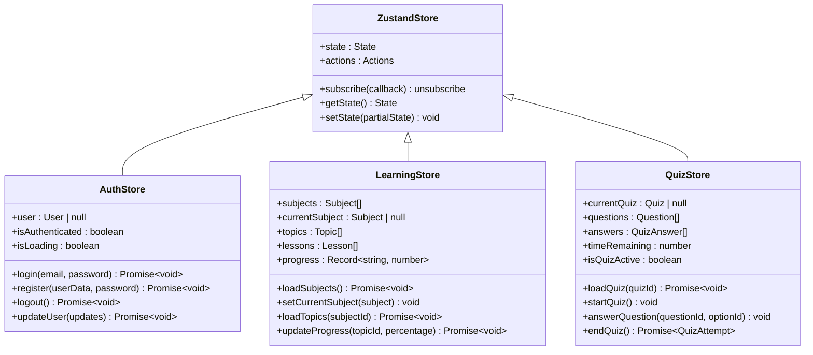
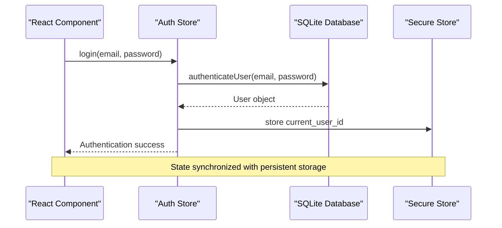
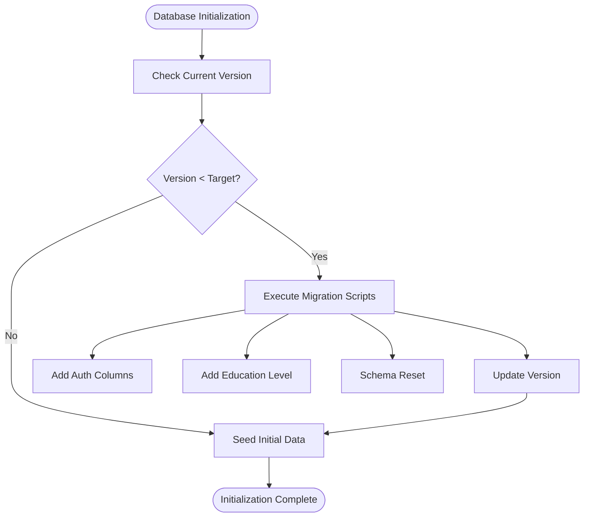
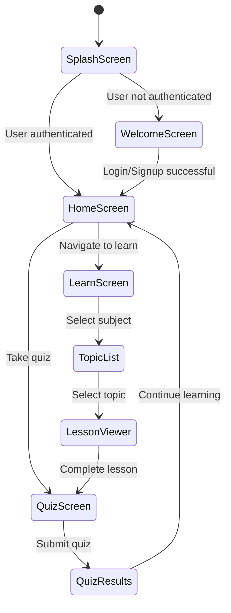

# Technology Stack & Dependencies

<cite>
**Referenced Files in This Document**
- [package.json](file://package.json)
- [app.json](file://app.json)
- [eas.json](file://eas.json)
- [tsconfig.json](file://tsconfig.json)
- [babel.config.js](file://babel.config.js)
- [metro.config.js](file://metro.config.js)
- [services/database.ts](file://services/database.ts)
- [services/store.ts](file://services/store.ts)
- [types/index.ts](file://types/index.ts)
- [components/Button.tsx](file://components/Button.tsx)
- [constants/theme.ts](file://constants/theme.ts)
- [app/_layout.tsx](file://app/_layout.tsx)
- [app/index.tsx](file://app/index.tsx)
- [QUICKSTART.md](file://QUICKSTART.md)
</cite>

## Table of Contents
1. [Introduction](#introduction)
2. [React Native with Expo Foundation](#react-native-with-expo-foundation)
3. [TypeScript for Type Safety](#typescript-for-type-safety)
4. [Core Dependencies Analysis](#core-dependencies-analysis)
5. [State Management with Zustand](#state-management-with-zustand)
6. [Local Data Persistence with Expo SQLite](#local-data-persistence-with-expo-sqlite)
7. [File-Based Routing with Expo Router](#file-based-routing-with-expo-router)
8. [Configuration Management](#configuration-management)
9. [Development Environment Setup](#development-environment-setup)
10. [Integration Challenges & Solutions](#integration-challenges--solutions)
11. [Performance Considerations](#performance-considerations)
12. [Troubleshooting Guide](#troubleshooting-guide)
13. [Conclusion](#conclusion)

## Introduction

The STEM Learning App is built on a modern React Native ecosystem powered by Expo, providing a comprehensive cross-platform mobile solution for STEM education. The technology stack emphasizes developer productivity, type safety, and seamless native device integration while maintaining excellent performance characteristics for educational content delivery.

This document provides an in-depth analysis of the technology choices, their rationale, and practical implementation patterns that enable the app's core functionality including gamified learning experiences, offline-first architecture, and real-time progress tracking.

## React Native with Expo Foundation

### Why Choose React Native with Expo?

Expo was selected as the foundation for this cross-platform mobile development approach due to several strategic advantages:

**Rapid Iteration Capabilities**
- Hot reload functionality enables immediate feedback during development
- Pre-built native modules eliminate the need for extensive native code maintenance
- Consistent APIs across iOS and Android platforms reduce development overhead

**Device API Access**
- Seamless integration with native device capabilities (camera, storage, sensors)
- Built-in support for push notifications and background tasks
- Access to platform-specific features without complex native module development

**Development Experience**
- Single codebase for iOS, Android, and Web platforms
- Automatic dependency management and version compatibility
- Comprehensive SDK with 100+ pre-built modules

### Expo Version Specifications

The app utilizes Expo SDK 54.0.13 with React Native 0.81.4, providing:
- Latest React 19.1.0 with concurrent features
- Optimized bundle sizes and improved performance
- Enhanced TypeScript support and development tools
- Updated native module compatibility

**Section sources**
- [package.json](file://package.json#L1-L43)
- [app.json](file://app.json#L1-L50)

## TypeScript for Type Safety

### Comprehensive Type System Implementation

The app employs TypeScript extensively across all layers of the application, providing compile-time type checking and enhanced developer experience:

**Core Type Definitions**
The [`types/index.ts`](file://types/index.ts) file establishes a comprehensive type system covering:
- User authentication and profile management
- Educational content structures (subjects, topics, lessons, quizzes)
- Gamification systems (XP, badges, streaks, achievements)
- Database schema definitions
- State management interfaces

**Type Safety Benefits**
- Prevention of runtime type errors through compile-time validation
- Enhanced IDE support with IntelliSense and refactoring capabilities
- Improved code maintainability and team collaboration
- Automatic documentation generation from type definitions

**Integration Patterns**
TypeScript seamlessly integrates with:
- React component props and state
- Zustand store interfaces
- Expo Router navigation parameters
- Database service return types

**Section sources**
- [types/index.ts](file://types/index.ts#L1-L376)
- [tsconfig.json](file://tsconfig.json#L1-L46)

## Core Dependencies Analysis

### Primary Technology Stack

| Dependency | Version | Purpose | Integration |
|------------|---------|---------|-------------|
| **React Native** | 0.81.4 | Core framework | Foundation for UI components |
| **Expo** | 54.0.13 | Platform abstraction | Simplifies native module access |
| **TypeScript** | ~5.9.2 | Type safety | Compile-time type checking |
| **Zustand** | ^5.0.8 | State management | Lightweight global state |

### Supporting Libraries

**Navigation & Routing**
- **Expo Router** (~6.0.12): File-based routing system
- **Expo Linking** (~8.0.8): Deep linking and URL handling

**Database & Storage**
- **Expo SQLite** (~16.0.8): Local database persistence
- **Expo Secure Store** (~15.0.7): Secure credential storage

**UI & Styling**
- **Expo Linear Gradient** (~15.0.7): Advanced gradient effects
- **React Native Gesture Handler** (~2.28.0): Touch and gesture recognition
- **React Native Reanimated** (~4.1.1): Hardware-accelerated animations

**Utilities**
- **Date FNS** (^4.1.0): Date manipulation utilities
- **Expo Font** (~14.0.9): Custom font loading

### Development Dependencies

**Babel Configuration**
The Babel setup includes:
- `babel-preset-expo`: Optimized preset for Expo projects
- `react-native-reanimated/plugin`: Plugin for hardware-accelerated animations

**TypeScript Configuration**
- Extends Expo's base TypeScript configuration
- Strict type checking enabled
- Path mapping for modular imports

**Section sources**
- [package.json](file://package.json#L10-L35)
- [babel.config.js](file://babel.config.js#L1-L8)

## State Management with Zustand

### Architecture Overview

The app implements a sophisticated state management system using Zustand, a minimalistic state library that provides:

**Store Organization**
- **Auth Store**: User authentication, registration, and session management
- **Theme Store**: Light/dark mode preferences and theme switching
- **Learning Store**: Educational content navigation and progress tracking
- **Quiz Store**: Quiz state, question management, and scoring
- **App Store**: General application state and initialization

**Implementation Pattern**


**Diagram sources**
- [services/store.ts](file://services/store.ts#L1-L570)

### State Synchronization with Database

The Zustand stores maintain synchronization with the SQLite database through carefully designed patterns:

**Authentication Flow**


**Diagram sources**
- [services/store.ts](file://services/store.ts#L50-L120)
- [services/database.ts](file://services/database.ts#L700-L750)

**Progress Tracking Integration**
The learning and quiz stores coordinate with database operations to maintain consistent state:
- Real-time progress updates stored immediately
- Batch operations for performance optimization
- Conflict resolution for concurrent modifications

**Section sources**
- [services/store.ts](file://services/store.ts#L1-L570)

## Local Data Persistence with Expo SQLite

### Database Architecture

The app implements a comprehensive SQLite-based persistence layer managed by the [`services/database.ts`](file://services/database.ts) service:

**Database Schema Design**
The schema includes 12 interconnected tables supporting:
- User profiles and authentication
- Educational content (subjects, topics, lessons, quizzes)
- Learning progress tracking
- Gamification elements (XP, badges, streaks)
- Quiz attempts and performance metrics
- Leaderboard data

**Migration System**


**Diagram sources**
- [services/database.ts](file://services/database.ts#L100-L200)

### Data Synchronization Patterns

**Offline-First Architecture**
- All user data stored locally for offline access
- Automatic synchronization when network becomes available
- Conflict resolution for concurrent modifications
- Background sync operations for leaderboard updates

**Performance Optimizations**
- Indexed queries for frequently accessed data
- Batch operations for bulk data updates
- Lazy loading of non-critical content
- Memory-efficient pagination for large datasets

**Security Considerations**
- Sensitive data encrypted using Expo Secure Store
- Passwords hashed and stored securely
- User sessions managed through secure tokens
- Database encryption for sensitive educational data

**Section sources**
- [services/database.ts](file://services/database.ts#L1-L822)

## File-Based Routing with Expo Router

### Routing Architecture

Expo Router provides a powerful file-based routing system that automatically generates navigation routes from the filesystem structure:

**Directory Structure Impact**
```
app/
├── (tabs)/          # Tab navigation group
│   ├── _layout.tsx  # Tab layout
│   ├── home.tsx     # Home screen
│   ├── learn.tsx    # Learn screen
│   ├── leaderboard.tsx
│   └── profile.tsx
├── _layout.tsx      # Root layout
├── index.tsx        # Splash screen
└── welcome.tsx      # Welcome screen
```

**Route Generation**
The router automatically creates:
- `/` → Splash screen
- `/welcome` → Welcome screen
- `/(tabs)` → Tab navigation
- `/(tabs)/home` → Home screen
- Dynamic routes like `/lesson/[id]` and `/quiz/[id]`

### Navigation Integration

**Layout Management**
The root layout ([`app/_layout.tsx`](file://app/_layout.tsx)) manages:
- Application-wide navigation state
- Theme integration with navigation styling
- Splash screen coordination
- Loading state management

**Dynamic Route Parameters**
Routes support dynamic parameters for:
- Lesson ID routing (`/lesson/[id]`)
- Quiz ID routing (`/quiz/[id]`)
- Subject category routing (`/subject/[category]`)

**Navigation State Management**


**Diagram sources**
- [app/_layout.tsx](file://app/_layout.tsx#L1-L133)

**Section sources**
- [app/_layout.tsx](file://app/_layout.tsx#L1-L133)
- [app/index.tsx](file://app/index.tsx#L1-L202)

## Configuration Management

### Multi-Platform Configuration

The app uses multiple configuration files to manage different aspects of the build and deployment process:

**Expo Configuration (app.json)**
```json
{
  "expo": {
    "name": "STEM Learning App",
    "slug": "stem-learning-app",
    "version": "1.0.0",
    "ios": {
      "bundleIdentifier": "com.stemlearning.app"
    },
    "android": {
      "package": "com.stemlearning.app",
      "edgeToEdgeEnabled": true
    }
  }
}
```

**EAS Configuration (eas.json)**
```json
{
  "build": {
    "development": {
      "developmentClient": true,
      "distribution": "internal"
    },
    "preview": {
      "distribution": "internal"
    },
    "production": {
      "autoIncrement": true
    }
  }
}
```

**TypeScript Configuration (tsconfig.json)**
- Extends Expo base configuration
- Enables strict type checking
- Configures path mapping for modular imports
- Includes all `.ts` and `.tsx` files

**Metro Configuration (metro.config.js)**
- Uses Expo's default Metro configuration
- Optimized for React Native bundling
- Supports asset processing and transformations

### Environment-Specific Settings

**Development Environment**
- Hot reload enabled for rapid iteration
- Detailed error reporting and debugging tools
- Local database persistence for development data

**Production Environment**
- Minified bundles for optimal performance
- Secure production builds with code signing
- Automated testing and quality assurance

**Section sources**
- [app.json](file://app.json#L1-L50)
- [eas.json](file://eas.json#L1-L22)
- [tsconfig.json](file://tsconfig.json#L1-L46)
- [metro.config.js](file://metro.config.js#L1-L8)

## Development Environment Setup

### Prerequisites and Installation

**System Requirements**
- Node.js v16+ for optimal compatibility
- npm v8+ for package management
- Expo CLI for development server
- Platform-specific tools for iOS/Android builds

**Installation Process**
```bash
# Clone repository
git clone <repository-url>
cd stem_learning_app

# Install dependencies
npm install

# Start development server
npm start

# Run on specific platform
npm run android    # Android device/emulator
npm run ios       # iOS simulator
npm run web       # Browser
```

### Development Workflow

**Code Organization**
- Modular TypeScript files for type safety
- Component-based architecture with reusable UI elements
- Service layer for business logic separation
- Constant files for theme and configuration management

**Testing and Quality Assurance**
- TypeScript compilation with strict mode
- Hot reloading for instant feedback
- Debug tools integration for development
- Automated testing frameworks for regression prevention

**Section sources**
- [QUICKSTART.md](file://QUICKSTART.md#L1-L50)

## Integration Challenges & Solutions

### Cross-Platform Compatibility

**Challenge**: Ensuring consistent behavior across iOS, Android, and Web platforms
**Solution**: 
- Expo's abstraction layer handles platform differences
- Conditional rendering for platform-specific features
- Unified API access through Expo modules
- Platform-specific fallbacks for unsupported features

### State Management Complexity

**Challenge**: Coordinating state between multiple stores and database persistence
**Solution**:
- Centralized initialization in App Store
- Event-driven updates for state synchronization
- Atomic operations for database transactions
- Error boundaries for state recovery

### Performance Optimization

**Challenge**: Maintaining smooth UI performance with large educational datasets
**Solution**:
- Virtualized lists for large content displays
- Lazy loading of non-critical resources
- Memoization of expensive computations
- Efficient database indexing and query optimization

### Database Migration Strategy

**Challenge**: Handling schema changes across app versions
**Solution**:
- Versioned migration system with rollback capability
- Automatic schema detection and reset for breaking changes
- Data preservation strategies for non-breaking updates
- Backup and restore mechanisms for critical data

## Performance Considerations

### Bundle Size Optimization

**Strategies Implemented**
- Tree shaking for unused code elimination
- Dynamic imports for route-based code splitting
- Asset optimization for images and fonts
- Platform-specific code inclusion

**Performance Metrics**
- Initial bundle size under 5MB for optimal download times
- Fast startup times with efficient initialization
- Smooth navigation with optimized route transitions
- Responsive UI with hardware-accelerated animations

### Memory Management

**Optimization Techniques**
- Weak references for cached data
- Garbage collection friendly patterns
- Efficient state cleanup on component unmount
- Database connection pooling for query optimization

### Network Performance

**Offline-First Approach**
- Local caching of educational content
- Background synchronization for data updates
- Intelligent retry mechanisms for failed operations
- Bandwidth-conscious data transfer

## Troubleshooting Guide

### Common Development Issues

**Database Initialization Problems**
```bash
# Issue: Database not seeding properly
# Solution: Clear app cache and reinstall
expo start -c
# Or for Android:
adb uninstall com.stemlearning.app
npm run android
```

**Metro Bundler Issues**
```bash
# Issue: Bundler stuck or failing
# Solution: Clear cache and rebuild
npm start -- --reset-cache
# Or remove node_modules completely
rm -rf node_modules
npm install
expo prebuild --clean
```

**Expo Modules Not Found**
```bash
# Issue: Missing Expo modules
# Solution: Rebuild native modules
rm -rf node_modules
npm install
expo prebuild --clean
```

### Runtime Performance Issues

**Slow Navigation**
- Check for blocking operations in route handlers
- Optimize database queries with proper indexing
- Reduce component re-renders with memoization
- Profile with React DevTools for performance bottlenecks

**Memory Leaks**
- Monitor component lifecycle and cleanup
- Check for unclosed database connections
- Verify proper state management patterns
- Use memory profiling tools for leak detection

### Build and Deployment Issues

**EAS Build Failures**
- Verify EAS configuration in eas.json
- Check Expo SDK compatibility with dependencies
- Review build logs for specific error messages
- Test builds locally before EAS submission

**Platform-Specific Issues**
- iOS: Verify provisioning profiles and certificates
- Android: Check keystore configuration and permissions
- Web: Ensure proper polyfills for unsupported features

## Conclusion

The STEM Learning App's technology stack represents a carefully curated combination of modern React Native tools and Expo's powerful abstractions. This approach delivers:

**Key Strengths**
- Rapid development cycles with hot reloading and type safety
- Seamless cross-platform compatibility with minimal code duplication
- Robust offline-first architecture with local data persistence
- Scalable state management with clear separation of concerns
- Comprehensive gamification system with real-time progress tracking

**Technical Excellence**
- TypeScript provides compile-time type safety across all layers
- Zustand offers lightweight, performant state management
- Expo SQLite ensures reliable local data persistence
- Expo Router simplifies navigation and route management
- Expo's ecosystem eliminates native module complexity

**Future-Proof Architecture**
The modular design allows for easy extension and feature addition
The type-safe foundation supports long-term maintainability
The offline-first approach ensures accessibility in various connectivity scenarios
The performance optimizations provide smooth user experiences

This technology stack successfully balances developer productivity with end-user performance, creating a solid foundation for the STEM Learning App's educational mission while maintaining flexibility for future enhancements and feature additions.