# Testing Strategy

<cite>
**Referenced Files in This Document**
- [TESTING.md](file://TESTING.md)
- [package.json](file://package.json)
- [app.json](file://app.json)
- [tsconfig.json](file://tsconfig.json)
- [services/database.ts](file://services/database.ts)
- [services/store.ts](file://services/store.ts)
- [components/Button.tsx](file://components/Button.tsx)
- [app/_layout.tsx](file://app/_layout.tsx)
- [types/index.ts](file://types/index.ts)
- [package-lock.json](file://package-lock.json)
</cite>

## Table of Contents
1. [Introduction](#introduction)
2. [Testing Philosophy](#testing-philosophy)
3. [Testing Architecture](#testing-architecture)
4. [Unit Testing Strategy](#unit-testing-strategy)
5. [Integration Testing Approach](#integration-testing-strategy)
6. [End-to-End Testing Framework](#end-to-end-testing-framework)
7. [Test Tools and Frameworks](#test-tools-and-frameworks)
8. [Critical Functionality Tests](#critical-functionality-tests)
9. [Mobile-Specific Testing Challenges](#mobile-specific-testing-challenges)
10. [Test Execution Process](#test-execution-process)
11. [Test Coverage and Maintenance](#test-coverage-and-maintenance)
12. [Debugging and Troubleshooting](#debugging-and-troubleshooting)
13. [Best Practices](#best-practices)

## Introduction

The STEM Learning App employs a comprehensive testing strategy designed to ensure reliability, maintainability, and quality across all aspects of the mobile application. This testing approach encompasses unit tests, integration tests, and end-to-end tests, specifically tailored for React Native applications with TypeScript, Zustand state management, and SQLite database interactions.

The testing framework is built around industry-standard tools and follows established patterns for mobile application testing, addressing the unique challenges of cross-platform development, offline functionality, and complex state management.

## Testing Philosophy

The STEM Learning App adopts a **test-driven development (TDD)** approach combined with **behavior-driven development (BDD)** principles. The testing philosophy emphasizes:

- **Reliability First**: Ensuring core functionality works consistently across devices
- **User-Centric Testing**: Focusing on user workflows and experiences
- **Continuous Integration**: Automated testing in CI/CD pipelines
- **Offline-First Testing**: Comprehensive testing of offline scenarios
- **Cross-Platform Compatibility**: Testing on both Android and iOS platforms

### Core Testing Principles

1. **Test Isolation**: Each test should be independent and not rely on external state
2. **Deterministic Results**: Tests should produce consistent results across environments
3. **Fast Feedback**: Unit tests execute quickly for rapid development cycles
4. **Realistic Scenarios**: Tests reflect actual user interactions and edge cases
5. **Maintainable Tests**: Clear, readable test code that's easy to update

## Testing Architecture

The testing architecture is structured around several key layers that mirror the application's architecture:

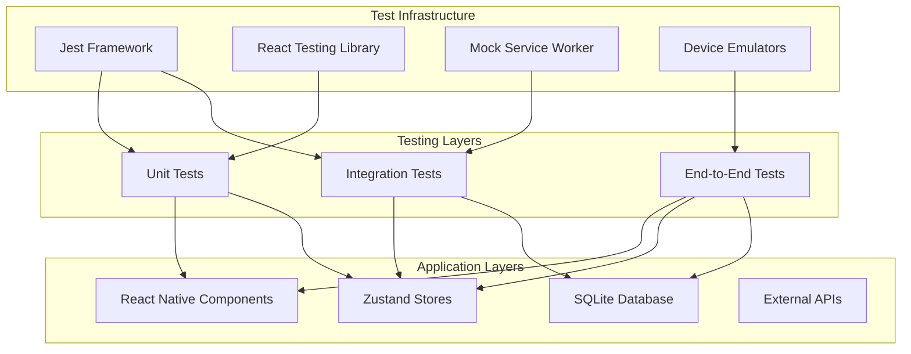

**Diagram sources**
- [services/store.ts](file://services/store.ts#L1-L570)
- [services/database.ts](file://services/database.ts#L1-L822)

### Testing Layer Responsibilities

| Layer | Purpose | Coverage |
|-------|---------|----------|
| **Unit Tests** | Individual component and function testing | Components, Utils, Stores |
| **Integration Tests** | Cross-layer functionality validation | Store-DB interactions, API calls |
| **End-to-End Tests** | Complete user workflow validation | User journeys, Device interactions |

**Section sources**
- [services/store.ts](file://services/store.ts#L1-L570)
- [services/database.ts](file://services/database.ts#L1-L822)

## Unit Testing Strategy

Unit tests focus on individual components, functions, and Zustand stores in isolation. They provide fast feedback and serve as the foundation for the testing pyramid.

### Component Testing

React Native components are tested using Jest with React Testing Library for rendering and interaction testing:

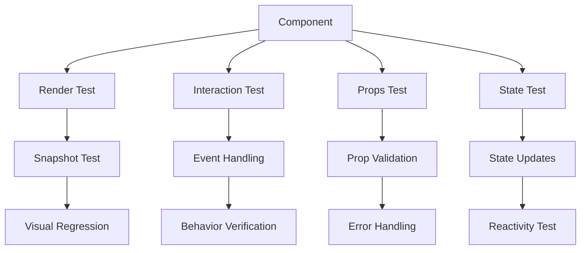

**Diagram sources**
- [components/Button.tsx](file://components/Button.tsx#L1-L167)

#### Button Component Testing Example

Key test scenarios for the Button component include:
- **Rendering**: Verify correct rendering with different props
- **Interactions**: Test press events and loading states
- **Variants**: Validate primary, secondary, and outline styles
- **Accessibility**: Ensure proper accessibility attributes

### Zustand Store Testing

Zustand stores require specialized testing approaches due to their state management nature:

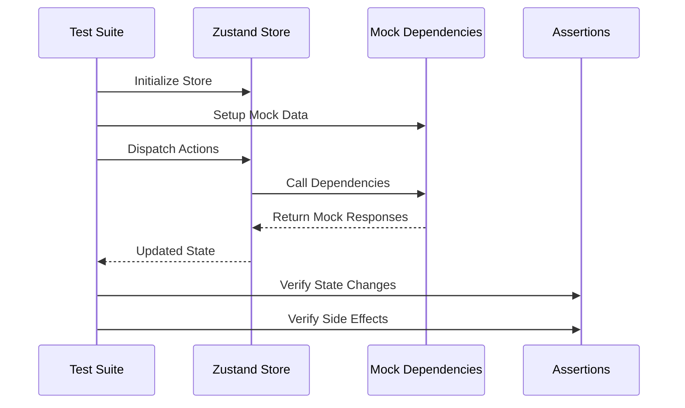

**Diagram sources**
- [services/store.ts](file://services/store.ts#L1-L570)

#### Store Testing Patterns

1. **Action Testing**: Verify actions modify state correctly
2. **Async Action Testing**: Test async operations with promises
3. **Selector Testing**: Validate computed state values
4. **Middleware Testing**: Test side effects and middleware

**Section sources**
- [services/store.ts](file://services/store.ts#L1-L570)
- [components/Button.tsx](file://components/Button.tsx#L1-L167)

## Integration Testing Strategy

Integration tests validate the interactions between different layers of the application, focusing on database operations, store interactions, and API communications.

### Database Integration Testing

The SQLite database requires comprehensive integration testing to ensure data integrity and proper CRUD operations:

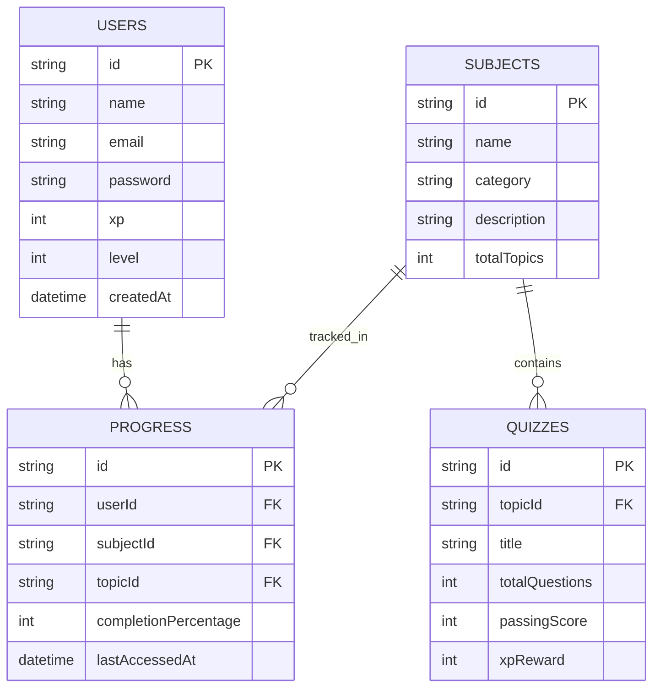

**Diagram sources**
- [services/database.ts](file://services/database.ts#L1-L822)
- [types/index.ts](file://types/index.ts#L1-L376)

#### Database Test Categories

| Test Type | Focus Area | Key Scenarios |
|-----------|------------|---------------|
| **CRUD Operations** | Basic database operations | Create, Read, Update, Delete |
| **Transaction Testing** | Data consistency | Rollbacks, Atomic operations |
| **Migration Testing** | Schema evolution | Version upgrades, data preservation |
| **Constraint Testing** | Data validation | Unique constraints, foreign keys |

### Store-Database Integration

Testing the interaction between Zustand stores and the database ensures proper state synchronization:

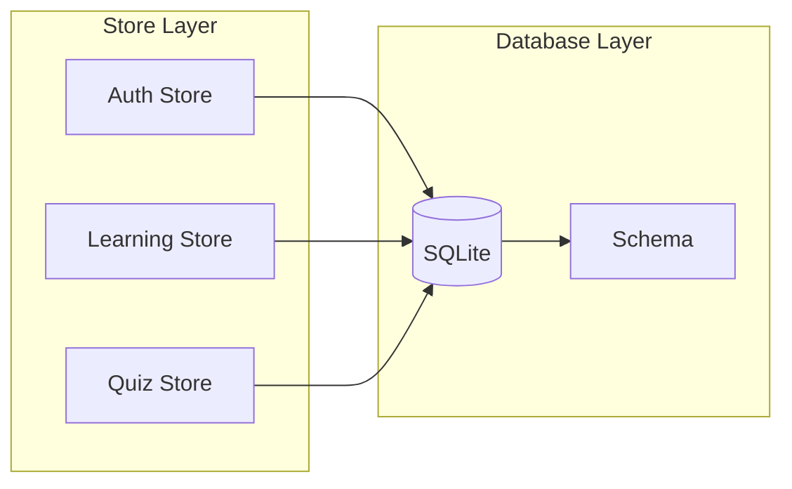

**Diagram sources**
- [services/store.ts](file://services/store.ts#L1-L570)
- [services/database.ts](file://services/database.ts#L1-L822)

**Section sources**
- [services/database.ts](file://services/database.ts#L1-L822)
- [services/store.ts](file://services/store.ts#L1-L570)

## End-to-End Testing Framework

End-to-end tests simulate real user interactions across the entire application stack, validating complete user workflows and device-specific functionality.

### Test Environment Setup

E2E testing requires specialized setup for different platforms and devices:

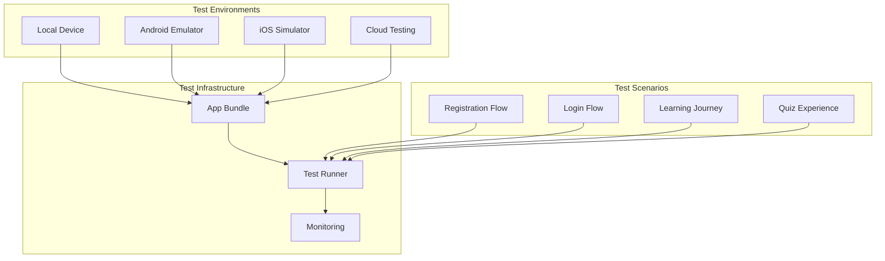

### Critical User Flows

The E2E tests focus on essential user journeys that represent core application functionality:

#### Authentication Flow
1. **Registration**: New user creation with validation
2. **Login**: Existing user authentication
3. **Logout**: Session termination
4. **Persistence**: Session restoration across app restarts

#### Learning Experience
1. **Subject Selection**: Browse and select learning topics
2. **Content Consumption**: Access lessons and materials
3. **Progress Tracking**: Monitor learning progress
4. **Gamification**: Earn XP and badges

#### Quiz Experience
1. **Quiz Access**: Navigate to quiz sections
2. **Question Interaction**: Answer multiple-choice questions
3. **Scoring**: Receive immediate feedback
4. **Results**: View performance analytics

**Section sources**
- [TESTING.md](file://TESTING.md#L1-L379)

## Test Tools and Frameworks

The STEM Learning App utilizes a comprehensive suite of testing tools and frameworks optimized for React Native development.

### Core Testing Framework

| Tool | Purpose | Configuration |
|------|---------|---------------|
| **Jest** | Test runner and assertion library | Default configuration with TypeScript support |
| **React Testing Library** | Component testing utilities | DOM testing without implementation details |
| **TypeScript** | Type-safe testing | Full type checking for test files |
| **Expo CLI** | Development and testing tools | Built-in testing commands |

### Database Testing Tools

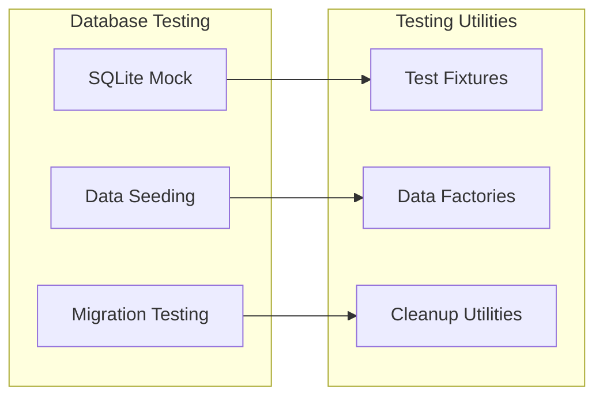

**Diagram sources**
- [services/database.ts](file://services/database.ts#L1-L822)

### Mobile-Specific Tools

The testing infrastructure includes tools specifically designed for mobile application testing:

- **React Native Testing Library**: Component testing for mobile UI
- **Expo Testing Tools**: Platform-specific testing utilities
- **Device Emulation**: Cross-platform testing capabilities
- **Network Simulation**: Offline and connectivity testing

**Section sources**
- [package.json](file://package.json#L1-L43)
- [tsconfig.json](file://tsconfig.json#L1-L46)

## Critical Functionality Tests

This section outlines the most important test cases for the STEM Learning App, focusing on core features that impact user experience and application reliability.

### User Authentication Tests

Authentication is a critical component requiring comprehensive testing across multiple scenarios:

#### Registration Testing
- **Valid Registration**: Successful user creation with proper validation
- **Duplicate Email**: Error handling for existing email addresses
- **Password Validation**: Strong password requirements enforcement
- **Form Submission**: Proper handling of submission states and errors

#### Login Testing
- **Successful Authentication**: Valid credentials acceptance
- **Invalid Credentials**: Appropriate error messaging
- **Account Lockout**: Rate limiting and security measures
- **Session Management**: Token handling and expiration

#### Logout Testing
- **Session Termination**: Complete session cleanup
- **State Reset**: Application state clearing
- **Navigation**: Redirect to appropriate screens
- **Data Persistence**: Selective data retention

### Quiz Scoring System

The quiz functionality requires precise testing to ensure accurate scoring and feedback:

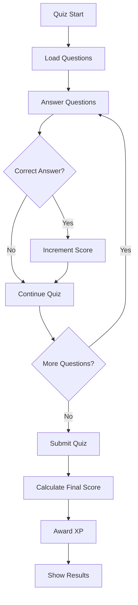

**Diagram sources**
- [services/store.ts](file://services/store.ts#L350-L450)

#### Quiz Test Scenarios
1. **Question Loading**: Proper question retrieval and ordering
2. **Answer Processing**: Correct handling of multiple choice answers
3. **Scoring Logic**: Accurate calculation of scores and percentages
4. **XP Awarding**: Proper XP distribution for correct answers
5. **Quiz Completion**: Final score calculation and result presentation

### Progress Synchronization

Learning progress tracking requires robust testing to ensure data consistency:

#### Progress Tracking Tests
- **Completion Percentage**: Accurate progress calculation
- **Time Tracking**: Proper time spent recording
- **Sync Behavior**: Offline/online data synchronization
- **Conflict Resolution**: Handling concurrent updates

### Gamification System

The achievement and reward system needs careful testing to ensure fairness and accuracy:

#### Badge System Testing
- **Unlock Conditions**: Proper badge unlocking criteria
- **Progress Calculation**: Accurate progress tracking
- **Reward Distribution**: Correct XP and item awards
- **Persistence**: Achievement data retention across sessions

**Section sources**
- [services/store.ts](file://services/store.ts#L350-L570)
- [services/database.ts](file://services/database.ts#L700-L822)

## Mobile-Specific Testing Challenges

Mobile application testing presents unique challenges that require specialized approaches and tools.

### Device Fragmentation

Testing across different devices and platforms requires comprehensive strategies:

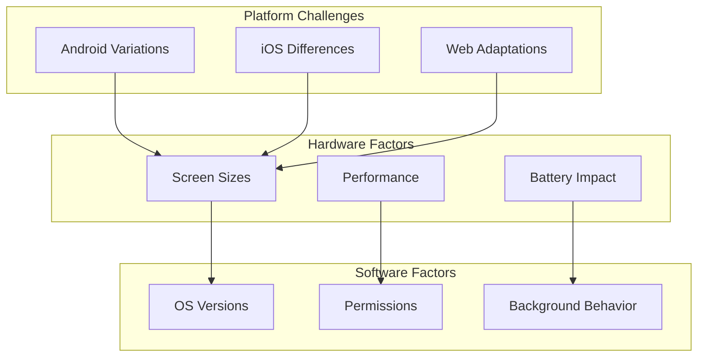

#### Testing Strategies for Fragmentation
1. **Device Matrix Testing**: Comprehensive device and OS version coverage
2. **Responsive Design Testing**: Multi-screen size validation
3. **Performance Benchmarking**: Consistent performance across devices
4. **Permission Testing**: Platform-specific permission handling

### Offline Functionality

The app's offline-first architecture requires extensive testing:

#### Offline Testing Scenarios
- **Data Availability**: Content availability without internet
- **Sync Behavior**: Data synchronization when connectivity returns
- **Conflict Resolution**: Handling conflicting data during sync
- **Cache Management**: Efficient caching strategies

### Gesture Interactions

Touch-based interactions require specialized testing approaches:

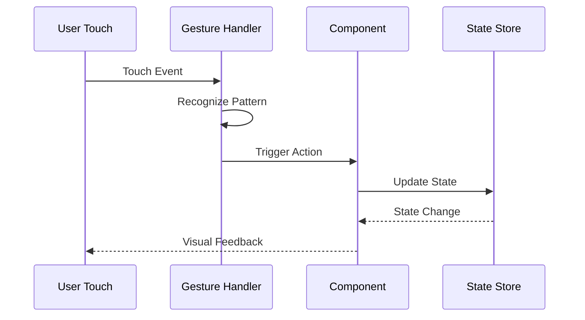

**Diagram sources**
- [components/Button.tsx](file://components/Button.tsx#L1-L167)

#### Gesture Testing Approaches
1. **Touch Event Simulation**: Programmatic touch event generation
2. **Gesture Recognition**: Complex gesture pattern testing
3. **Multi-Touch Support**: Simultaneous touch testing
4. **Accessibility**: Alternative interaction methods

**Section sources**
- [TESTING.md](file://TESTING.md#L200-L300)

## Test Execution Process

The test execution process is designed to provide fast feedback during development while ensuring comprehensive validation in production environments.

### Local Development Testing

Development teams execute tests locally to catch issues early:

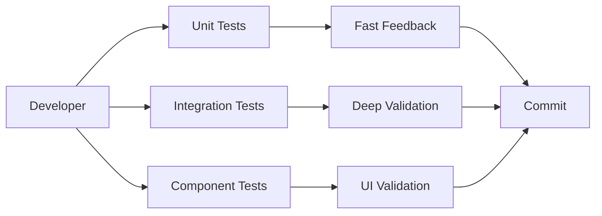

#### Local Test Commands
- **`npm test`**: Run all tests
- **`npm test -- --watch`**: Continuous testing during development
- **`npm test -- --coverage`**: Generate coverage reports
- **`npm test -- --testPathPattern=auth`**: Target specific test suites

### CI/CD Pipeline Integration

Automated testing in CI/CD ensures code quality and prevents regressions:

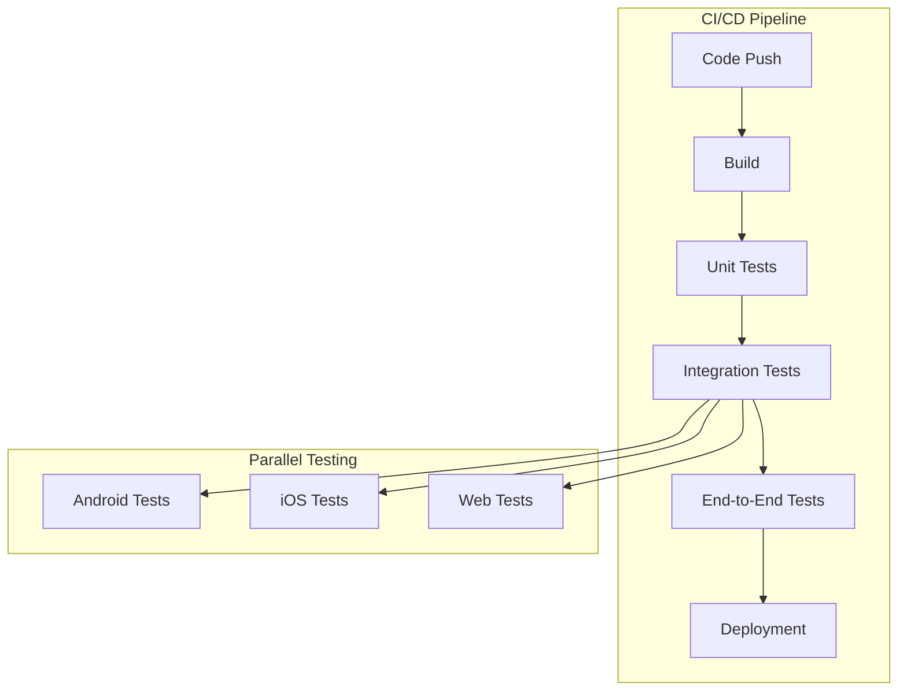

#### CI/CD Test Phases
1. **Quick Checks**: Fast unit tests for immediate feedback
2. **Integration Validation**: Database and API integration tests
3. **Cross-Platform Testing**: Platform-specific test execution
4. **Performance Monitoring**: Performance regression detection

### Test Reporting and Analytics

Comprehensive reporting helps track test effectiveness and identify areas for improvement:

#### Test Metrics
- **Pass Rate**: Percentage of passing tests
- **Execution Time**: Test suite runtime analysis
- **Coverage**: Code coverage metrics
- **Failure Rate**: Trend analysis of test failures

**Section sources**
- [package.json](file://package.json#L5-L10)

## Test Coverage and Maintenance

Maintaining comprehensive test coverage requires ongoing effort and strategic planning.

### Coverage Goals and Targets

The testing strategy aims for specific coverage targets across different code areas:

| Component Type | Coverage Goal | Measurement Method |
|----------------|---------------|-------------------|
| **Components** | 85%+ | Line coverage |
| **Stores** | 90%+ | Branch coverage |
| **Services** | 80%+ | Function coverage |
| **Utilities** | 95%+ | Statement coverage |

### Coverage Analysis Tools

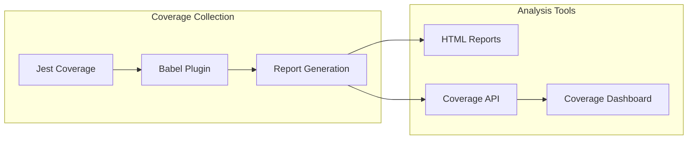

### Maintenance Strategies

#### Regular Coverage Reviews
- **Weekly Analysis**: Review coverage trends and identify gaps
- **Monthly Refactoring**: Improve poorly covered code areas
- **Quarterly Audits**: Comprehensive coverage assessment

#### Test Quality Assurance
- **Code Reviews**: Peer review of test code quality
- **Refactoring**: Improve test readability and maintainability
- **Documentation**: Keep test documentation up to date

### Continuous Improvement

The testing strategy evolves based on feedback and changing requirements:

#### Improvement Areas
1. **Test Speed**: Optimize slow-running tests
2. **Flaky Tests**: Identify and stabilize unreliable tests
3. **Coverage Gaps**: Expand coverage in critical areas
4. **Test Maintenance**: Reduce maintenance overhead

**Section sources**
- [package.json](file://package.json#L1-L43)

## Debugging and Troubleshooting

Effective debugging is crucial for maintaining test reliability and identifying issues quickly.

### Common Test Issues

#### Database Test Issues
- **Connection Problems**: Database connection failures
- **Schema Mismatches**: Outdated database schemas
- **Data Conflicts**: Test data conflicts between runs
- **Migration Failures**: Database migration issues

#### Store Test Issues
- **State Pollution**: Test state affecting other tests
- **Async Timing**: Asynchronous operation timing issues
- **Mock Dependencies**: Incorrect mock implementations
- **Side Effects**: Unintended side effect propagation

### Debugging Strategies

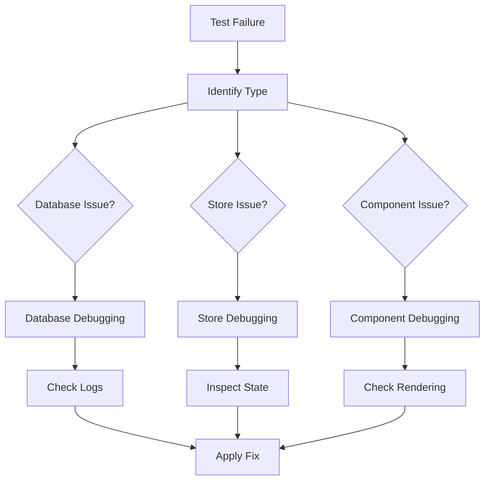

### Troubleshooting Tools

#### Development Tools
- **React DevTools**: Component state inspection
- **Redux DevTools**: Store state monitoring
- **Database Inspector**: SQLite database examination
- **Console Logging**: Detailed execution tracing

#### Test-Specific Tools
- **Test Watch Mode**: Continuous test execution
- **Coverage Analysis**: Code coverage visualization
- **Performance Profiling**: Test execution time analysis
- **Snapshot Management**: Visual regression testing

### Error Recovery Procedures

#### Test Environment Recovery
1. **Clean State**: Reset test environment between runs
2. **Data Cleanup**: Remove test data after completion
3. **Resource Management**: Proper resource allocation and deallocation
4. **Environment Reset**: Restore original state after testing

**Section sources**
- [TESTING.md](file://TESTING.md#L250-L350)

## Best Practices

Following established best practices ensures test reliability, maintainability, and effectiveness.

### Test Organization

#### File Structure Guidelines
- **Feature-Based Organization**: Group tests by feature areas
- **Separate Concerns**: Separate unit, integration, and E2E tests
- **Descriptive Naming**: Clear, descriptive test file and function names
- **Consistent Patterns**: Standardized test patterns across the codebase

#### Test Case Structure
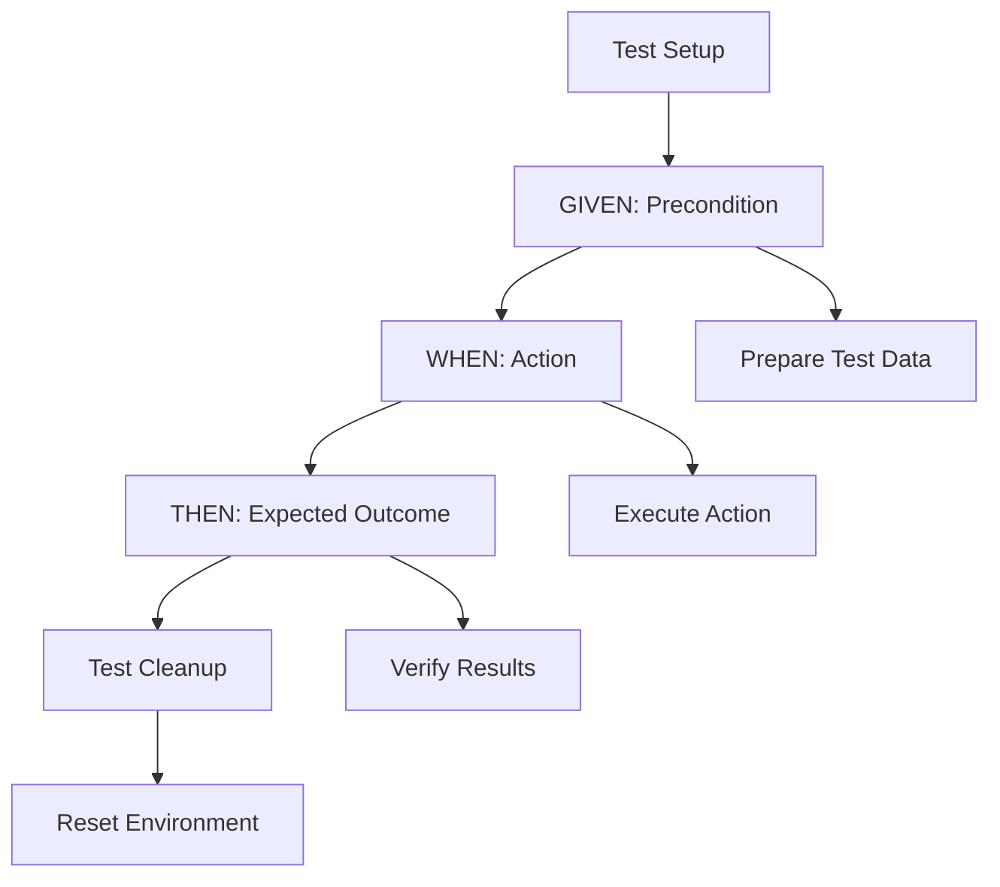

### Test Writing Guidelines

#### Writing Effective Tests
1. **Single Responsibility**: Each test should verify one specific behavior
2. **Clear Intent**: Test purpose should be immediately apparent
3. **Isolated Execution**: Tests should not depend on external state
4. **Fast Execution**: Minimize test execution time
5. **Readable Assertions**: Clear, descriptive assertion messages

#### Test Data Management
- **Test Fixtures**: Reusable test data sets
- **Factories**: Dynamic test data generation
- **Seeding**: Consistent initial data setup
- **Cleanup**: Proper test data removal

### Performance Optimization

#### Test Execution Optimization
- **Parallel Execution**: Run independent tests concurrently
- **Selective Testing**: Target specific test suites
- **Mock Optimization**: Efficient mocking strategies
- **Resource Management**: Optimal resource utilization

#### Memory Management
- **Test Isolation**: Prevent memory leaks between tests
- **Resource Cleanup**: Proper cleanup of resources
- **Garbage Collection**: Efficient memory management
- **Leak Detection**: Identify and prevent memory leaks

### Maintenance Best Practices

#### Code Quality Standards
- **Consistent Style**: Adhere to coding standards
- **Documentation**: Well-documented test code
- **Refactoring**: Regular test code improvement
- **Review Process**: Peer review of test changes

#### Continuous Improvement
- **Metrics Tracking**: Monitor test effectiveness
- **Tool Updates**: Keep testing tools current
- **Process Refinement**: Continuously improve testing processes
- **Team Training**: Regular testing skill development

**Section sources**
- [TESTING.md](file://TESTING.md#L350-L379)