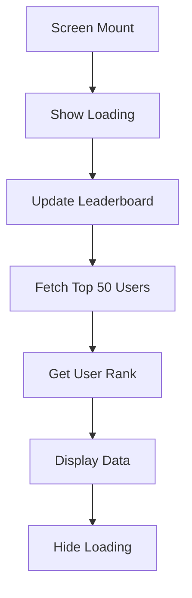
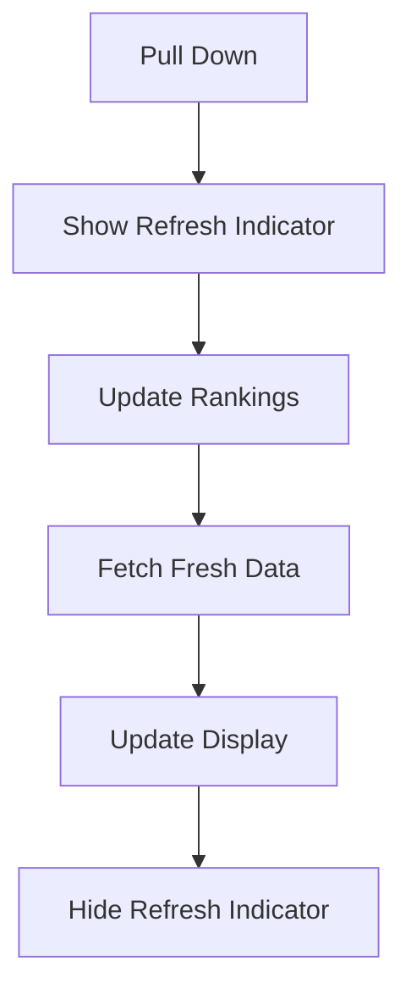

# Leaderboard Feature Documentation

## Overview
The Leaderboard feature replaces the Quiz tab and provides a comprehensive ranking system where users can see their position among peers based on XP (Experience Points) earned through learning activities.

## Feature Highlights

### 🏆 **Top Champions Podium**
- Visual podium display for top 3 users
- Medal indicators: 🥇 Gold, 🥈 Silver, 🥉 Bronze
- Unique heights for each position (1st tallest, then 2nd, then 3rd)
- Color-coded rankings (Gold, Silver, Bronze)

### 📊 **Systematic Ranking View**
- Displays up to 50 top users
- Clear rank numbers (#4, #5, etc.)
- User XP and level information
- "You" badge for current user's position
- Real-time XP tracking

### 📈 **Personal Stats Card**
- Shows current user's rank
- Displays total XP earned
- Shows current level
- Gradient design for visual appeal

### 🔄 **Pull-to-Refresh**
- Refresh leaderboard data by pulling down
- Updates rankings in real-time
- Smooth animation and feedback

---

## User Interface Components

### 1. **Header Section**
```
┌─────────────────────────────────┐
│         🏆                      │
│      Leaderboard                │
│  Compete with top learners      │
└─────────────────────────────────┘
```
- Gradient background (primary → science color)
- Leaderboard icon
- Clear title and subtitle
- Rounded bottom corners

### 2. **User Rank Card**
```
┌─────────────────────────────────┐
│  Your Rank  │  Your XP  │ Level │
│     #12     │   1,450   │   5   │
└─────────────────────────────────┘
```
- Three-column layout
- White text on gradient background
- Quick access to personal stats
- Only shown if user is logged in

### 3. **Top 3 Podium**
```
     2nd        1st        3rd
    ┌───┐      ┌───┐     ┌───┐
    │ 👤 │      │ 👤 │     │ 👤 │
    │Name│      │Name│     │Name│
    │XP  │      │XP  │     │XP  │
    ├───┤      ├───┤     ├───┤
    │🥈 │      │🥇 │     │🥉 │
    │Lvl│      │Lvl│     │Lvl│
    └───┘      └───┘     └───┘
  (100px)    (140px)   (80px)
```
- Podium-style layout with varying heights
- Avatars with rank badges
- Medal emojis for visual distinction
- XP and level display

### 4. **Leaderboard List**
```
┌─────────────────────────────────┐
│ #4  👤 John Doe      1,200 XP   │
│     Level 4                      │
├─────────────────────────────────┤
│ #5  👤 Jane Smith    1,100 XP   │
│     Level 4                      │
├─────────────────────────────────┤
│ #6  👤 You (Bob)     1,050 XP   │  ← Highlighted
│     Level 4                      │
└─────────────────────────────────┘
```
- Card-based design with shadows
- Rank number in badge
- User avatar and name
- Level indicator with icon
- XP displayed prominently
- Current user highlighted

---

## Data Flow

### 1. **Loading Sequence**


### 2. **Refresh Flow**


### 3. **Ranking Calculation**
```typescript
// Rankings are based on total XP
1. Fetch all users ordered by XP DESC
2. Assign rank numbers (1, 2, 3, ...)
3. Store in leaderboard table
4. Display top 50 in UI
```

---

## Database Integration

### Tables Used

#### 1. **users table**
```sql
SELECT id, name, xp, level, avatarId
FROM users
ORDER BY xp DESC
```

#### 2. **leaderboard table**
```sql
CREATE TABLE leaderboard (
  id TEXT PRIMARY KEY,
  userId TEXT NOT NULL,
  userName TEXT NOT NULL,
  avatarId TEXT NOT NULL,
  totalXp INTEGER NOT NULL,
  level INTEGER NOT NULL,
  rank INTEGER NOT NULL,
  weeklyXp INTEGER DEFAULT 0
);
```

### Key Functions

#### `updateLeaderboard()`
- Clears existing leaderboard data
- Fetches all users sorted by XP
- Assigns rank numbers sequentially
- Inserts updated rankings into leaderboard table

#### `getLeaderboard(limit: number)`
- Returns top N users from leaderboard
- Ordered by rank ascending
- Default limit: 10, Current usage: 50

#### `getUserRank(userId: string)`
- Returns specific user's current rank
- Returns 0 if user not found
- Used for personal stats display

---

## Styling & Theme Support

### Color Scheme
```typescript
// Rank Colors
Gold:   #FFD700 (1st place)
Silver: #C0C0C0 (2nd place)
Bronze: #CD7F32 (3rd place)
Default: colors.textSecondary (4th onwards)

// Theme Support
Light Mode: White backgrounds, dark text
Dark Mode: Dark backgrounds, light text
```

### Responsive Design
- Adapts to different screen sizes
- Scrollable content for long lists
- Touch-friendly card sizes (minimum 48px height)
- Proper spacing and padding

### Visual Elements
- **Shadows**: Elevated cards for depth
- **Gradients**: Header and user rank card
- **Icons**: Material Icons throughout
- **Emojis**: Medals for top 3 (🥇 🥈 🥉)
- **Colors**: Subject colors from theme

---

## User Experience Features

### 1. **Visual Hierarchy**
- Top 3 get special podium treatment
- Current user highlighted in list
- Clear rank indicators (#1, #2, etc.)
- Prominent XP display

### 2. **Feedback & States**

#### Loading State
```
     🔄
Loading leaderboard...
```

#### Empty State
```
     🏆
  No Rankings Yet
Start learning to earn XP
and climb the leaderboard!
```

#### Refresh State
- Pull-down refresh indicator
- Smooth animation
- Color-matched to theme

### 3. **Navigation**
- Accessible via bottom tab bar
- Leaderboard icon clearly visible
- No additional navigation needed

---

## Performance Optimizations

### 1. **Data Management**
- Limit to top 50 users (prevents large data loads)
- Efficient SQL queries with proper indexing
- Cached leaderboard data in database table

### 2. **Rendering**
- FlatList-style rendering for list items
- Conditional rendering for empty states
- Optimized re-renders with proper state management

### 3. **Network Efficiency**
- Local database queries (no API calls)
- Pull-to-refresh for manual updates
- Automatic update on screen focus

---

## Gamification Elements

### 1. **Competitive Motivation**
- See where you rank among peers
- Visual rewards for top performers
- Clear progression path

### 2. **Social Comparison**
- Compare XP with other users
- See levels of top performers
- Identify learning leaders

### 3. **Achievement Recognition**
- Podium display for top 3
- Medal indicators
- Special highlighting for champions

---

## Integration Points

### 1. **XP System**
- Earned through lessons, quizzes
- Automatic leaderboard updates
- Real-time rank changes

### 2. **Level System**
- Displayed alongside rankings
- Based on XP thresholds
- Visual indicator of progress

### 3. **User Profile**
- Links to user's personal stats
- Avatar display
- Name visibility

---

## Future Enhancements

### Potential Features
1. **Time-based Leaderboards**
   - Daily rankings
   - Weekly rankings
   - Monthly rankings
   - All-time rankings

2. **Category Leaderboards**
   - Science subject leaders
   - Technology subject leaders
   - Engineering subject leaders
   - Mathematics subject leaders

3. **Friend Leaderboards**
   - Compare with friends only
   - Private group rankings
   - Class-based leaderboards

4. **Achievements Integration**
   - Badge displays on leaderboard
   - Special indicators for achievements
   - Achievement-based rankings

5. **Advanced Stats**
   - XP gain trends
   - Rank change history
   - Performance graphs
   - Learning streaks display

6. **Social Features**
   - Challenge other users
   - Send congratulations
   - Follow top learners
   - Direct messaging

---

## Testing Scenarios

### 1. **New User**
- Should see basic leaderboard
- Own rank displayed if XP > 0
- Empty state if no users exist

### 2. **Top Performer**
- Should see self in podium (if top 3)
- Special highlighting in list
- Accurate XP and rank display

### 3. **Mid-Rank User**
- Should find self in list view
- "You" badge clearly visible
- Correct rank number shown

### 4. **Refresh Action**
- Pull-to-refresh should work
- Data should update
- Loading indicators shown

### 5. **Theme Switching**
- Light/dark mode support
- All colors adjust properly
- Text remains readable

---

## Code Structure

### Main Components
```
leaderboard.tsx
├── Header (Gradient)
├── User Rank Card (Personal Stats)
├── Top 3 Podium
│   ├── 2nd Place
│   ├── 1st Place
│   └── 3rd Place
├── Leaderboard List
│   └── Rank Items (4-50)
└── Empty State
```

### State Management
```typescript
const [leaderboard, setLeaderboard] = useState<LeaderboardEntry[]>([]);
const [userRank, setUserRank] = useState<number>(0);
const [isLoading, setIsLoading] = useState(true);
const [isRefreshing, setIsRefreshing] = useState(false);
```

### Key Functions
```typescript
loadLeaderboard()      // Initial data load
onRefresh()            // Pull-to-refresh handler
getRankMedal(rank)     // Medal emoji for ranks
getRankColor(rank)     // Color for rank badges
renderTopThree()       // Podium component
renderLeaderboardList() // List component
renderUserRankCard()   // Personal stats card
```

---

## Accessibility Considerations

### 1. **Screen Reader Support**
- Descriptive labels for all elements
- Rank numbers announced clearly
- XP values readable
- Medal emojis have meaning

### 2. **Visual Clarity**
- High contrast text
- Clear rank indicators
- Proper font sizes (min 12px)
- Touch targets ≥ 48px

### 3. **Color Independence**
- Rankings work without color
- Text labels supplement colors
- Multiple visual cues (medals, numbers, text)

---

## Files Modified/Created

### Created
- ✅ `app/(tabs)/leaderboard.tsx` - Main leaderboard screen

### Modified
- ✅ `app/(tabs)/_layout.tsx` - Tab navigation updated

### Deleted
- ✅ `app/(tabs)/quiz.tsx` - Removed quiz placeholder

### Documentation
- ✅ `LEADERBOARD_FEATURE.md` - This file

---

## Summary

The Leaderboard feature provides a comprehensive, visually appealing ranking system that:
- ✅ Motivates users through competition
- ✅ Displays clear progression indicators
- ✅ Highlights top performers with podium
- ✅ Shows personal stats prominently
- ✅ Supports real-time updates
- ✅ Works seamlessly with XP system
- ✅ Follows app design patterns
- ✅ Includes proper error handling
- ✅ Supports both light and dark themes

This implementation replaces the Quiz tab with a more engaging and functional leaderboard system that encourages continued learning and healthy competition among users.
